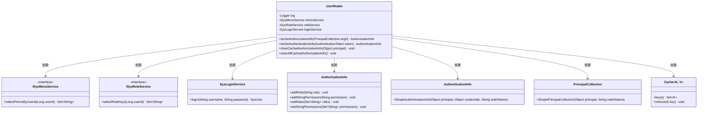
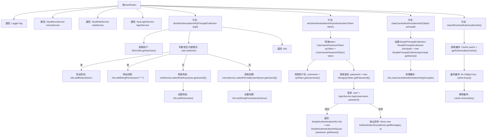

# 基础信息

|      |      |
|------|------|
| 名称 | UserRealm |
| 编码语言 | .java |
| 代码路径 | RuoYi-main/ruoyi-framework/src/main/java/com/ruoyi/framework/shiro/realm/UserRealm.java |
| 包名 | com.ruoyi.framework.shiro.realm |
| 依赖项 | ['java.util.HashSet', 'java.util.Set', 'org.apache.shiro.authc.AuthenticationException', 'org.apache.shiro.authc.AuthenticationInfo', 'org.apache.shiro.authc.AuthenticationToken', 'org.apache.shiro.authc.ExcessiveAttemptsException', 'org.apache.shiro.authc.IncorrectCredentialsException', 'org.apache.shiro.authc.LockedAccountException', 'org.apache.shiro.authc.SimpleAuthenticationInfo', 'org.apache.shiro.authc.UnknownAccountException', 'org.apache.shiro.authc.UsernamePasswordToken', 'org.apache.shiro.authz.AuthorizationInfo', 'org.apache.shiro.authz.SimpleAuthorizationInfo', 'org.apache.shiro.cache.Cache', 'org.apache.shiro.realm.AuthorizingRealm', 'org.apache.shiro.subject.PrincipalCollection', 'org.apache.shiro.subject.SimplePrincipalCollection', 'org.slf4j.Logger', 'org.slf4j.LoggerFactory', 'org.springframework.beans.factory.annotation.Autowired', 'com.ruoyi.common.core.domain.entity.SysUser', 'com.ruoyi.common.exception.user.CaptchaException', 'com.ruoyi.common.exception.user.RoleBlockedException', 'com.ruoyi.common.exception.user.UserBlockedException', 'com.ruoyi.common.exception.user.UserNotExistsException', 'com.ruoyi.common.exception.user.UserPasswordNotMatchException', 'com.ruoyi.common.exception.user.UserPasswordRetryLimitExceedException', 'com.ruoyi.common.utils.ShiroUtils', 'com.ruoyi.framework.shiro.service.SysLoginService', 'com.ruoyi.system.service.ISysMenuService', 'com.ruoyi.system.service.ISysRoleService'] |
| 概述说明 | UserRealm类负责用户授权认证，管理角色权限，支持缓存清理。 |

# 说明

UserRealm类负责实现系统的授权和认证功能，管理用户的角色和权限，确保用户访问系统资源时具备相应的权限。此外，该类还支持缓存清理功能，能够及时清除缓存数据，保证系统的实时性和一致性。通过UserRealm类，系统能够有效地控制用户访问权限，提升安全性和性能。

# 类列表 Class Summary

| 名称   | 类型  | 说明 |
|-------|------|-------------|
| UserRealm | class | UserRealm类实现授权和认证功能，管理用户角色和权限，支持缓存清理。 |

## 类 UserRealm

|      |      |
|------|------|
| 访问范围 | public |
| 类型 | class |
| 名称 | UserRealm |
| 说明 | UserRealm类实现授权和认证功能，管理用户角色和权限，支持缓存清理。 |

### UML类图

**描述：**  
`UserRealm` 类继承自 `AuthorizingRealm`，负责用户授权和认证。它依赖 `ISysMenuService` 和 `ISysRoleService` 接口来获取用户的权限和角色信息，依赖 `SysLoginService` 来处理用户登录。`UserRealm` 通过 `doGetAuthorizationInfo` 方法进行授权，通过 `doGetAuthenticationInfo` 方法进行认证，并提供清理授权信息缓存的功能。类图中展示了 `UserRealm` 与其他类的依赖关系及其主要方法。

### 内部方法调用关系图

### 描述
这段代码定义了一个名为 `UserRealm` 的类，继承自 `AuthorizingRealm`，主要用于用户授权和认证。`doGetAuthorizationInfo` 方法用于获取用户的授权信息，判断用户是否为管理员并设置相应的角色和权限。`doGetAuthenticationInfo` 方法用于处理用户登录认证，验证用户名和密码，并根据不同异常抛出相应的认证异常。`clearCachedAuthorizationInfo` 和 `clearAllCachedAuthorizationInfo` 方法用于清理用户的授权信息缓存。

### 字段列表 Field List

| 名称  | 类型  | 说明 |
|-------|-------|------|
| menuService | ISysMenuService | 自动注入菜单服务实例。 |
| loginService | SysLoginService | 自动注入SysLoginService服务实例。 |
| log = LoggerFactory.getLogger(UserRealm.class) | Logger | UserRealm类中定义了一个私有的静态日志记录器。 |
| roleService | ISysRoleService | 自动注入角色服务实例。 |

### 方法列表 Method List

| 名称  | 类型  | 说明 |
|-------|-------|------|
| clearCachedAuthorizationInfo | void | 清除指定主体的缓存授权信息。 |
| doGetAuthenticationInfo | AuthenticationInfo | 验证用户登录信息，处理异常并返回认证结果。 |
| clearAllCachedAuthorizationInfo | void | 清除所有缓存的授权信息，遍历缓存键并逐个移除。 |
| doGetAuthorizationInfo | AuthorizationInfo | 该方法为系统用户分配角色和权限，管理员拥有全部权限，普通用户则根据ID获取角色和权限。 |

