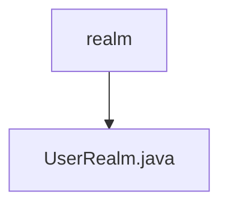

# 基础信息

|      |      |
|------|------|
| 名称 | realm |
| 编码语言 | .java |
| 代码路径 | RuoYi-main/ruoyi-framework/src/main/java/com/ruoyi/framework/shiro/realm |
| 包名 | RuoYi-main.ruoyi-framework.src.main.java.com.ruoyi.framework.shiro.realm |
| 概述说明 | UserRealm类负责用户授权认证，管理角色权限，支持缓存清理。 |

# 说明

UserRealm类负责实现系统的授权和认证功能，管理用户的角色和权限，确保用户访问系统资源时具备相应的权限。此外，该类还支持缓存清理功能，能够及时清除缓存数据，保证系统的实时性和一致性。通过UserRealm类，系统能够有效地控制用户访问权限，提升安全性和性能。

### 包内部结构视图

该流程图展示了路径的层级关系，`realm`文件夹包含一个文件`UserRealm.java`。通过简洁的图形表示，清晰地反映了文件与文件夹之间的从属关系，便于理解项目结构。

# 文件列表 File List

| 名称   | 类型  | 说明 |
|-------|------|-------------|
| [UserRealm.java](UserRealm.md) | file | UserRealm类负责用户授权认证，管理角色权限，支持缓存清理。 |

