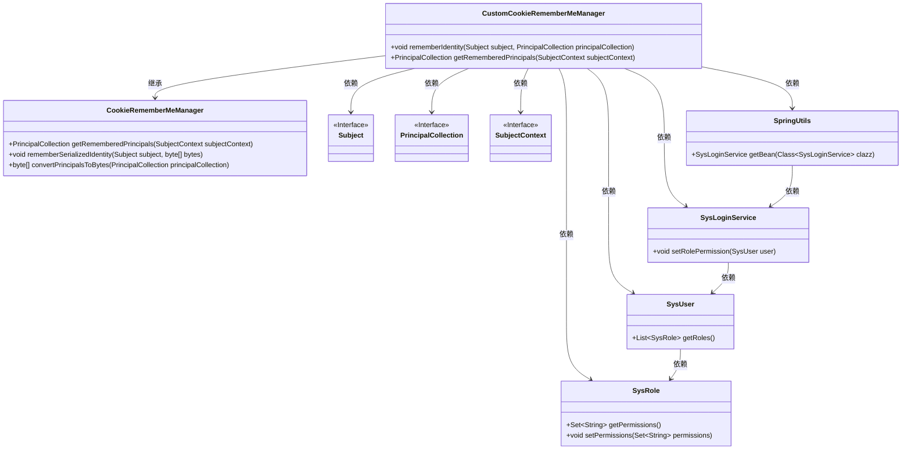
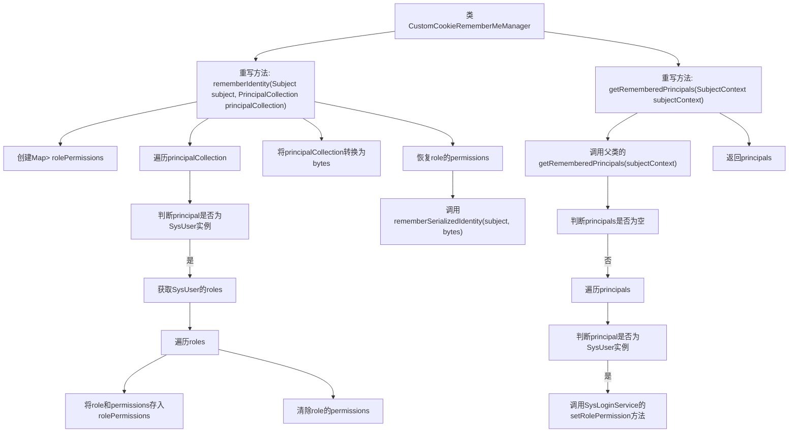

# 基础信息

|      |      |
|------|------|
| 名称 | CustomCookieRememberMeManager |
| 编码语言 | .java |
| 代码路径 | RuoYi-main/ruoyi-framework/src/main/java/com/ruoyi/framework/shiro/rememberMe/CustomCookieRememberMeManager.java |
| 包名 | com.ruoyi.framework.shiro.rememberMe |
| 依赖项 | ['java.util.HashMap', 'java.util.List', 'java.util.Map', 'java.util.Set', 'org.apache.shiro.subject.PrincipalCollection', 'org.apache.shiro.subject.Subject', 'org.apache.shiro.subject.SubjectContext', 'org.apache.shiro.web.mgt.CookieRememberMeManager', 'com.ruoyi.common.core.domain.entity.SysRole', 'com.ruoyi.common.core.domain.entity.SysUser', 'com.ruoyi.common.utils.spring.SpringUtils', 'com.ruoyi.framework.shiro.service.SysLoginService'] |
| 概述说明 | 优化CookieRememberMeManager，减少角色权限存储，避免请求头过大。 |

# 说明

自定义CookieRememberMeManager通过优化角色权限的存储方式，有效解决了请求头过大的问题。该优化减少了存储在Cookie中的数据量，从而避免了因请求头过大导致的性能瓶颈和潜在的安全风险。这一改进提升了系统的整体性能和用户体验，同时确保了权限管理的安全性和可靠性。

# 类列表 Class Summary

| 名称   | 类型  | 说明 |
|-------|------|-------------|
| CustomCookieRememberMeManager | class | 自定义CookieRememberMeManager优化角色权限存储，防止请求头过大。 |

## 类 CustomCookieRememberMeManager

|      |      |
|------|------|
| 访问范围 | public |
| 类型 | class |
| 名称 | CustomCookieRememberMeManager |
| 说明 | 自定义CookieRememberMeManager优化角色权限存储，防止请求头过大。 |

### UML类图

**描述：**
`CustomCookieRememberMeManager` 继承自 `CookieRememberMeManager`，主要用于管理“记住我”功能中的用户身份信息。在 `rememberIdentity` 方法中，它暂时移除用户角色的权限字符串以防止HTTP请求头过大，并在处理完成后恢复这些权限。在 `getRememberedPrincipals` 方法中，它通过 `SysLoginService` 恢复用户角色的权限。该类依赖于多个接口和类，如 `Subject`、`PrincipalCollection`、`SysUser` 和 `SysRole`，并通过 `SpringUtils` 获取 `SysLoginService` 的实例。

### 内部方法调用关系图

这段代码是`CustomCookieRememberMeManager`类的实现，主要功能是管理记住我（Remember Me）功能。`rememberIdentity`方法在记住用户身份时，临时清除角色的权限字符串以防止HTTP请求头过大，并在操作完成后恢复权限。`getRememberedPrincipals`方法在获取记住的用户身份时，通过`SysLoginService`恢复角色的权限字符串。这两个方法通过遍历和条件判断确保操作的准确性和安全性。

### 字段列表 Field List

| 名称  | 类型  | 说明 |
|-------|-------|------|

### 方法列表 Method List

| 名称  | 类型  | 说明 |
|-------|-------|------|
| rememberIdentity | void | 清除并恢复用户角色权限，序列化身份信息存储。 |
| getRememberedPrincipals | PrincipalCollection | 重写方法获取记住的用户主体，若为空返回，否则设置角色权限。 |

