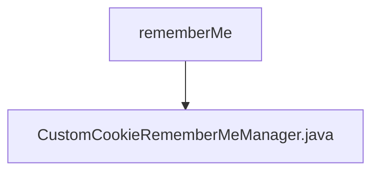

# 基础信息

|      |      |
|------|------|
| 名称 | rememberMe |
| 编码语言 | .java |
| 代码路径 | RuoYi-main/ruoyi-framework/src/main/java/com/ruoyi/framework/shiro/rememberMe |
| 包名 | RuoYi-main.ruoyi-framework.src.main.java.com.ruoyi.framework.shiro.rememberMe |
| 概述说明 | 优化CookieRememberMeManager，减少角色权限存储，避免请求头过大。 |

# 说明

自定义CookieRememberMeManager通过优化角色权限的存储方式，有效解决了请求头过大的问题。该优化减少了存储在Cookie中的数据量，从而避免了因请求头过大导致的性能瓶颈和潜在的安全风险。这一改进提升了系统的整体性能和用户体验，同时确保了权限管理的安全性和可靠性。

### 包内部结构视图

这个流程图展示了路径的层级关系，`rememberMe` 是父节点，`CustomCookieRememberMeManager.java` 是其子节点。`rememberMe` 是一个文件夹，而 `CustomCookieRememberMeManager.java` 是该文件夹中的一个文件。这个结构清晰地表明了文件在项目中的位置和所属关系。

# 文件列表 File List

| 名称   | 类型  | 说明 |
|-------|------|-------------|
| [CustomCookieRememberMeManager.java](CustomCookieRememberMeManager.md) | file | 优化CookieRememberMeManager，减少角色权限存储，避免请求头过大。 |

