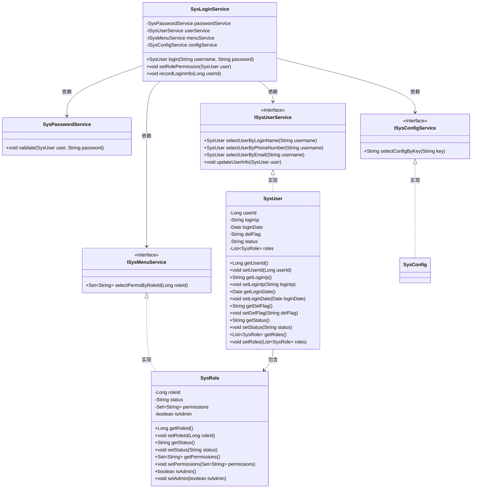
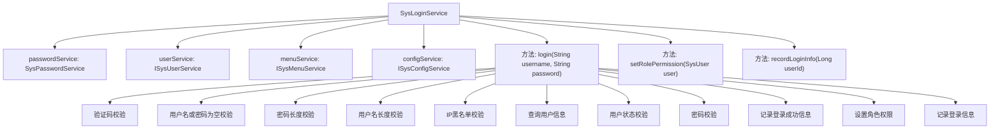

# 基础信息

|      |      |
|------|------|
| 名称 | SysLoginService |
| 编码语言 | .java |
| 代码路径 | RuoYi-main/ruoyi-framework/src/main/java/com/ruoyi/framework/shiro/service/SysLoginService.java |
| 包名 | com.ruoyi.framework.shiro.service |
| 依赖项 | ['java.util.List', 'java.util.Set', 'org.springframework.beans.factory.annotation.Autowired', 'org.springframework.stereotype.Component', 'com.ruoyi.common.constant.Constants', 'com.ruoyi.common.constant.ShiroConstants', 'com.ruoyi.common.constant.UserConstants', 'com.ruoyi.common.core.domain.entity.SysRole', 'com.ruoyi.common.core.domain.entity.SysUser', 'com.ruoyi.common.enums.UserStatus', 'com.ruoyi.common.exception.user.BlackListException', 'com.ruoyi.common.exception.user.CaptchaException', 'com.ruoyi.common.exception.user.UserBlockedException', 'com.ruoyi.common.exception.user.UserDeleteException', 'com.ruoyi.common.exception.user.UserNotExistsException', 'com.ruoyi.common.exception.user.UserPasswordNotMatchException', 'com.ruoyi.common.utils.DateUtils', 'com.ruoyi.common.utils.IpUtils', 'com.ruoyi.common.utils.MessageUtils', 'com.ruoyi.common.utils.ServletUtils', 'com.ruoyi.common.utils.ShiroUtils', 'com.ruoyi.common.utils.StringUtils', 'com.ruoyi.framework.manager.AsyncManager', 'com.ruoyi.framework.manager.factory.AsyncFactory', 'com.ruoyi.system.service.ISysConfigService', 'com.ruoyi.system.service.ISysMenuService', 'com.ruoyi.system.service.ISysUserService'] |
| 概述说明 | SysLoginService处理用户登录，验证信息，设置权限并记录日志。 |

# 说明

SysLoginService负责处理用户登录流程，主要功能包括验证用户名和密码的有效性，检查用户IP是否在黑名单中，根据验证结果设置用户的角色权限，并记录用户的登录信息以确保系统安全性和可追溯性。

# 类列表 Class Summary

| 名称   | 类型  | 说明 |
|-------|------|-------------|
| SysLoginService | class | SysLoginService处理用户登录，验证用户名、密码、IP黑名单，并设置角色权限和记录登录信息。 |

## 类 SysLoginService

|      |      |
|------|------|
| 访问范围 | @Component;public |
| 类型 | class |
| 名称 | SysLoginService |
| 说明 | SysLoginService处理用户登录，验证用户名、密码、IP黑名单，并设置角色权限和记录登录信息。 |

### UML类图

这段代码定义了一个`SysLoginService`类，负责用户登录的逻辑。它依赖于`SysPasswordService`、`ISysUserService`、`ISysMenuService`和`ISysConfigService`等接口和类。`SysLoginService`通过`login`方法验证用户输入的用户名和密码，并处理各种异常情况。它还提供了`setRolePermission`和`recordLoginInfo`方法来设置用户角色权限和记录登录信息。`SysUser`类表示用户信息，包含用户ID、登录IP、登录日期等属性，并包含一个`SysRole`类的列表，表示用户的角色。

### 内部方法调用关系图

这段代码描述了一个`SysLoginService`类，负责处理用户登录的逻辑。代码首先进行一系列校验，包括验证码、用户名和密码的合法性、IP黑名单等。如果校验通过，则查询用户信息并进行状态校验，最后验证密码并记录登录信息。`setRolePermission`方法用于设置用户的角色权限，`recordLoginInfo`方法用于记录用户的登录信息。整个流程确保了登录过程的安全性和完整性。

### 字段列表 Field List

| 名称  | 类型  | 说明 |
|-------|-------|------|
| userService | ISysUserService | 自动注入用户服务实例。 |
| passwordService | SysPasswordService | 自动注入系统密码服务实例。 |
| menuService | ISysMenuService | 自动注入菜单服务接口实例。 |
| configService | ISysConfigService | 自动注入系统配置服务实例。 |

### 方法列表 Method List

| 名称  | 类型  | 说明 |
|-------|-------|------|
| setRolePermission | void | 该方法为用户角色设置权限，遍历角色列表，为非管理员且状态正常的角色添加权限。 |
| recordLoginInfo | void | 记录用户登录信息，包括用户ID、登录IP和登录时间。 |
| login | SysUser | 登录方法校验用户名密码，验证码，IP黑名单，用户状态，成功返回用户信息。 |

