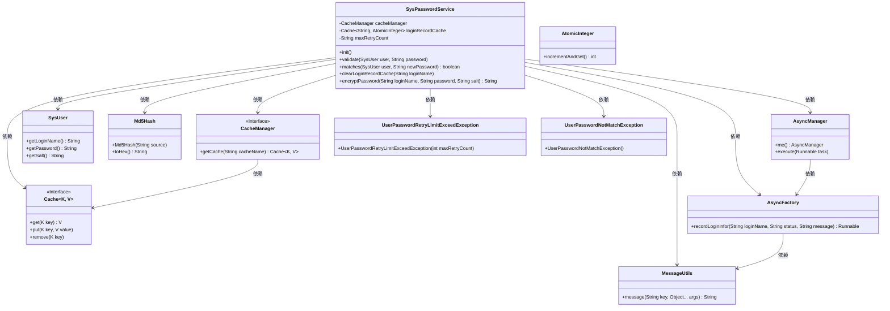

# 基础信息

|      |      |
|------|------|
| 名称 | SysPasswordService |
| 编码语言 | .java |
| 代码路径 | RuoYi-main/ruoyi-framework/src/main/java/com/ruoyi/framework/shiro/service/SysPasswordService.java |
| 包名 | com.ruoyi.framework.shiro.service |
| 依赖项 | ['java.util.concurrent.atomic.AtomicInteger', 'javax.annotation.PostConstruct', 'org.apache.shiro.cache.Cache', 'org.apache.shiro.cache.CacheManager', 'org.apache.shiro.crypto.hash.Md5Hash', 'org.springframework.beans.factory.annotation.Autowired', 'org.springframework.beans.factory.annotation.Value', 'org.springframework.stereotype.Component', 'com.ruoyi.common.constant.Constants', 'com.ruoyi.common.constant.ShiroConstants', 'com.ruoyi.common.core.domain.entity.SysUser', 'com.ruoyi.common.exception.user.UserPasswordNotMatchException', 'com.ruoyi.common.exception.user.UserPasswordRetryLimitExceedException', 'com.ruoyi.common.utils.MessageUtils', 'com.ruoyi.framework.manager.AsyncManager', 'com.ruoyi.framework.manager.factory.AsyncFactory'] |
| 概述说明 | SysPasswordService类负责用户密码验证，含登录失败重试限制和密码匹配检查。 |

# 说明

SysPasswordService类主要负责用户密码验证的相关功能，包括处理登录失败时的重试限制机制以及密码匹配检查。该类确保在用户尝试登录时，系统能够有效控制失败次数，防止恶意攻击，同时准确验证用户输入的密码是否与系统存储的密码一致，从而保障账户安全。

# 类列表 Class Summary

| 名称   | 类型  | 说明 |
|-------|------|-------------|
| SysPasswordService | class | SysPasswordService类处理用户密码验证，包括登录失败重试限制和密码匹配检查。 |

## 类 SysPasswordService

|      |      |
|------|------|
| 访问范围 | @Component;public |
| 类型 | class |
| 名称 | SysPasswordService |
| 说明 | SysPasswordService类处理用户密码验证，包括登录失败重试限制和密码匹配检查。 |

### UML类图

### 描述
`SysPasswordService` 类负责处理用户密码的验证和重试限制。它通过 `CacheManager` 获取缓存实例，并在 `validate` 方法中检查用户登录尝试次数。如果超过最大重试次数，抛出 `UserPasswordRetryLimitExceedException` 异常；如果密码不匹配，抛出 `UserPasswordNotMatchException` 异常。`matches` 方法用于验证密码是否正确，`encryptPassword` 方法用于加密密码。`AsyncManager` 和 `AsyncFactory` 用于异步记录登录信息。

### 内部方法调用关系图

```mermaid
graph TD
    A["类SysPasswordService"]
    B["属性: CacheManager cacheManager"]
    C["属性: Cache<String, AtomicInteger> loginRecordCache"]
    D["属性: String maxRetryCount"]
    E["方法: init()"]
    F["方法: validate(SysUser user, String password)"]
    G["方法: matches(SysUser user, String newPassword)"]
    H["方法: clearLoginRecordCache(String loginName)"]
    I["方法: encryptPassword(String loginName, String password, String salt)"]
    J["步骤: 获取loginName"]
    K["步骤: 从loginRecordCache获取retryCount"]
    L["步骤: 如果retryCount为null，初始化为0并放入缓存"]
    M["步骤: 增加retryCount并检查是否超过最大重试次数"]
    N["步骤: 如果超过最大重试次数，记录日志并抛出异常"]
    O["步骤: 检查密码是否匹配"]
    P["步骤: 如果密码不匹配，记录日志并抛出异常"]
    Q["步骤: 如果密码匹配，清除缓存"]
    R["步骤: 返回密码匹配结果"]
    S["步骤: 移除缓存中的loginName"]
    T["步骤: 计算并返回加密后的密码"]

    A --> B
    A --> C
    A --> D
    A --> E
    A --> F
    A --> G
    A --> H
    A --> I
    E --> C
    F --> J
    F --> K
    F --> L
    F --> M
    F --> N
    F --> O
    F --> P
    F --> Q
    G --> R
    H --> S
    I --> T
```

这段代码定义了一个名为 `SysPasswordService` 的类，主要用于处理用户密码的验证和相关缓存操作。代码通过 `validate` 方法验证用户密码，并在密码错误时记录重试次数，超过最大重试次数时抛出异常。`matches` 方法用于检查密码是否匹配，`clearLoginRecordCache` 方法用于清除缓存中的登录记录，`encryptPassword` 方法用于加密密码。代码中还包含了一个 `init` 方法，用于初始化缓存。

### 字段列表 Field List

| 名称  | 类型  | 说明 |
|-------|-------|------|
| cacheManager | CacheManager | 使用@Autowired注解注入CacheManager实例。 |
| maxRetryCount | String | 用户密码最大重试次数配置。 |
| loginRecordCache | Cache<String, AtomicInteger> | 私有缓存用于存储登录记录的字符串和原子整数。 |

### 方法列表 Method List

| 名称  | 类型  | 说明 |
|-------|-------|------|
| init | void | 初始化方法获取登录记录缓存实例。 |
| matches | boolean | 检查用户新密码是否与加密后密码匹配。 |
| clearLoginRecordCache | void | 清除指定用户登录记录缓存。 |
| validate | void | 验证用户登录密码，记录重试次数，超限抛出异常，成功则清除缓存。 |
| encryptPassword | String | 使用MD5算法加密密码，结合登录名、密码和盐值生成哈希值。 |

