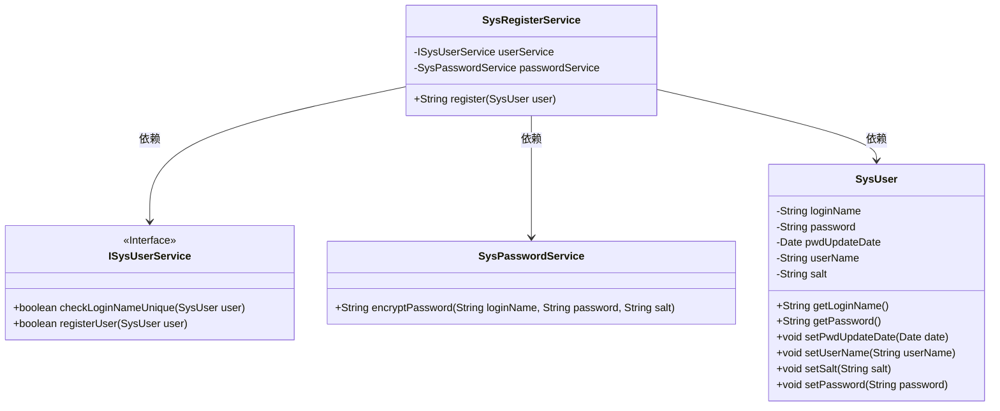
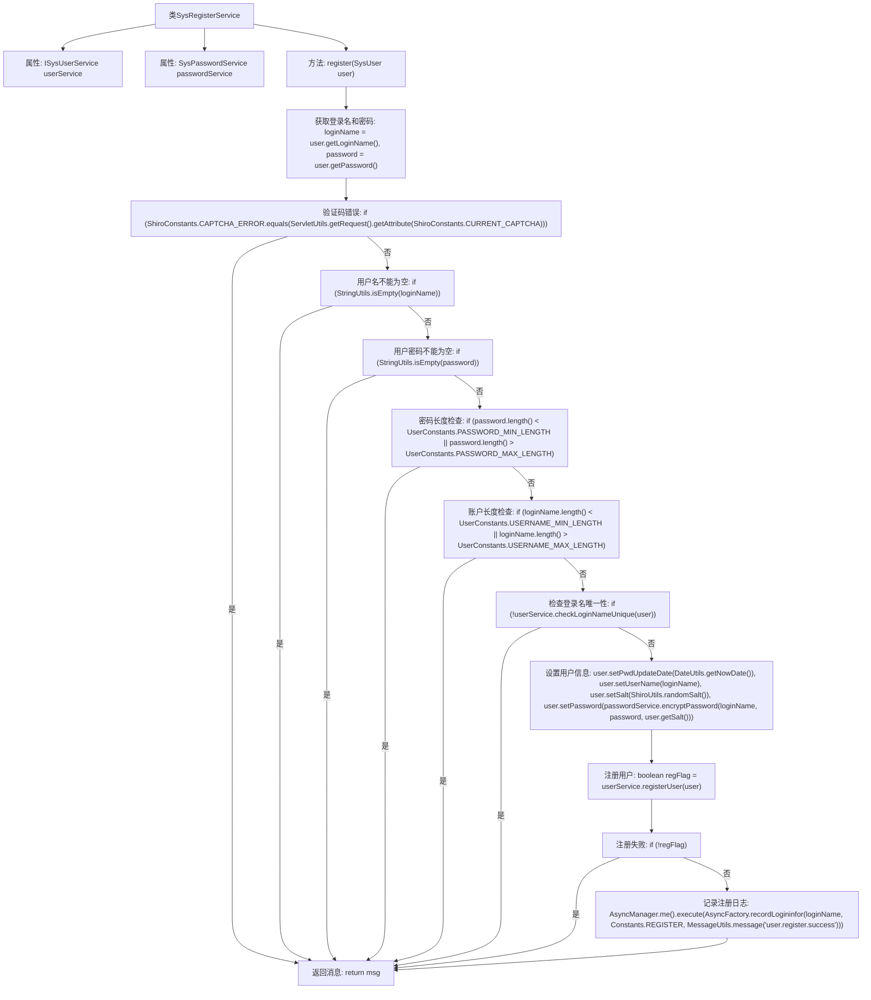

# 基础信息

|      |      |
|------|------|
| 名称 | SysRegisterService |
| 编码语言 | .java |
| 代码路径 | RuoYi-main/ruoyi-framework/src/main/java/com/ruoyi/framework/shiro/service/SysRegisterService.java |
| 包名 | com.ruoyi.framework.shiro.service |
| 依赖项 | ['org.springframework.beans.factory.annotation.Autowired', 'org.springframework.stereotype.Component', 'com.ruoyi.common.constant.Constants', 'com.ruoyi.common.constant.ShiroConstants', 'com.ruoyi.common.constant.UserConstants', 'com.ruoyi.common.core.domain.entity.SysUser', 'com.ruoyi.common.utils.DateUtils', 'com.ruoyi.common.utils.MessageUtils', 'com.ruoyi.common.utils.ServletUtils', 'com.ruoyi.common.utils.ShiroUtils', 'com.ruoyi.common.utils.StringUtils', 'com.ruoyi.framework.manager.AsyncManager', 'com.ruoyi.framework.manager.factory.AsyncFactory', 'com.ruoyi.system.service.ISysUserService'] |
| 概述说明 | SysRegisterService类负责用户注册，验证用户名、密码、验证码，确保唯一性，加密密码后完成注册。 |

# 说明

SysRegisterService类负责处理用户注册流程，主要包括验证用户名、密码和验证码的有效性，检查用户名在系统中的唯一性，对密码进行加密处理，并最终完成用户注册操作。该服务确保注册过程的完整性和安全性，通过多重验证和加密手段保障用户信息的安全。

# 类列表 Class Summary

| 名称   | 类型  | 说明 |
|-------|------|-------------|
| SysRegisterService | class | SysRegisterService类处理用户注册，验证用户名、密码、验证码，并检查唯一性，最终加密密码并注册用户。 |

## 类 SysRegisterService

|      |      |
|------|------|
| 访问范围 | @Component;public |
| 类型 | class |
| 名称 | SysRegisterService |
| 说明 | SysRegisterService类处理用户注册，验证用户名、密码、验证码，并检查唯一性，最终加密密码并注册用户。 |

### UML类图

**描述：**
`SysRegisterService` 类负责用户注册功能，依赖于 `ISysUserService` 和 `SysPasswordService` 接口。`ISysUserService` 提供了检查用户名唯一性和注册用户的方法，`SysPasswordService` 用于加密用户密码。`SysUser` 类包含用户的基本信息和相关操作方法。注册过程中会进行用户名、密码的验证，并在验证通过后调用相关服务完成用户注册。

### 内部方法调用关系图

这段代码是一个用户注册服务类 `SysRegisterService`，它通过 `register` 方法处理用户注册流程。代码首先检查验证码、用户名和密码的有效性，然后验证登录名的唯一性。如果所有检查通过，系统会设置用户信息并尝试注册用户。注册成功后，记录注册日志并返回相应的消息。流程图清晰地展示了每个步骤的逻辑关系和条件判断。

### 字段列表 Field List

| 名称  | 类型  | 说明 |
|-------|-------|------|
| userService | ISysUserService | 自动注入用户服务接口实例。 |
| passwordService | SysPasswordService | 自动注入SysPasswordService实例。 |

### 方法列表 Method List

| 名称  | 类型  | 说明 |
|-------|-------|------|
| register | String | 用户注册方法，验证码、用户名、密码长度及唯一性，成功则加密并记录日志。 |

