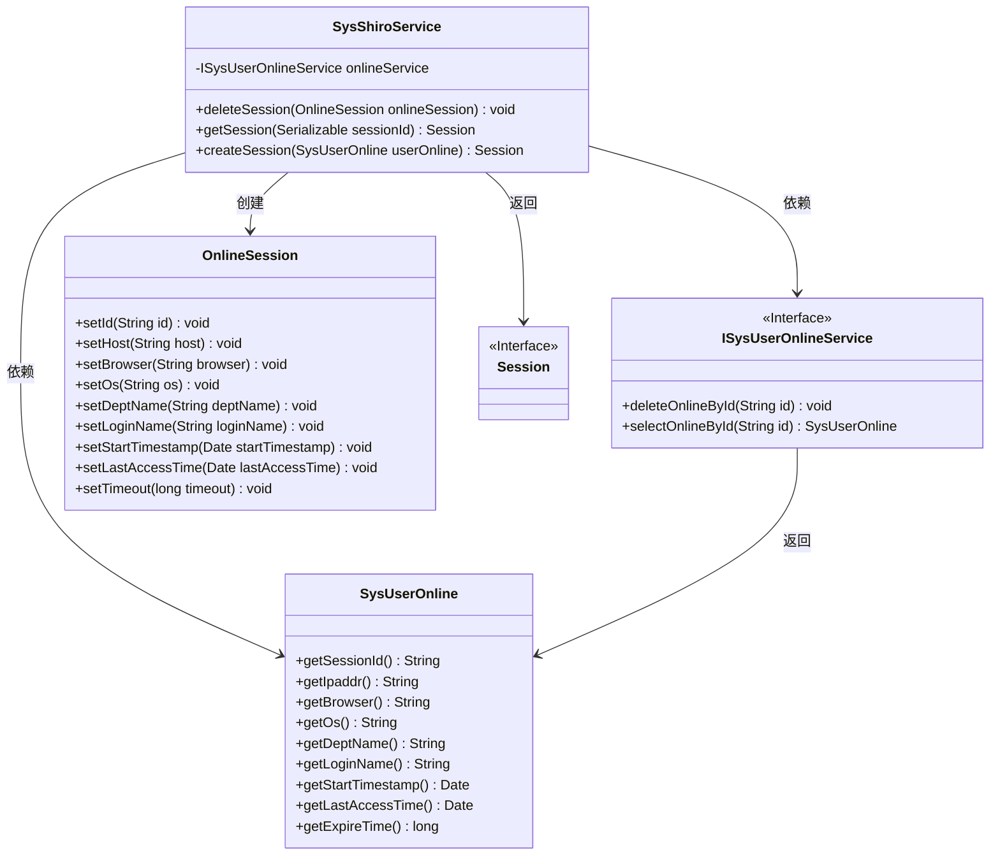

# 基础信息

|      |      |
|------|------|
| 名称 | SysShiroService |
| 编码语言 | .java |
| 代码路径 | RuoYi-main/ruoyi-framework/src/main/java/com/ruoyi/framework/shiro/service/SysShiroService.java |
| 包名 | com.ruoyi.framework.shiro.service |
| 依赖项 | ['java.io.Serializable', 'org.apache.shiro.session.Session', 'org.springframework.beans.factory.annotation.Autowired', 'org.springframework.stereotype.Component', 'com.ruoyi.common.utils.StringUtils', 'com.ruoyi.framework.shiro.session.OnlineSession', 'com.ruoyi.system.domain.SysUserOnline', 'com.ruoyi.system.service.ISysUserOnlineService'] |
| 概述说明 | SysShiroService类负责会话管理，支持删除和获取会话信息。 |

# 说明

SysShiroService类负责会话管理，主要功能包括删除会话和获取会话信息。该类通过高效的方法实现对会话的精确控制，确保系统安全性和会话数据的准确性。删除会话功能用于终止特定会话，防止未授权访问；获取会话信息功能则用于查询会话状态和详细信息，便于监控和审计。SysShiroService类的设计旨在简化会话管理流程，提升系统性能和安全性。

# 类列表 Class Summary

| 名称   | 类型  | 说明 |
|-------|------|-------------|
| SysShiroService | class | SysShiroService类管理会话，提供删除会话和获取会话信息功能。 |

## 类 SysShiroService

|      |      |
|------|------|
| 访问范围 | @Component;public |
| 类型 | class |
| 名称 | SysShiroService |
| 说明 | SysShiroService类管理会话，提供删除会话和获取会话信息功能。 |

### UML类图

这段代码描述了一个名为 `SysShiroService` 的类，它负责管理与用户会话相关的操作。`SysShiroService` 依赖于 `ISysUserOnlineService` 接口来删除和查询在线用户会话信息。`SysShiroService` 提供了 `deleteSession` 方法来删除会话，`getSession` 方法来获取会话信息，以及 `createSession` 方法来创建新的会话对象。`OnlineSession` 类用于存储会话的详细信息，而 `SysUserOnline` 类则包含在线用户的相关数据。`Session` 是一个接口，表示会话对象的抽象。

### 内部方法调用关系图

```mermaid
graph TD
    A["类SysShiroService"]
    B["属性: ISysUserOnlineService onlineService"]
    C["方法: void deleteSession(OnlineSession onlineSession)"]
    D["方法: Session getSession(Serializable sessionId)"]
    E["方法: Session createSession(SysUserOnline userOnline)"]
    F["调用: onlineService.deleteOnlineById(String.valueOf(onlineSession.getId()))"]
    G["调用: onlineService.selectOnlineById(String.valueOf(sessionId))"]
    H["调用: StringUtils.isNull(userOnline)"]
    I["调用: createSession(userOnline)"]
    J["创建: OnlineSession onlineSession"]
    K["设置: onlineSession.setId(userOnline.getSessionId())"]
    L["设置: onlineSession.setHost(userOnline.getIpaddr())"]
    M["设置: onlineSession.setBrowser(userOnline.getBrowser())"]
    N["设置: onlineSession.setOs(userOnline.getOs())"]
    O["设置: onlineSession.setDeptName(userOnline.getDeptName())"]
    P["设置: onlineSession.setLoginName(userOnline.getLoginName())"]
    Q["设置: onlineSession.setStartTimestamp(userOnline.getStartTimestamp())"]
    R["设置: onlineSession.setLastAccessTime(userOnline.getLastAccessTime())"]
    S["设置: onlineSession.setTimeout(userOnline.getExpireTime())"]

    A --> B
    A --> C
    A --> D
    A --> E
    C --> F
    D --> G
    G --> H
    H -->|是| I
    H -->|否| null
    E --> J
    J --> K
    J --> L
    J --> M
    J --> N
    J --> O
    J --> P
    J --> Q
    J --> R
    J --> S
```

该流程图描述了`SysShiroService`类的结构及其方法调用关系。`deleteSession`方法通过`onlineService`删除会话，`getSession`方法通过`onlineService`获取会话信息并调用`createSession`方法创建会话对象。`createSession`方法根据`SysUserOnline`对象设置`OnlineSession`的各个属性。整个过程展示了类内部方法的调用逻辑和数据流动。

### 字段列表 Field List

| 名称  | 类型  | 说明 |
|-------|-------|------|
| onlineService | ISysUserOnlineService | 自动注入在线用户服务实例。 |

### 方法列表 Method List

| 名称  | 类型  | 说明 |
|-------|-------|------|
| getSession | Session | 根据sessionId获取在线用户会话，若不存在则返回null。 |
| createSession | Session | 创建会话方法，根据用户在线信息设置会话属性并返回会话对象。 |
| deleteSession | void | 删除指定在线会话的方法，调用服务删除会话ID。 |

