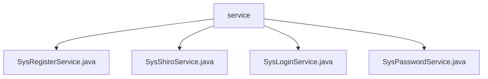

# 基础信息

|      |      |
|------|------|
| 名称 | service |
| 编码语言 | .java |
| 代码路径 | RuoYi-main/ruoyi-framework/src/main/java/com/ruoyi/framework/shiro/service |
| 包名 | RuoYi-main.ruoyi-framework.src.main.java.com.ruoyi.framework.shiro.service |
| 概述说明 | SysRegisterService处理用户注册，验证用户名密码，加密密码。SysShiroService管理会话，删除和获取会话信息。SysLoginService处理登录，验证用户信息，设置权限。SysPasswordService验证密码，控制登录失败次数。 |

# 说明

## 概述
该代码模块主要围绕用户认证和会话管理展开，提供了从用户注册、登录到会话管理的完整流程。模块通过多个服务类实现了用户注册、登录、密码验证和会话管理的核心功能，确保系统的安全性和用户信息的完整性。每个服务类都专注于特定的业务场景，通过多重验证、加密手段和会话控制机制，有效防止未授权访问和恶意攻击，同时提升了系统的性能和可维护性。

## 主要业务场景
1. **用户注册**：`SysRegisterService` 类负责处理用户注册流程，包括验证用户名、密码和验证码的有效性，检查用户名的唯一性，并对密码进行加密处理。该服务确保注册过程的完整性和安全性，防止无效或重复的用户信息进入系统。
  
2. **用户登录**：`SysLoginService` 类负责处理用户登录流程，验证用户名和密码的有效性，检查用户IP是否在黑名单中，并根据验证结果设置用户的角色权限。同时，该服务记录用户的登录信息，确保系统安全性和操作的可追溯性。

3. **密码验证**：`SysPasswordService` 类负责用户密码验证的相关功能，包括处理登录失败时的重试限制机制以及密码匹配检查。该服务有效控制登录失败次数，防止恶意攻击，并确保密码验证的准确性，保障账户安全。

4. **会话管理**：`SysShiroService` 类负责会话管理，提供删除会话和获取会话信息的功能。删除会话功能用于终止特定会话，防止未授权访问；获取会话信息功能则用于查询会话状态和详细信息，便于监控和审计。该服务简化了会话管理流程，提升了系统的安全性和性能。

通过以上业务场景，该模块为用户认证和会话管理提供了全面的支持，确保了系统的安全性和稳定性。

### 包内部结构视图

该流程图展示了`service`文件夹与其下属的四个Java文件之间的层级关系。`service`作为父节点，包含了`SysRegisterService.java`、`SysShiroService.java`、`SysLoginService.java`和`SysPasswordService.java`四个子节点，清晰地反映了文件在项目中的组织结构。

# 文件列表 File List

| 名称   | 类型  | 说明 |
|-------|------|-------------|
| [SysLoginService.java](SysLoginService.md) | file | SysLoginService处理用户登录，验证信息，设置权限并记录日志。 |
| [SysPasswordService.java](SysPasswordService.md) | file | SysPasswordService类负责用户密码验证，含登录失败重试限制和密码匹配检查。 |
| [SysShiroService.java](SysShiroService.md) | file | SysShiroService类负责会话管理，支持删除和获取会话信息。 |
| [SysRegisterService.java](SysRegisterService.md) | file | SysRegisterService类负责用户注册，验证用户名、密码、验证码，确保唯一性，加密密码后完成注册。 |

