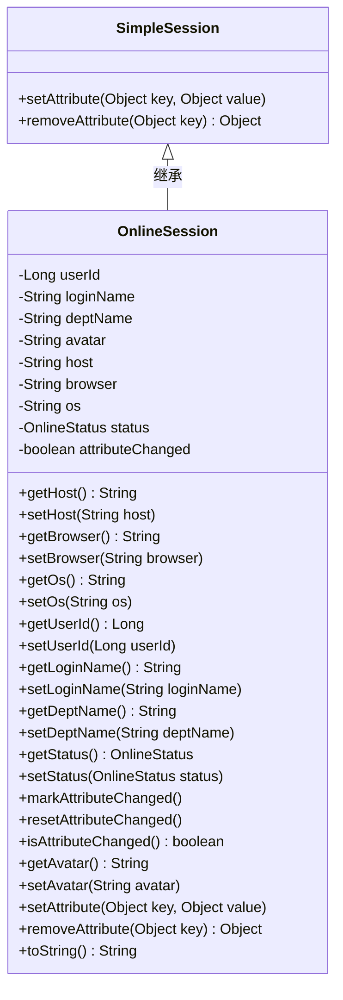

# 基础信息

|      |      |
|------|------|
| 名称 | OnlineSession |
| 编码语言 | .java |
| 代码路径 | RuoYi-main/ruoyi-framework/src/main/java/com/ruoyi/framework/shiro/session/OnlineSession.java |
| 包名 | com.ruoyi.framework.shiro.session |
| 依赖项 | ['org.apache.commons.lang3.builder.ToStringBuilder', 'org.apache.commons.lang3.builder.ToStringStyle', 'org.apache.shiro.session.mgt.SimpleSession', 'com.ruoyi.common.enums.OnlineStatus'] |
| 概述说明 | OnlineSession继承SimpleSession，记录用户信息、设备及在线状态。 |

# 说明

OnlineSession类继承自SimpleSession，用于管理在线会话信息。该类包含多个关键属性，包括用户ID、用户名称、所属部门、用户头像、IP地址、使用的浏览器类型、操作系统信息、在线状态以及属性变更标记。这些属性共同构成了用户在线会话的详细信息，便于系统对用户会话进行跟踪和管理。通过属性变更标记，系统可以识别并处理会话信息的更新和变化。

# 类列表 Class Summary

| 名称   | 类型  | 说明 |
|-------|------|-------------|
| OnlineSession | class | OnlineSession类扩展SimpleSession，包含用户ID、名称、部门、头像、IP、浏览器、操作系统、在线状态及属性变更标记。 |

## 类 OnlineSession

|      |      |
|------|------|
| 访问范围 | public |
| 类型 | class |
| 名称 | OnlineSession |
| 说明 | OnlineSession类扩展SimpleSession，包含用户ID、名称、部门、头像、IP、浏览器、操作系统、在线状态及属性变更标记。 |

### UML类图

### 描述
`OnlineSession`类继承自`SimpleSession`，用于管理在线会话的相关信息，包括用户ID、登录名、部门名称、头像、主机IP、浏览器类型、操作系统、在线状态等。该类提供了对这些属性的获取和设置方法，并包含标记属性是否改变的功能。`OnlineSession`还重写了`setAttribute`和`removeAttribute`方法，并提供了一个详细的`toString`方法用于输出会话信息。

### 内部方法调用关系图

```mermaid
graph TD
    A["类OnlineSession"]
    B["属性: Long userId"]
    C["属性: String loginName"]
    D["属性: String deptName"]
    E["属性: String avatar"]
    F["属性: String host"]
    G["属性: String browser"]
    H["属性: String os"]
    I["属性: OnlineStatus status"]
    J["属性: boolean attributeChanged"]
    K["方法: String getHost()"]
    L["方法: void setHost(String host)"]
    M["方法: String getBrowser()"]
    N["方法: void setBrowser(String browser)"]
    O["方法: String getOs()"]
    P["方法: void setOs(String os)"]
    Q["方法: Long getUserId()"]
    R["方法: void setUserId(Long userId)"]
    S["方法: String getLoginName()"]
    T["方法: void setLoginName(String loginName)"]
    U["方法: String getDeptName()"]
    V["方法: void setDeptName(String deptName)"]
    W["方法: OnlineStatus getStatus()"]
    X["方法: void setStatus(OnlineStatus status)"]
    Y["方法: void markAttributeChanged()"]
    Z["方法: void resetAttributeChanged()"]
    AA["方法: boolean isAttributeChanged()"]
    AB["方法: String getAvatar()"]
    AC["方法: void setAvatar(String avatar)"]
    AD["方法: void setAttribute(Object key, Object value)"]
    AE["方法: Object removeAttribute(Object key)"]
    AF["方法: String toString()"]

    A --> B
    A --> C
    A --> D
    A --> E
    A --> F
    A --> G
    A --> H
    A --> I
    A --> J
    A --> K
    A --> L
    A --> M
    A --> N
    A --> O
    A --> P
    A --> Q
    A --> R
    A --> S
    A --> T
    A --> U
    A --> V
    A --> W
    A --> X
    A --> Y
    A --> Z
    A --> AA
    A --> AB
    A --> AC
    A --> AD
    A --> AE
    A --> AF
```

这段代码定义了一个名为 `OnlineSession` 的类，该类继承自 `SimpleSession`。`OnlineSession` 类包含多个属性，如用户ID、登录名、部门名称、头像、登录IP地址、浏览器类型、操作系统、在线状态等。类中还定义了多个getter和setter方法，用于访问和修改这些属性。此外，类中还包含一些辅助方法，如 `markAttributeChanged` 和 `resetAttributeChanged`，用于标记属性是否改变。`toString` 方法用于生成对象的字符串表示，包含所有属性的值。

### 字段列表 Field List

| 名称  | 类型  | 说明 |
|-------|-------|------|
| serialVersionUID = 1L | long | 声明序列化版本UID为1L。 |
| userId | Long | 用户ID字段，类型为长整型。 |
| browser | String | 定义了一个私有字符串变量browser。 |
| loginName | String | 定义了一个私有字符串类型的登录名变量。 |
| host | String | 定义了一个私有字符串变量host。 |
| os | String | 定义了一个私有字符串变量os。 |
| status = OnlineStatus.on_line | OnlineStatus | 定义私有在线状态变量并初始化为在线。 |
| deptName | String | 定义了一个私有字符串类型的部门名称变量。 |
| avatar | String | 定义私有字符串变量avatar。 |
| attributeChanged = false | boolean | 私有瞬态布尔变量attributeChanged初始值为false。 |

### 方法列表 Method List

| 名称  | 类型  | 说明 |
|-------|-------|------|
| setDeptName | void | 设置部门名称的方法。 |
| getHost | String | 重写getHost方法，返回host变量值。 |
| getStatus | OnlineStatus | 获取当前在线状态的方法。 |
| setBrowser | void | 设置浏览器属性的方法。 |
| setOs | void | 设置操作系统属性的方法。 |
| getOs | String | 该方法返回操作系统信息。 |
| getLoginName | String | 获取登录名的Java方法。 |
| getDeptName | String | 获取部门名称的方法。 |
| getBrowser | String | 获取浏览器信息的公共方法。 |
| markAttributeChanged | void | 标记属性已更改的方法。 |
| getUserId | Long | 该方法返回用户ID，类型为长整型。 |
| setHost | void | 重写setHost方法，设置主机属性。 |
| setUserId | void | 设置用户ID的方法，接受长整型参数。 |
| resetAttributeChanged | void | 重置属性变更状态为未改变。 |
| setAttribute | void | 重写setAttribute方法，调用父类实现。 |
| toString | String | 重写toString方法，返回多行格式的用户信息字符串。 |
| removeAttribute | Object | 重写removeAttribute方法，调用父类实现移除属性。 |
| setLoginName | void | 设置用户登录名的方法。 |
| setAvatar | void | 设置用户头像的方法，接收字符串参数并赋值给类成员变量。 |
| setStatus | void | 方法设置在线状态为指定值。 |
| getAvatar | String | 获取用户头像的方法，返回字符串类型的头像信息。 |
| isAttributeChanged | boolean | 方法返回属性是否已更改的布尔值。 |

