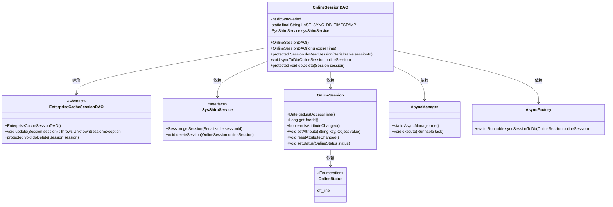
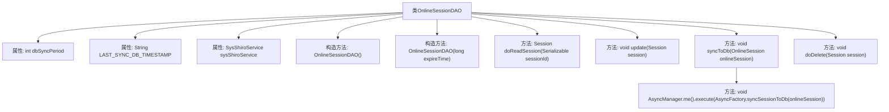

# 基础信息

|      |      |
|------|------|
| 名称 | OnlineSessionDAO |
| 编码语言 | .java |
| 代码路径 | RuoYi-main/ruoyi-framework/src/main/java/com/ruoyi/framework/shiro/session/OnlineSessionDAO.java |
| 包名 | com.ruoyi.framework.shiro.session |
| 依赖项 | ['java.io.Serializable', 'java.util.Date', 'org.apache.shiro.session.Session', 'org.apache.shiro.session.UnknownSessionException', 'org.apache.shiro.session.mgt.eis.EnterpriseCacheSessionDAO', 'org.springframework.beans.factory.annotation.Autowired', 'org.springframework.beans.factory.annotation.Value', 'com.ruoyi.common.enums.OnlineStatus', 'com.ruoyi.framework.manager.AsyncManager', 'com.ruoyi.framework.manager.factory.AsyncFactory', 'com.ruoyi.framework.shiro.service.SysShiroService'] |
| 概述说明 | OnlineSessionDAO类负责会话同步、删除、更新访问时间及处理过期和停止。 |

# 说明

OnlineSessionDAO类负责会话的同步与删除操作，定期将会话数据同步到数据库，同时更新会话的最后访问时间。此外，该类还处理会话的过期与停止逻辑，确保会话管理的高效性和一致性。

# 类列表 Class Summary

| 名称   | 类型  | 说明 |
|-------|------|-------------|
| OnlineSessionDAO | class | OnlineSessionDAO类管理会话同步与删除，定期同步会话至数据库，更新最后访问时间，处理会话过期与停止。 |

## 类 OnlineSessionDAO

|      |      |
|------|------|
| 访问范围 | public |
| 类型 | class |
| 名称 | OnlineSessionDAO |
| 说明 | OnlineSessionDAO类管理会话同步与删除，定期同步会话至数据库，更新最后访问时间，处理会话过期与停止。 |

### UML类图

**描述：**  
`OnlineSessionDAO` 继承自 `EnterpriseCacheSessionDAO`，负责管理在线会话的持久化操作。它通过 `SysShiroService` 接口与数据库交互，读取和删除会话。`OnlineSession` 类表示会话对象，包含会话的属性和状态。`OnlineSessionDAO` 使用 `AsyncManager` 和 `AsyncFactory` 异步将会话数据同步到数据库。`OnlineStatus` 枚举表示会话的状态，如离线状态。该设计确保了会话数据的高效管理和同步。

### 内部方法调用关系图

这段代码定义了一个`OnlineSessionDAO`类，用于管理在线会话的数据库同步和删除操作。类中包含多个方法，如`doReadSession`用于读取会话，`syncToDb`用于将会话同步到数据库，`doDelete`用于删除会话。代码通过检查时间差和会话属性变化来决定是否需要同步会话，并在必要时调用异步任务进行数据库同步。

### 字段列表 Field List

| 名称  | 类型  | 说明 |
|-------|-------|------|
| dbSyncPeriod | int | Shiro会话数据库同步周期配置项。 |
| LAST_SYNC_DB_TIMESTAMP = OnlineSessionDAO.class.getName() + "LAST_SYNC_DB_TIMESTAMP" | String | 定义常量LAST_SYNC_DB_TIMESTAMP，值为类名加“LAST_SYNC_DB_TIMESTAMP”。 |
| sysShiroService | SysShiroService | 自动注入SysShiroService实例。 |

### 方法列表 Method List

| 名称  | 类型  | 说明 |
|-------|-------|------|
| update | void | 重写update方法，调用父类更新会话处理。 |
| doDelete | void | 重写doDelete方法，删除在线会话并更新状态。 |
| syncToDb | void | 根据时间差和用户状态决定是否同步会话数据到数据库。 |
| doReadSession | Session | 重写方法读取会话信息。 |

