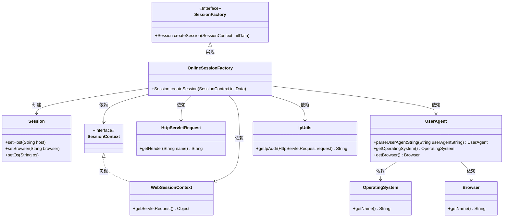
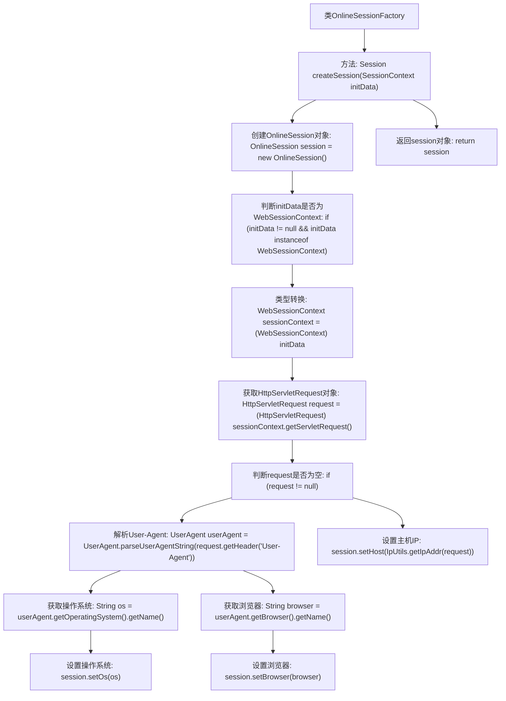

# 基础信息

|      |      |
|------|------|
| 名称 | OnlineSessionFactory |
| 编码语言 | .java |
| 代码路径 | RuoYi-main/ruoyi-framework/src/main/java/com/ruoyi/framework/shiro/session/OnlineSessionFactory.java |
| 包名 | com.ruoyi.framework.shiro.session |
| 依赖项 | ['javax.servlet.http.HttpServletRequest', 'org.apache.shiro.session.Session', 'org.apache.shiro.session.mgt.SessionContext', 'org.apache.shiro.session.mgt.SessionFactory', 'org.apache.shiro.web.session.mgt.WebSessionContext', 'org.springframework.stereotype.Component', 'com.ruoyi.common.utils.IpUtils', 'eu.bitwalker.useragentutils.UserAgent'] |
| 概述说明 | OnlineSessionFactory创建会话，解析用户代理，设置主机、浏览器和操作系统信息。 |

# 说明

OnlineSessionFactory负责创建在线会话，其核心功能包括解析用户代理信息，以确定用户使用的浏览器和操作系统类型，并据此设置相关的主机、浏览器和操作系统信息，确保会话环境与用户设备匹配。这一过程有助于优化用户体验，确保系统能够根据用户设备特性提供合适的服务。

# 类列表 Class Summary

| 名称   | 类型  | 说明 |
|-------|------|-------------|
| OnlineSessionFactory | class | OnlineSessionFactory创建会话，解析用户代理，设置主机、浏览器和操作系统信息。 |

## 类 OnlineSessionFactory

|      |      |
|------|------|
| 访问范围 | @Component;public |
| 类型 | class |
| 名称 | OnlineSessionFactory |
| 说明 | OnlineSessionFactory创建会话，解析用户代理，设置主机、浏览器和操作系统信息。 |

### UML类图

这段代码定义了一个`OnlineSessionFactory`类，实现了`SessionFactory`接口，用于创建`Session`对象。`OnlineSessionFactory`通过`SessionContext`获取`WebSessionContext`，进而获取`HttpServletRequest`，解析`User-Agent`字符串以获取客户端操作系统和浏览器信息，并将这些信息设置到`Session`对象中。类图展示了`OnlineSessionFactory`与其他类之间的依赖关系及其实现接口的层级结构。

### 内部方法调用关系图

这段代码的流程图展示了`OnlineSessionFactory`类中的`createSession`方法的执行流程。该方法首先创建一个`OnlineSession`对象，然后检查传入的`initData`是否为`WebSessionContext`类型。如果是，则获取`HttpServletRequest`对象，并从中解析`User-Agent`信息，获取客户端操作系统和浏览器名称，最后将这些信息设置到`session`对象中并返回。整个过程确保了会话对象的正确初始化和信息填充。

### 字段列表 Field List

| 名称  | 类型  | 说明 |
|-------|-------|------|

### 方法列表 Method List

| 名称  | 类型  | 说明 |
|-------|-------|------|
| createSession | Session | 重写createSession方法，根据请求信息设置会话的IP、浏览器和操作系统。 |

