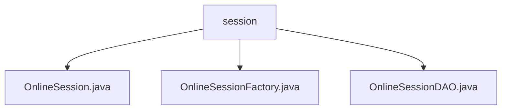

# 基础信息

|      |      |
|------|------|
| 名称 | session |
| 编码语言 | .java |
| 代码路径 | RuoYi-main/ruoyi-framework/src/main/java/com/ruoyi/framework/shiro/session |
| 包名 | RuoYi-main.ruoyi-framework.src.main.java.com.ruoyi.framework.shiro.session |
| 概述说明 | OnlineSession类管理在线会话，包含用户信息、设备信息和状态。OnlineSessionFactory创建会话，解析用户代理信息。OnlineSessionDAO同步和删除会话，处理过期逻辑。 |

# 说明

## 概述
该代码模块主要围绕在线会话管理展开，包含三个核心类：`OnlineSession`、`OnlineSessionFactory` 和 `OnlineSessionDAO`。`OnlineSession` 类用于存储和管理用户的在线会话信息，包括用户ID、名称、部门、头像、IP地址、浏览器类型、操作系统信息、在线状态等。`OnlineSessionFactory` 负责创建会话，并解析用户代理信息以确定用户设备和操作系统类型，从而优化用户体验。`OnlineSessionDAO` 则负责会话的同步、删除、过期和停止操作，确保会话数据的一致性和高效管理。

## 主要业务场景
1. **会话信息管理**：通过 `OnlineSession` 类，系统能够详细记录和跟踪用户的在线会话信息，包括用户身份、设备信息和在线状态等，便于会话的实时监控和管理。
2. **会话创建与设备适配**：`OnlineSessionFactory` 类通过解析用户代理信息，自动识别用户使用的浏览器和操作系统类型，确保会话环境与用户设备匹配，从而提供更优化的服务体验。
3. **会话同步与维护**：`OnlineSessionDAO` 类定期将会话数据同步到数据库，更新会话的最后访问时间，并处理会话的过期与停止逻辑，确保会话管理的高效性和数据一致性。
4. **会话生命周期管理**：该模块通过 `OnlineSessionDAO` 实现了会话的完整生命周期管理，包括会话的创建、同步、更新、过期和删除，确保系统能够高效地管理大量在线会话。

### 包内部结构视图

该流程图展示了`session`文件夹下的三个Java文件之间的层级关系。`session`作为父节点，包含`OnlineSession.java`、`OnlineSessionFactory.java`和`OnlineSessionDAO.java`三个子节点。每个子节点代表一个具体的Java文件，展示了它们在项目中的组织结构。

# 文件列表 File List

| 名称   | 类型  | 说明 |
|-------|------|-------------|
| [OnlineSessionFactory.java](OnlineSessionFactory.md) | file | OnlineSessionFactory创建会话，解析用户代理，设置主机、浏览器和操作系统信息。 |
| [OnlineSessionDAO.java](OnlineSessionDAO.md) | file | OnlineSessionDAO类负责会话同步、删除、更新访问时间及处理过期和停止。 |
| [OnlineSession.java](OnlineSession.md) | file | OnlineSession继承SimpleSession，记录用户信息、设备及在线状态。 |

