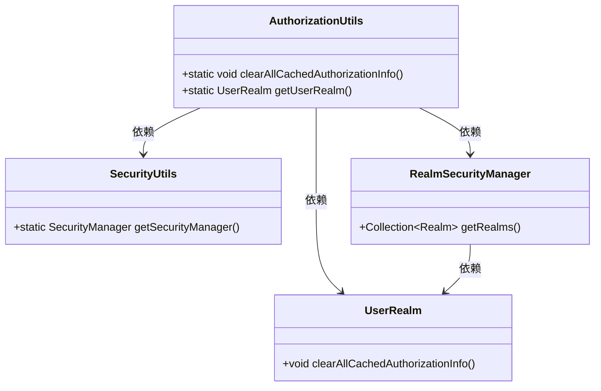
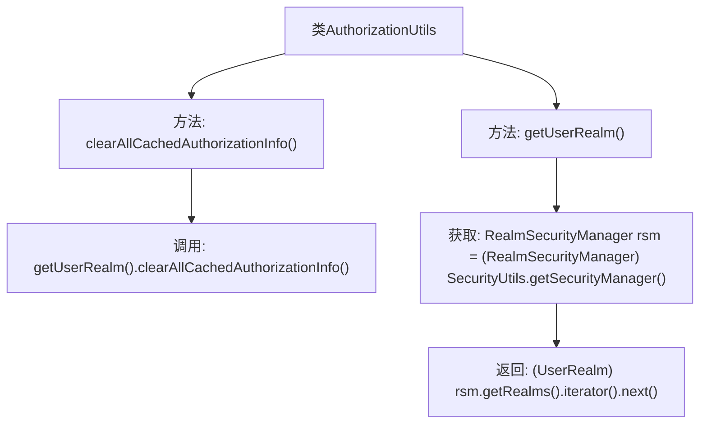

# 基础信息

|      |      |
|------|------|
| 名称 | AuthorizationUtils |
| 编码语言 | .java |
| 代码路径 | RuoYi-main/ruoyi-framework/src/main/java/com/ruoyi/framework/shiro/util/AuthorizationUtils.java |
| 包名 | com.ruoyi.framework.shiro.util |
| 依赖项 | ['org.apache.shiro.SecurityUtils', 'org.apache.shiro.mgt.RealmSecurityManager', 'com.ruoyi.framework.shiro.realm.UserRealm'] |
| 概述说明 | 清理用户授权缓存并获取自定义Realm。 |

# 说明

该操作涉及清理用户授权缓存，并获取自定义的Realm。清理用户授权缓存是为了确保系统在验证用户权限时使用最新的数据，避免因缓存过期或数据不一致导致的安全问题。获取自定义Realm则是为了使用特定的身份验证和授权逻辑，以满足系统对用户管理的特殊需求。这一过程有助于提升系统的安全性和灵活性，确保用户权限管理的准确性和高效性。

# 类列表 Class Summary

| 名称   | 类型  | 说明 |
|-------|------|-------------|
| AuthorizationUtils | class | 清理用户授权缓存并获取自定义Realm。 |

## 类 AuthorizationUtils

|      |      |
|------|------|
| 访问范围 | public |
| 类型 | class |
| 名称 | AuthorizationUtils |
| 说明 | 清理用户授权缓存并获取自定义Realm。 |

### UML类图

这段代码描述了一个授权工具类 `AuthorizationUtils`，它提供了清理所有用户授权信息缓存的功能。`AuthorizationUtils` 依赖于 `SecurityUtils` 获取安全管理器，并通过 `RealmSecurityManager` 获取自定义的 `UserRealm`，最终调用 `UserRealm` 的方法来清理缓存。整个流程展示了如何通过多层依赖关系来实现授权信息的清理操作。

### 内部方法调用关系图

这段代码定义了一个名为 `AuthorizationUtils` 的类，包含两个静态方法。`clearAllCachedAuthorizationInfo()` 方法用于清理所有用户授权信息缓存，它通过调用 `getUserRealm()` 方法获取 `UserRealm` 实例，并调用其 `clearAllCachedAuthorizationInfo()` 方法。`getUserRealm()` 方法通过 `SecurityUtils.getSecurityManager()` 获取 `RealmSecurityManager` 实例，并返回其第一个 `Realm` 实例。该代码主要用于管理和清理用户授权信息的缓存。

### 字段列表 Field List

| 名称  | 类型  | 说明 |
|-------|-------|------|

### 方法列表 Method List

| 名称  | 类型  | 说明 |
|-------|-------|------|
| clearAllCachedAuthorizationInfo | void | 清除所有缓存的授权信息。 |
| getUserRealm | UserRealm | 获取安全管理器中的第一个用户领域实例。 |

