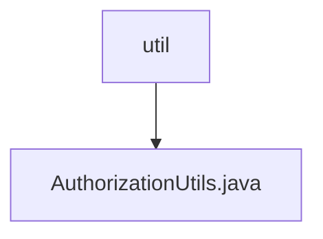

# 基础信息

|      |      |
|------|------|
| 名称 | util |
| 编码语言 | .java |
| 代码路径 | RuoYi-main/ruoyi-framework/src/main/java/com/ruoyi/framework/shiro/util |
| 包名 | RuoYi-main.ruoyi-framework.src.main.java.com.ruoyi.framework.shiro.util |
| 概述说明 | 清理用户授权缓存并获取自定义Realm。 |

# 说明

该操作涉及清理用户授权缓存，并获取自定义的Realm。清理用户授权缓存是为了确保系统在验证用户权限时使用最新的数据，避免因缓存过期或数据不一致导致的安全问题。获取自定义Realm则是为了使用特定的身份验证和授权逻辑，以满足系统对用户管理的特殊需求。这一过程有助于提升系统的安全性和灵活性，确保用户权限管理的准确性和高效性。

### 包内部结构视图

该流程图展示了路径的层级关系，`util`文件夹下包含一个文件`AuthorizationUtils.java`。路径结构简单，直接反映了文件夹与文件之间的包含关系，便于理解文件在项目中的位置和作用。

# 文件列表 File List

| 名称   | 类型  | 说明 |
|-------|------|-------------|
| [AuthorizationUtils.java](AuthorizationUtils.md) | file | 清理用户授权缓存并获取自定义Realm。 |

