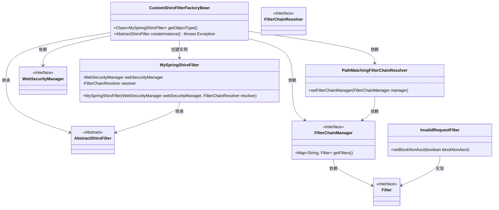

# 基础信息

|      |      |
|------|------|
| 名称 | CustomShiroFilterFactoryBean |
| 编码语言 | .java |
| 代码路径 | RuoYi-main/ruoyi-framework/src/main/java/com/ruoyi/framework/shiro/web/CustomShiroFilterFactoryBean.java |
| 包名 | com.ruoyi.framework.shiro.web |
| 依赖项 | ['org.apache.shiro.spring.web.ShiroFilterFactoryBean', 'org.apache.shiro.web.filter.InvalidRequestFilter', 'org.apache.shiro.web.filter.mgt.DefaultFilter', 'org.apache.shiro.web.filter.mgt.FilterChainManager', 'org.apache.shiro.web.filter.mgt.FilterChainResolver', 'org.apache.shiro.web.filter.mgt.PathMatchingFilterChainResolver', 'org.apache.shiro.web.mgt.WebSecurityManager', 'org.apache.shiro.web.servlet.AbstractShiroFilter', 'org.apache.shiro.mgt.SecurityManager', 'org.springframework.beans.factory.BeanInitializationException', 'javax.servlet.Filter', 'java.util.Map'] |
| 概述说明 | 自定义Shiro过滤器工厂类，重写实例创建方法，解决URL中文校验问题。 |

# 说明

自定义Shiro过滤器工厂类，通过重写创建实例方法，解决了URL中包含中文字符时的校验问题。该方法优化了过滤器的处理逻辑，确保在URL路径中存在中文时能够正确跳过校验，避免因字符编码问题导致的错误或异常。这一改进提升了系统的兼容性和稳定性，特别是在处理多语言环境下的URL请求时表现尤为显著。

# 类列表 Class Summary

| 名称   | 类型  | 说明 |
|-------|------|-------------|
| CustomShiroFilterFactoryBean | class | 自定义Shiro过滤器工厂类，重写创建实例方法，跳过URL中文校验bug。 |

## 类 CustomShiroFilterFactoryBean

|      |      |
|------|------|
| 访问范围 | public |
| 类型 | class |
| 名称 | CustomShiroFilterFactoryBean |
| 说明 | 自定义Shiro过滤器工厂类，重写创建实例方法，跳过URL中文校验bug。 |

### UML类图

### 描述
`CustomShiroFilterFactoryBean` 是一个扩展自 `ShiroFilterFactoryBean` 的类，负责创建 `MySpringShiroFilter` 实例。它通过 `createInstance` 方法初始化 `SecurityManager` 和 `FilterChainResolver`，并在创建过程中处理 `InvalidRequestFilter` 的配置。`MySpringShiroFilter` 是 `AbstractShiroFilter` 的具体实现，负责设置 `WebSecurityManager` 和 `FilterChainResolver`。

### 内部方法调用关系图

这段代码定义了一个`CustomShiroFilterFactoryBean`类，继承自`ShiroFilterFactoryBean`，并重写了`getObjectType`和`createInstance`方法。`createInstance`方法负责创建`MySpringShiroFilter`实例，期间会检查`SecurityManager`的合法性，创建并配置`FilterChainManager`和`PathMatchingFilterChainResolver`，并处理`InvalidRequestFilter`的配置。`MySpringShiroFilter`是一个内部类，负责初始化`WebSecurityManager`和`FilterChainResolver`。整个流程确保了Shiro过滤器的正确创建和配置。

### 字段列表 Field List

| 名称  | 类型  | 说明 |
|-------|-------|------|

### 方法列表 Method List

| 名称  | 类型  | 说明 |
|-------|-------|------|
| createInstance | AbstractShiroFilter | 创建ShiroFilter实例，检查SecurityManager并设置FilterChainResolver。 |
| getObjectType | Class<MySpringShiroFilter> | 重写方法返回MySpringShiroFilter类类型。 |

