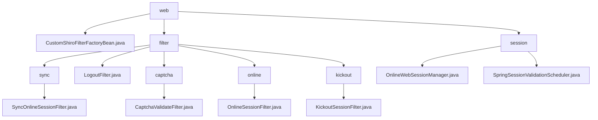

# 基础信息

|      |      |
|------|------|
| 名称 | web |
| 编码语言 | .java |
| 代码路径 | RuoYi-main/ruoyi-framework/src/main/java/com/ruoyi/framework/shiro/web |
| 包名 | RuoYi-main.ruoyi-framework.src.main.java.com.ruoyi.framework.shiro.web |
| 概述说明 | Shiro框架实现会话管理、验证码校验、用户退出等过滤器，提升系统安全性和稳定性。 |

# 说明

## 概述
该代码模块基于Shiro框架实现了一系列的过滤器，主要用于处理用户会话管理、验证码校验、用户退出操作等关键业务逻辑。通过这些过滤器，系统能够有效地维护在线会话信息、控制用户访问权限、确保验证码的正确性，并在用户退出时执行必要的清理和重定向操作。整体设计旨在提升系统的安全性、稳定性和用户体验。此外，模块还包含会话管理功能，通过实时监控、验证和清理会话，确保系统的高效运行和安全性。

## 主要业务场景
1. **在线会话同步**：`SyncOnlineSessionFilter`类负责将在线会话数据同步到数据库，确保每次请求过程中最多只进行一次数据同步，避免重复同步带来的性能开销和数据一致性问题。
2. **用户退出处理**：`LogoutFilter`类处理用户退出操作，包括记录日志、清理缓存，并将用户重定向到指定的URL，确保退出过程的安全性和可追踪性。
3. **验证码校验**：`CaptchaValidateFilter`类用于验证码验证，支持验证码的开关和类型设置，确保用户输入的验证码正确，提升系统的安全性。
4. **访问控制与会话管理**：`OnlineSessionFilter`类负责验证会话状态，并在拒绝访问时处理重定向操作，确保只有符合条件的会话能够继续访问。
5. **会话数量管理**：`KickoutSessionFilter`类用于管理用户会话数量，当会话数超过设定限制时，自动踢出最早的会话，并将用户重定向到指定页面，确保会话资源的合理分配和使用。
6. **会话管理**：通过 `OnlineWebSessionManager` 类，系统能够实时监控会话状态，标记会话属性的变化，并自动清理过期会话，确保会话数据的及时更新和资源的有效释放。
7. **会话验证**：通过 `SpringSessionValidationScheduler` 类，系统定时验证会话的有效性，确保会话在设定的时间间隔内进行有效性检查，防止无效或过期的会话占用系统资源。
8. **安全性保障**：通过会话监控和验证机制，系统能够及时发现和处理潜在的安全威胁，例如会话劫持或会话过期问题，从而保障系统的安全性。
9. **灵活配置**：开发者可以根据具体需求，灵活配置会话验证的频率和启用状态，以满足不同业务场景下的性能和安全要求。

通过这些过滤器和会话管理功能，系统能够高效地处理用户会话、验证码校验、用户退出等关键业务场景，确保系统的安全性和稳定性。

### 包内部结构视图

该流程图展示了RuoYi框架中`shiro`模块下的`web`目录结构及其子目录和文件的层级关系。`web`目录下包含`filter`、`session`以及`CustomShiroFilterFactoryBean.java`文件。`filter`目录进一步细分为`sync`、`captcha`、`online`和`kickout`子目录，每个子目录下都有对应的过滤器类。`session`目录下则包含`OnlineWebSessionManager.java`和`SpringSessionValidationScheduler.java`文件。

# 文件列表 File List

| 名称   | 类型  | 说明 |
|-------|------|-------------|
| [CustomShiroFilterFactoryBean.java](CustomShiroFilterFactoryBean.md) | file | 自定义Shiro过滤器工厂类，重写实例创建方法，解决URL中文校验问题。 |
| [session](session/_module.md) | package | OnlineWebSessionManager管理会话状态与验证，SpringSessionValidationScheduler定时检查会话有效性。 |
| [filter](filter/_module.md) | package | SyncOnlineSessionFilter同步会话数据，LogoutFilter处理退出，CaptchaValidateFilter验证验证码，OnlineSessionFilter管理访问，KickoutSessionFilter控制会话数量。 |

