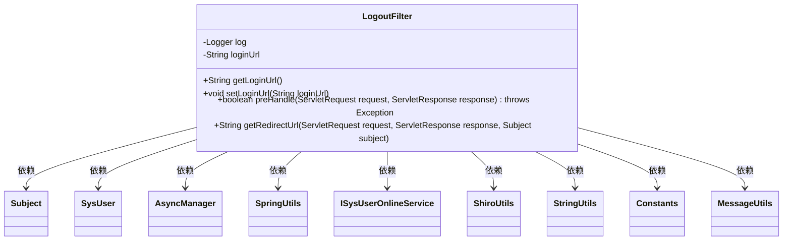
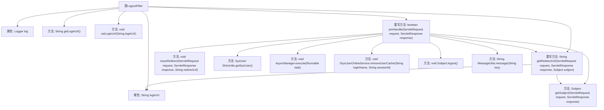

# 基础信息

|      |      |
|------|------|
| 名称 | LogoutFilter |
| 编码语言 | .java |
| 代码路径 | RuoYi-main/ruoyi-framework/src/main/java/com/ruoyi/framework/shiro/web/filter/LogoutFilter.java |
| 包名 | com.ruoyi.framework.shiro.web.filter |
| 依赖项 | ['javax.servlet.ServletRequest', 'javax.servlet.ServletResponse', 'org.apache.shiro.session.SessionException', 'org.apache.shiro.subject.Subject', 'org.slf4j.Logger', 'org.slf4j.LoggerFactory', 'com.ruoyi.common.constant.Constants', 'com.ruoyi.common.core.domain.entity.SysUser', 'com.ruoyi.common.utils.MessageUtils', 'com.ruoyi.common.utils.ShiroUtils', 'com.ruoyi.common.utils.StringUtils', 'com.ruoyi.common.utils.spring.SpringUtils', 'com.ruoyi.framework.manager.AsyncManager', 'com.ruoyi.framework.manager.factory.AsyncFactory', 'com.ruoyi.system.service.ISysUserOnlineService'] |
| 概述说明 | LogoutFilter处理用户退出，记录日志、清理缓存并重定向。 |

# 说明

LogoutFilter负责处理用户退出操作，包括记录日志、清理缓存，并将用户重定向到指定的URL。该过滤器确保在用户退出时，系统能够有效地执行相关清理任务，并记录必要的日志信息，以便后续审计和追踪。同时，通过重定向到指定URL，确保用户退出后能够安全地跳转到预期页面，提升用户体验和系统安全性。

# 类列表 Class Summary

| 名称   | 类型  | 说明 |
|-------|------|-------------|
| LogoutFilter | class | LogoutFilter处理用户退出，记录日志并清理缓存，重定向到指定URL。 |

## 类 LogoutFilter

|      |      |
|------|------|
| 访问范围 | public |
| 类型 | class |
| 名称 | LogoutFilter |
| 说明 | LogoutFilter处理用户退出，记录日志并清理缓存，重定向到指定URL。 |

### UML类图

**描述：**
`LogoutFilter` 类继承自 `org.apache.shiro.web.filter.authc.LogoutFilter`，用于处理用户退出登录的逻辑。它包含一个 `loginUrl` 属性，用于指定退出后重定向的地址。`preHandle` 方法负责处理退出请求，记录用户退出日志并清理缓存，最后重定向到指定地址。`getRedirectUrl` 方法用于获取重定向的URL，优先使用 `loginUrl`，如果为空则调用父类方法获取。该类依赖于多个工具类和服务类来完成其功能。

### 内部方法调用关系图

这段代码定义了一个`LogoutFilter`类，继承自`org.apache.shiro.web.filter.authc.LogoutFilter`，用于处理用户退出登录的逻辑。类中包含了对用户退出时的日志记录、缓存清理、会话注销以及重定向等功能。流程图展示了类中各个方法的调用关系，特别是`preHandle`方法在处理退出请求时的详细步骤。

### 字段列表 Field List

| 名称  | 类型  | 说明 |
|-------|-------|------|
| log = LoggerFactory.getLogger(LogoutFilter.class) | Logger | LogoutFilter类中定义了一个私有的静态日志记录器。 |
| loginUrl | String | 定义了一个私有字符串变量loginUrl。 |

### 方法列表 Method List

| 名称  | 类型  | 说明 |
|-------|-------|------|
| getLoginUrl | String | 获取登录URL的方法。 |
| preHandle | boolean | 处理用户退出登录，记录日志并清理缓存。 |
| getRedirectUrl | String | 重写方法，获取登录URL，非空则返回，否则调用父类方法。 |
| setLoginUrl | void | 设置登录URL的方法，将传入的loginUrl赋值给类变量。 |

