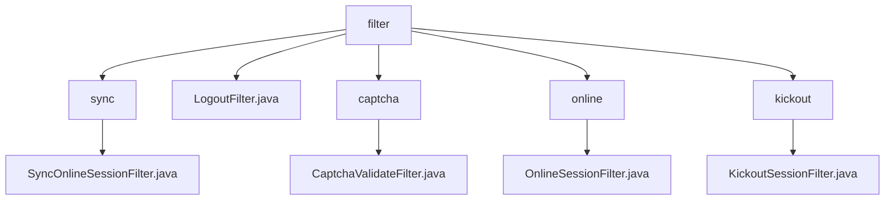

# 基础信息

|      |      |
|------|------|
| 名称 | filter |
| 编码语言 | .java |
| 代码路径 | RuoYi-main/ruoyi-framework/src/main/java/com/ruoyi/framework/shiro/web/filter |
| 包名 | RuoYi-main.ruoyi-framework.src.main.java.com.ruoyi.framework.shiro.web.filter |
| 概述说明 | SyncOnlineSessionFilter同步会话数据，LogoutFilter处理退出，CaptchaValidateFilter验证验证码，OnlineSessionFilter管理访问，KickoutSessionFilter控制会话数量。 |

# 说明

## 概述
该代码模块主要基于Shiro框架实现了一系列的过滤器，用于处理用户会话管理、验证码校验、用户退出操作等关键业务逻辑。通过这些过滤器，系统能够有效地维护在线会话信息、控制用户访问权限、确保验证码的正确性，并在用户退出时执行必要的清理和重定向操作。整体设计旨在提升系统的安全性、稳定性和用户体验。

## 主要业务场景
1. **在线会话同步**：`SyncOnlineSessionFilter`类负责将在线会话数据同步到数据库，确保每次请求过程中最多只进行一次数据同步，避免重复同步带来的性能开销和数据一致性问题。
2. **用户退出处理**：`LogoutFilter`类处理用户退出操作，包括记录日志、清理缓存，并将用户重定向到指定的URL，确保退出过程的安全性和可追踪性。
3. **验证码校验**：`CaptchaValidateFilter`类用于验证码验证，支持验证码的开关和类型设置，确保用户输入的验证码正确，提升系统的安全性。
4. **访问控制与会话管理**：`OnlineSessionFilter`类负责验证会话状态，并在拒绝访问时处理重定向操作，确保只有符合条件的会话能够继续访问。
5. **会话数量管理**：`KickoutSessionFilter`类用于管理用户会话数量，当会话数超过设定限制时，自动踢出最早的会话，并将用户重定向到指定页面，确保会话资源的合理分配和使用。

通过这些过滤器，系统能够高效地处理用户会话、验证码校验、用户退出等关键业务场景，确保系统的安全性和稳定性。

### 包内部结构视图

该流程图展示了RuoYi项目中`shiro`模块下`web/filter`目录的层级结构。`filter`作为根节点，包含了`sync`、`LogoutFilter.java`、`captcha`、`online`和`kickout`五个子节点。每个子节点进一步展开，展示了具体的过滤器类文件，如`SyncOnlineSessionFilter.java`、`CaptchaValidateFilter.java`等。通过该图可以清晰地看到各过滤器类在项目中的组织关系。

# 文件列表 File List

| 名称   | 类型  | 说明 |
|-------|------|-------------|
| [LogoutFilter.java](LogoutFilter.md) | file | LogoutFilter处理用户退出，记录日志、清理缓存并重定向。 |
| [kickout](kickout/_module.md) | package | KickoutSessionFilter控制会话数，超限踢出旧会话并重定向。 |
| [online](online/_module.md) | package | OnlineSessionFilter类管理访问控制，验证会话状态并处理拒绝访问的重定向。 |
| [captcha](captcha/_module.md) | package | CaptchaValidateFilter类用于验证码验证，支持开关和类型设置，校验表单提交。 |
| [sync](sync/_module.md) | package | SyncOnlineSessionFilter类利用Shiro过滤器同步在线会话数据至数据库，限制每次请求最多同步一次。 |

