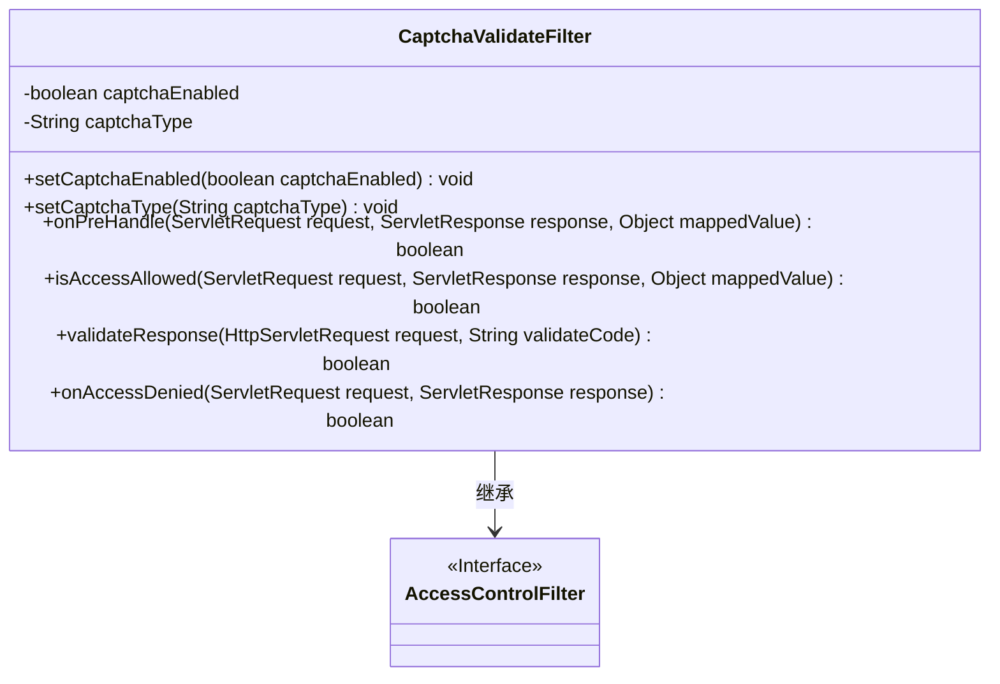

# 基础信息

|      |      |
|------|------|
| 名称 | CaptchaValidateFilter |
| 编码语言 | .java |
| 代码路径 | RuoYi-main/ruoyi-framework/src/main/java/com/ruoyi/framework/shiro/web/filter/captcha/CaptchaValidateFilter.java |
| 包名 | com.ruoyi.framework.shiro.web.filter.captcha |
| 依赖项 | ['javax.servlet.ServletRequest', 'javax.servlet.ServletResponse', 'javax.servlet.http.HttpServletRequest', 'org.apache.shiro.web.filter.AccessControlFilter', 'com.google.code.kaptcha.Constants', 'com.ruoyi.common.constant.ShiroConstants', 'com.ruoyi.common.utils.ShiroUtils', 'com.ruoyi.common.utils.StringUtils'] |
| 概述说明 | CaptchaValidateFilter类用于验证码验证，支持开关和类型设置，校验表单提交。 |

# 说明

CaptchaValidateFilter类是一个用于验证码验证的工具，支持验证码的开关和类型设置。其主要功能是在处理表单提交时进行验证码校验，确保用户输入的验证码正确。通过该类的配置，可以灵活地控制验证码的使用场景和验证方式，提升系统的安全性和用户体验。

# 类列表 Class Summary

| 名称   | 类型  | 说明 |
|-------|------|-------------|
| CaptchaValidateFilter | class | CaptchaValidateFilter类用于验证码验证，支持开关和类型设置，处理表单提交时进行验证码校验。 |

## 类 CaptchaValidateFilter

|      |      |
|------|------|
| 访问范围 | public |
| 类型 | class |
| 名称 | CaptchaValidateFilter |
| 说明 | CaptchaValidateFilter类用于验证码验证，支持开关和类型设置，处理表单提交时进行验证码校验。 |

### UML类图

这段代码定义了一个名为 `CaptchaValidateFilter` 的类，它继承自 `AccessControlFilter`。该类用于验证码验证，包含是否启用验证码、验证码类型等属性，并提供了设置这些属性的方法。主要功能包括在请求处理前设置验证码相关属性、检查访问是否允许、验证验证码是否正确以及在访问被拒绝时的处理逻辑。

### 内部方法调用关系图

```mermaid
graph TD
    A["类CaptchaValidateFilter"]
    B["属性: boolean captchaEnabled"]
    C["属性: String captchaType"]
    D["方法: setCaptchaEnabled(boolean captchaEnabled)"]
    E["方法: setCaptchaType(String captchaType)"]
    F["重写方法: onPreHandle(ServletRequest request, ServletResponse response, Object mappedValue)"]
    G["重写方法: isAccessAllowed(ServletRequest request, ServletResponse response, Object mappedValue)"]
    H["方法: validateResponse(HttpServletRequest request, String validateCode)"]
    I["重写方法: onAccessDenied(ServletRequest request, ServletResponse response)"]
    J["设置属性: request.setAttribute(ShiroConstants.CURRENT_ENABLED, captchaEnabled)"]
    K["设置属性: request.setAttribute(ShiroConstants.CURRENT_TYPE, captchaType)"]
    L["调用父类方法: super.onPreHandle(request, response, mappedValue)"]
    M["获取HttpServletRequest对象: HttpServletRequest httpServletRequest = (HttpServletRequest) request"]
    N["判断验证码是否禁用或不是表单提交: if (captchaEnabled == false || !'post'.equals(httpServletRequest.getMethod().toLowerCase()))"]
    O["返回true: return true"]
    P["调用验证方法: validateResponse(httpServletRequest, httpServletRequest.getParameter(ShiroConstants.CURRENT_VALIDATECODE))"]
    Q["获取会话中的验证码: Object obj = ShiroUtils.getSession().getAttribute(Constants.KAPTCHA_SESSION_KEY)"]
    R["清除会话中的验证码: request.getSession().removeAttribute(Constants.KAPTCHA_SESSION_KEY)"]
    S["判断验证码是否为空或不匹配: if (StringUtils.isEmpty(validateCode) || !validateCode.equalsIgnoreCase(code))"]
    T["返回false: return false"]
    U["返回true: return true"]
    V["设置属性: request.setAttribute(ShiroConstants.CURRENT_CAPTCHA, ShiroConstants.CAPTCHA_ERROR)"]
    W["返回true: return true"]

    A --> B
    A --> C
    A --> D
    A --> E
    A --> F
    A --> G
    A --> H
    A --> I
    F --> J
    F --> K
    F --> L
    G --> M
    G --> N
    N --> O
    N --> P
    H --> Q
    H --> R
    H --> S
    S --> T
    S --> U
    I --> V
    I --> W
```

该流程图展示了`CaptchaValidateFilter`类的主要方法和属性之间的调用关系。类中包含验证码的启用状态和类型设置方法，以及处理请求前、验证访问权限和验证码的具体逻辑。流程图详细描述了各个方法之间的调用顺序和条件判断，帮助理解代码的执行流程和逻辑结构。

### 字段列表 Field List

| 名称  | 类型  | 说明 |
|-------|-------|------|
| captchaEnabled = true | boolean | 启用了验证码功能。 |
| captchaType = "math" | String | 验证码类型设置为数学题。 |

### 方法列表 Method List

| 名称  | 类型  | 说明 |
|-------|-------|------|
| setCaptchaType | void | 设置验证码类型的方法。 |
| isAccessAllowed | boolean | 验证码禁用或非表单提交时允许访问，否则验证响应。 |
| onAccessDenied | boolean | 重写方法处理访问拒绝，设置当前验证码错误并返回真。 |
| validateResponse | boolean | 验证请求中的验证码，清除会话属性，返回验证结果。 |
| setCaptchaEnabled | void | 设置验证码启用状态的公共方法。 |
| onPreHandle | boolean | 重写onPreHandle方法，设置请求属性并调用父类方法。 |

