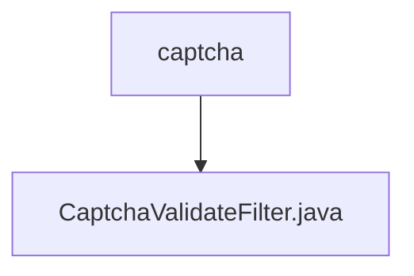

# 基础信息

|      |      |
|------|------|
| 名称 | captcha |
| 编码语言 | .java |
| 代码路径 | RuoYi-main/ruoyi-framework/src/main/java/com/ruoyi/framework/shiro/web/filter/captcha |
| 包名 | RuoYi-main.ruoyi-framework.src.main.java.com.ruoyi.framework.shiro.web.filter.captcha |
| 概述说明 | CaptchaValidateFilter类用于验证码验证，支持开关和类型设置，校验表单提交。 |

# 说明

CaptchaValidateFilter类是一个用于验证码验证的工具，支持验证码的开关和类型设置。其主要功能是在处理表单提交时进行验证码校验，确保用户输入的验证码正确。通过该类的配置，可以灵活地控制验证码的使用场景和验证方式，提升系统的安全性和用户体验。

### 包内部结构视图

该流程图展示了路径的层级关系，`captcha`文件夹包含一个名为`CaptchaValidateFilter.java`的文件。图中清晰地反映了文件夹与文件之间的从属关系，结构简洁明了。

# 文件列表 File List

| 名称   | 类型  | 说明 |
|-------|------|-------------|
| [CaptchaValidateFilter.java](CaptchaValidateFilter.md) | file | CaptchaValidateFilter类用于验证码验证，支持开关和类型设置，校验表单提交。 |

