# 基础信息

|      |      |
|------|------|
| 名称 | KickoutSessionFilter |
| 编码语言 | .java |
| 代码路径 | RuoYi-main/ruoyi-framework/src/main/java/com/ruoyi/framework/shiro/web/filter/kickout/KickoutSessionFilter.java |
| 包名 | com.ruoyi.framework.shiro.web.filter.kickout |
| 依赖项 | ['java.io.IOException', 'java.io.Serializable', 'java.util.ArrayDeque', 'java.util.Deque', 'javax.servlet.ServletRequest', 'javax.servlet.ServletResponse', 'javax.servlet.http.HttpServletRequest', 'javax.servlet.http.HttpServletResponse', 'org.apache.shiro.cache.Cache', 'org.apache.shiro.cache.CacheManager', 'org.apache.shiro.session.Session', 'org.apache.shiro.session.mgt.DefaultSessionKey', 'org.apache.shiro.session.mgt.SessionManager', 'org.apache.shiro.subject.Subject', 'org.apache.shiro.web.filter.AccessControlFilter', 'org.apache.shiro.web.util.WebUtils', 'com.fasterxml.jackson.databind.ObjectMapper', 'com.ruoyi.common.constant.ShiroConstants', 'com.ruoyi.common.core.domain.AjaxResult', 'com.ruoyi.common.core.domain.entity.SysUser', 'com.ruoyi.common.utils.ServletUtils', 'com.ruoyi.common.utils.ShiroUtils'] |
| 概述说明 | KickoutSessionFilter控制会话数，超限踢出旧会话并重定向。 |

# 说明

KickoutSessionFilter用于管理用户会话数量，当会话数超过设定限制时，系统会自动踢出最早的会话，并将用户重定向到指定页面，以确保会话资源的合理分配和使用。

# 类列表 Class Summary

| 名称   | 类型  | 说明 |
|-------|------|-------------|
| KickoutSessionFilter | class | KickoutSessionFilter控制用户会话数，超出时踢出旧会话并重定向。 |


## 类 KickoutSessionFilter

|      |      |
|------|------|
| 访问范围 | public |
| 类型 | class |
| 名称 | KickoutSessionFilter |
| 说明 | KickoutSessionFilter控制用户会话数，超出时踢出旧会话并重定向。 |


### UML类图

```mermaid
classDiagram
    class KickoutSessionFilter {
        -ObjectMapper objectMapper
        -int maxSession
        -Boolean kickoutAfter
        -String kickoutUrl
        -SessionManager sessionManager
        -Cache~String, Deque~Serializable~~ cache
        +KickoutSessionFilter()
        +void setMaxSession(int maxSession)
        +void setKickoutAfter(boolean kickoutAfter)
        +void setKickoutUrl(String kickoutUrl)
        +void setSessionManager(SessionManager sessionManager)
        +void setCacheManager(CacheManager cacheManager)
        +boolean isAccessAllowed(ServletRequest servletRequest, ServletResponse servletResponse, Object o)
        +boolean onAccessDenied(ServletRequest request, ServletResponse response)
        -boolean isAjaxResponse(ServletRequest request, ServletResponse response)
    }

    class AccessControlFilter {
        <<Interface>>
        +boolean isAccessAllowed(ServletRequest servletRequest, ServletResponse servletResponse, Object o)
        +boolean onAccessDenied(ServletRequest request, ServletResponse response)
    }

    class SessionManager {
        <<Interface>>
        +Session getSession(DefaultSessionKey key)
    }

    class Cache~K, V~ {
        <<Interface>>
        +V get(K key)
        +void put(K key, V value)
    }

    class CacheManager {
        <<Interface>>
        +Cache~K, V~ getCache(String name)
    }

    KickoutSessionFilter --> AccessControlFilter : 继承
    KickoutSessionFilter --> SessionManager : 依赖
    KickoutSessionFilter --> Cache~String, Deque~Serializable~~ : 依赖
    KickoutSessionFilter --> CacheManager : 依赖
```

**描述：**
`KickoutSessionFilter` 是一个用于控制用户会话的过滤器，继承自 `AccessControlFilter`。它通过 `SessionManager` 管理会话，并使用 `Cache` 来存储用户的会话队列。当用户会话数超过最大限制时，会根据配置踢出之前或之后登录的用户，并将用户重定向到指定的 `kickoutUrl`。该过滤器还支持处理 AJAX 请求，返回相应的错误信息。


### 内部方法调用关系图

```mermaid
graph TD
    A["类KickoutSessionFilter"]
    B["属性: ObjectMapper objectMapper"]
    C["属性: int maxSession"]
    D["属性: Boolean kickoutAfter"]
    E["属性: String kickoutUrl"]
    F["属性: SessionManager sessionManager"]
    G["属性: Cache<String, Deque<Serializable>> cache"]
    H["方法: boolean isAccessAllowed(ServletRequest, ServletResponse, Object)"]
    I["方法: boolean onAccessDenied(ServletRequest, ServletResponse)"]
    J["方法: boolean isAjaxResponse(ServletRequest, ServletResponse)"]
    K["方法: void setMaxSession(int)"]
    L["方法: void setKickoutAfter(boolean)"]
    M["方法: void setKickoutUrl(String)"]
    N["方法: void setSessionManager(SessionManager)"]
    O["方法: void setCacheManager(CacheManager)"]

    A --> B
    A --> C
    A --> D
    A --> E
    A --> F
    A --> G
    A --> H
    A --> I
    A --> J
    A --> K
    A --> L
    A --> M
    A --> N
    A --> O
```



这段代码定义了一个名为`KickoutSessionFilter`的类，用于控制用户会话的最大数量，并在超出限制时踢出用户。类中包含多个属性和方法，用于管理会话、缓存和处理踢出逻辑。`onAccessDenied`方法是核心逻辑，负责检查会话数量并执行踢出操作。`isAjaxResponse`方法用于处理Ajax请求的响应，而其他setter方法用于配置类的属性。

### 字段列表 Field List

| 名称  | 类型  | 说明 |
|-------|-------|------|
| maxSession = -1 | int | 最大会话数默认为-1。 |
| objectMapper = new ObjectMapper() | ObjectMapper | 声明并初始化一个私有的静态ObjectMapper对象。 |
| kickoutUrl | String | 私有字符串变量kickoutUrl。 |
| cache | Cache<String, Deque<Serializable>> | 私有缓存存储字符串到可序列化双端队列的映射。 |
| kickoutAfter = false | Boolean | 私有布尔变量kickoutAfter默认值为false。 |
| sessionManager | SessionManager | 私有SessionManager实例声明。 |

### 方法列表 Method List

| 名称  | 类型  | 说明 |
|-------|-------|------|
| setKickoutUrl | void | 设置踢出URL的方法。 |
| setMaxSession | void | 设置最大会话数量的方法。 |
| isAccessAllowed | boolean | 重写方法isAccessAllowed，始终返回false。 |
| setCacheManager | void | 设置缓存管理器，获取指定缓存。 |
| onAccessDenied | boolean | 处理用户会话超限，踢出旧会话并重定向。 |
| setSessionManager | void | 该方法用于设置会话管理器实例。 |
| isAjaxResponse | boolean | 方法判断请求是否为Ajax，是则返回错误信息，否则重定向。 |
| setKickoutAfter | void | 设置踢出后状态的方法。 |


