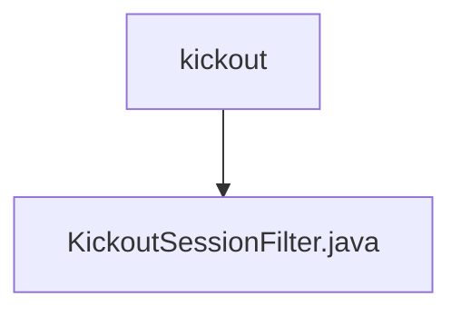

# 基础信息

|      |      |
|------|------|
| 名称 | kickout |
| 编码语言 | .java |
| 代码路径 | RuoYi-main/ruoyi-framework/src/main/java/com/ruoyi/framework/shiro/web/filter/kickout |
| 包名 | RuoYi-main.ruoyi-framework.src.main.java.com.ruoyi.framework.shiro.web.filter.kickout |
| 概述说明 | KickoutSessionFilter控制会话数，超限踢出旧会话并重定向。 |

# 说明

KickoutSessionFilter用于管理用户会话数量，当会话数超过设定限制时，系统会自动踢出最早的会话，并将用户重定向到指定页面，以确保会话资源的合理分配和使用。

### 包内部结构视图

该流程图展示了路径的层级关系，`kickout`文件夹包含一个文件`KickoutSessionFilter.java`。路径结构清晰，体现了文件夹与文件之间的从属关系，符合Mermaid格式的简洁表达方式。

# 文件列表 File List

| 名称   | 类型  | 说明 |
|-------|------|-------------|
| [KickoutSessionFilter.java](KickoutSessionFilter.md) | file | KickoutSessionFilter控制会话数，超限踢出旧会话并重定向。 |

