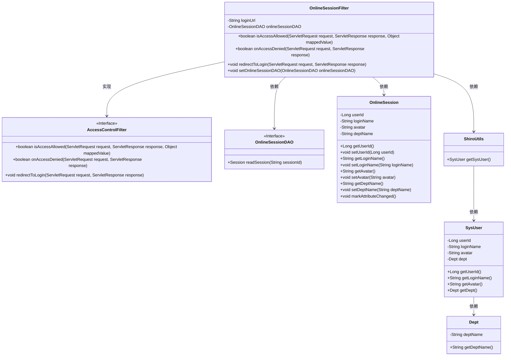
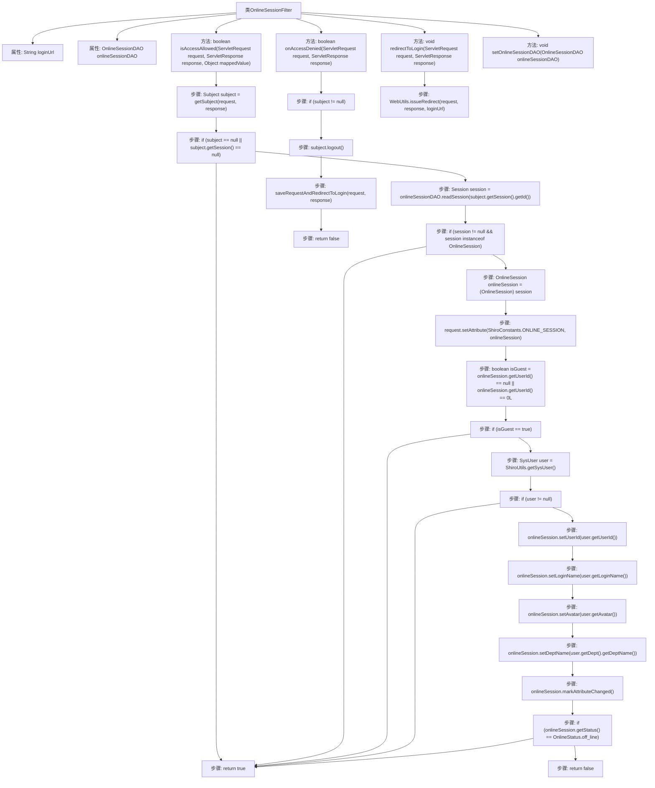

# 基础信息

|      |      |
|------|------|
| 名称 | OnlineSessionFilter |
| 编码语言 | .java |
| 代码路径 | RuoYi-main/ruoyi-framework/src/main/java/com/ruoyi/framework/shiro/web/filter/online/OnlineSessionFilter.java |
| 包名 | com.ruoyi.framework.shiro.web.filter.online |
| 依赖项 | ['java.io.IOException', 'javax.servlet.ServletRequest', 'javax.servlet.ServletResponse', 'org.apache.shiro.session.Session', 'org.apache.shiro.subject.Subject', 'org.apache.shiro.web.filter.AccessControlFilter', 'org.apache.shiro.web.util.WebUtils', 'org.springframework.beans.factory.annotation.Value', 'com.ruoyi.common.constant.ShiroConstants', 'com.ruoyi.common.core.domain.entity.SysUser', 'com.ruoyi.common.enums.OnlineStatus', 'com.ruoyi.common.utils.ShiroUtils', 'com.ruoyi.framework.shiro.session.OnlineSession', 'com.ruoyi.framework.shiro.session.OnlineSessionDAO'] |
| 概述说明 | OnlineSessionFilter类管理访问控制，验证会话状态并处理拒绝访问的重定向。 |

# 说明

OnlineSessionFilter类负责管理访问控制，验证会话状态，并在拒绝访问时处理重定向操作。该类的核心功能是确保只有符合条件的会话能够继续访问，同时在不满足条件时自动引导用户到指定页面。通过这种方式，OnlineSessionFilter类有效地维护了系统的安全性和用户体验。

# 类列表 Class Summary

| 名称   | 类型  | 说明 |
|-------|------|-------------|
| OnlineSessionFilter | class | OnlineSessionFilter类控制访问，验证会话状态并处理拒绝访问的重定向。 |

## 类 OnlineSessionFilter

|      |      |
|------|------|
| 访问范围 | public |
| 类型 | class |
| 名称 | OnlineSessionFilter |
| 说明 | OnlineSessionFilter类控制访问，验证会话状态并处理拒绝访问的重定向。 |

### UML类图

### 描述
`OnlineSessionFilter`类继承自`AccessControlFilter`接口，用于控制用户会话的访问权限。它通过`OnlineSessionDAO`读取会话信息，并根据会话状态决定是否允许访问。如果会话状态为离线，则拒绝访问并重定向到登录页。`ShiroUtils`用于获取系统用户信息，`SysUser`和`Dept`类分别表示用户和部门信息。`OnlineSession`类用于存储和管理在线会话的详细信息。

### 内部方法调用关系图

这段代码定义了一个名为 `OnlineSessionFilter` 的类，继承自 `AccessControlFilter`。它主要用于处理用户会话的访问控制逻辑。代码中包含两个主要方法：`isAccessAllowed` 和 `onAccessDenied`。`isAccessAllowed` 方法用于检查用户是否允许访问资源，如果用户会话不存在或用户是访客，则允许访问；如果用户会话状态为离线，则拒绝访问。`onAccessDenied` 方法在访问被拒绝时执行，会注销用户并重定向到登录页面。流程图展示了这些方法的执行流程及其内部逻辑。

### 字段列表 Field List

| 名称  | 类型  | 说明 |
|-------|-------|------|
| onlineSessionDAO | OnlineSessionDAO | 私有变量onlineSessionDAO用于管理在线会话数据。 |
| loginUrl | String | Shiro配置中定义了用户登录的URL地址。 |

### 方法列表 Method List

| 名称  | 类型  | 说明 |
|-------|-------|------|
| setOnlineSessionDAO | void | 设置在线会话数据访问对象。 |
| isAccessAllowed | boolean | 检查用户会话状态，更新在线会话信息，返回访问权限结果。 |
| onAccessDenied | boolean | 访问被拒时，用户登出并重定向至登录页面。 |
| redirectToLogin | void | 重写方法，重定向到登录页面。 |

