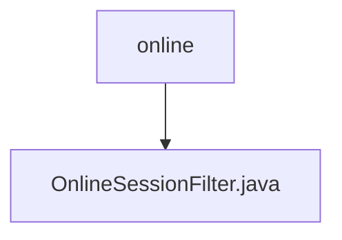

# 基础信息

|      |      |
|------|------|
| 名称 | online |
| 编码语言 | .java |
| 代码路径 | RuoYi-main/ruoyi-framework/src/main/java/com/ruoyi/framework/shiro/web/filter/online |
| 包名 | RuoYi-main.ruoyi-framework.src.main.java.com.ruoyi.framework.shiro.web.filter.online |
| 概述说明 | OnlineSessionFilter类管理访问控制，验证会话状态并处理拒绝访问的重定向。 |

# 说明

OnlineSessionFilter类负责管理访问控制，验证会话状态，并在拒绝访问时处理重定向操作。该类的核心功能是确保只有符合条件的会话能够继续访问，同时在不满足条件时自动引导用户到指定页面。通过这种方式，OnlineSessionFilter类有效地维护了系统的安全性和用户体验。

### 包内部结构视图

该流程图展示了路径的层级关系，`online`文件夹下包含一个名为`OnlineSessionFilter.java`的文件。这种结构常用于Java项目中，用于组织和管理与在线会话相关的过滤器代码。

# 文件列表 File List

| 名称   | 类型  | 说明 |
|-------|------|-------------|
| [OnlineSessionFilter.java](OnlineSessionFilter.md) | file | OnlineSessionFilter类管理访问控制，验证会话状态并处理拒绝访问的重定向。 |

