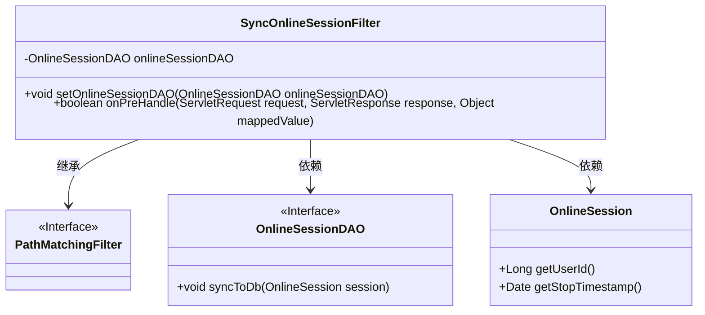
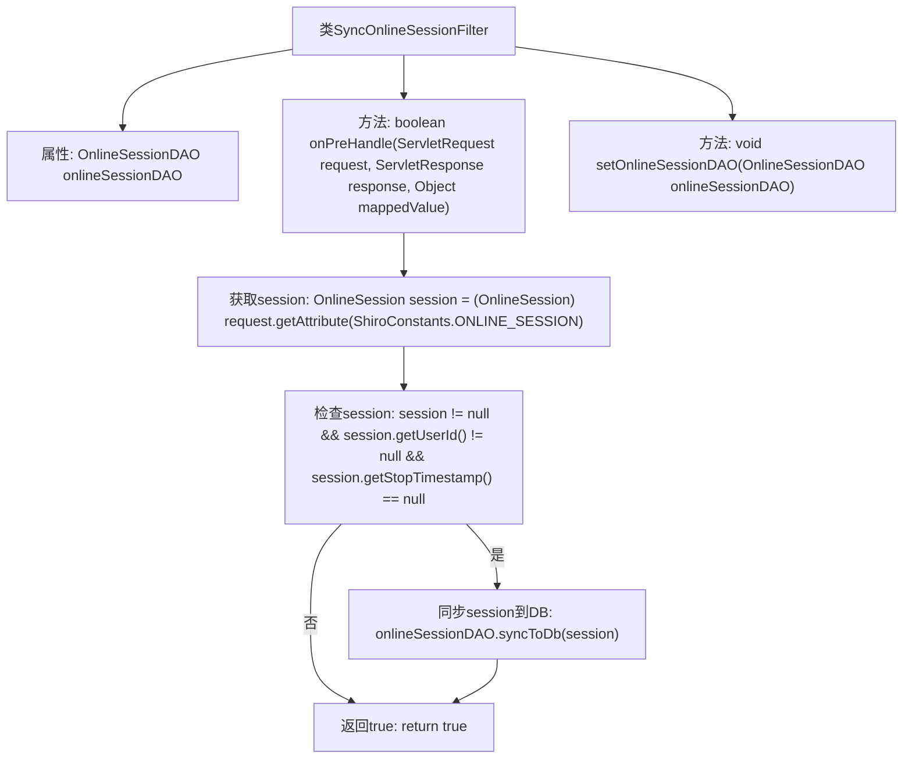

# 基础信息

|      |      |
|------|------|
| 名称 | SyncOnlineSessionFilter |
| 编码语言 | .java |
| 代码路径 | RuoYi-main/ruoyi-framework/src/main/java/com/ruoyi/framework/shiro/web/filter/sync/SyncOnlineSessionFilter.java |
| 包名 | com.ruoyi.framework.shiro.web.filter.sync |
| 依赖项 | ['javax.servlet.ServletRequest', 'javax.servlet.ServletResponse', 'org.apache.shiro.web.filter.PathMatchingFilter', 'com.ruoyi.common.constant.ShiroConstants', 'com.ruoyi.framework.shiro.session.OnlineSession', 'com.ruoyi.framework.shiro.session.OnlineSessionDAO'] |
| 概述说明 | SyncOnlineSessionFilter类利用Shiro过滤器同步在线会话数据至数据库，限制每次请求最多同步一次。 |

# 说明

SyncOnlineSessionFilter类利用Shiro过滤器机制，负责将在线会话数据同步到数据库。其主要功能是确保在每次请求过程中，最多只进行一次数据同步操作，从而避免重复同步带来的性能开销和数据一致性问题。通过这种方式，系统能够高效且准确地维护在线会话信息，提升整体系统的稳定性和响应速度。

# 类列表 Class Summary

| 名称   | 类型  | 说明 |
|-------|------|-------------|
| SyncOnlineSessionFilter | class | SyncOnlineSessionFilter类通过Shiro过滤器同步在线会话数据到数据库，确保每次请求最多同步一次。 |

## 类 SyncOnlineSessionFilter

|      |      |
|------|------|
| 访问范围 | public |
| 类型 | class |
| 名称 | SyncOnlineSessionFilter |
| 说明 | SyncOnlineSessionFilter类通过Shiro过滤器同步在线会话数据到数据库，确保每次请求最多同步一次。 |

### UML类图

这段代码展示了 `SyncOnlineSessionFilter` 类，它继承自 `PathMatchingFilter` 接口，并依赖于 `OnlineSessionDAO` 和 `OnlineSession` 类。`SyncOnlineSessionFilter` 的主要功能是在请求处理前同步在线会话数据到数据库，确保每次请求最多同步一次，避免过多处理。`OnlineSessionDAO` 接口提供了同步数据到数据库的方法，而 `OnlineSession` 类则包含了会话的用户ID和停止时间等属性。

### 内部方法调用关系图

这段代码定义了一个名为`SyncOnlineSessionFilter`的类，继承自`PathMatchingFilter`。该类的主要功能是在请求处理前同步会话数据到数据库。`onPreHandle`方法首先从请求中获取会话对象，然后检查会话是否有效且未停止，如果满足条件，则调用`onlineSessionDAO.syncToDb`方法将会话数据同步到数据库。整个过程通过流程图清晰地展示了各个步骤的执行顺序和条件判断。

### 字段列表 Field List

| 名称  | 类型  | 说明 |
|-------|-------|------|
| onlineSessionDAO | OnlineSessionDAO | 私有成员变量onlineSessionDAO用于在线会话数据访问。 |

### 方法列表 Method List

| 名称  | 类型  | 说明 |
|-------|-------|------|
| setOnlineSessionDAO | void | 设置在线会话数据访问对象。 |
| onPreHandle | boolean | 检查并同步在线会话数据到数据库。 |

