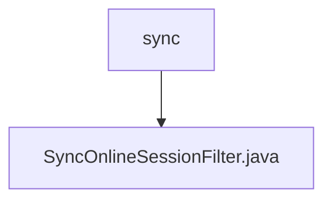

# 基础信息

|      |      |
|------|------|
| 名称 | sync |
| 编码语言 | .java |
| 代码路径 | RuoYi-main/ruoyi-framework/src/main/java/com/ruoyi/framework/shiro/web/filter/sync |
| 包名 | RuoYi-main.ruoyi-framework.src.main.java.com.ruoyi.framework.shiro.web.filter.sync |
| 概述说明 | SyncOnlineSessionFilter类利用Shiro过滤器同步在线会话数据至数据库，限制每次请求最多同步一次。 |

# 说明

SyncOnlineSessionFilter类利用Shiro过滤器机制，负责将在线会话数据同步到数据库。其主要功能是确保在每次请求过程中，最多只进行一次数据同步操作，从而避免重复同步带来的性能开销和数据一致性问题。通过这种方式，系统能够高效且准确地维护在线会话信息，提升整体系统的稳定性和响应速度。

### 包内部结构视图

该流程图展示了路径的层级关系，`sync` 是父节点，`SyncOnlineSessionFilter.java` 是其子节点。路径从 `sync` 文件夹指向具体的 `SyncOnlineSessionFilter.java` 文件，清晰地表示了文件在文件夹结构中的位置关系。

# 文件列表 File List

| 名称   | 类型  | 说明 |
|-------|------|-------------|
| [SyncOnlineSessionFilter.java](SyncOnlineSessionFilter.md) | file | SyncOnlineSessionFilter类利用Shiro过滤器同步在线会话数据至数据库，限制每次请求最多同步一次。 |

