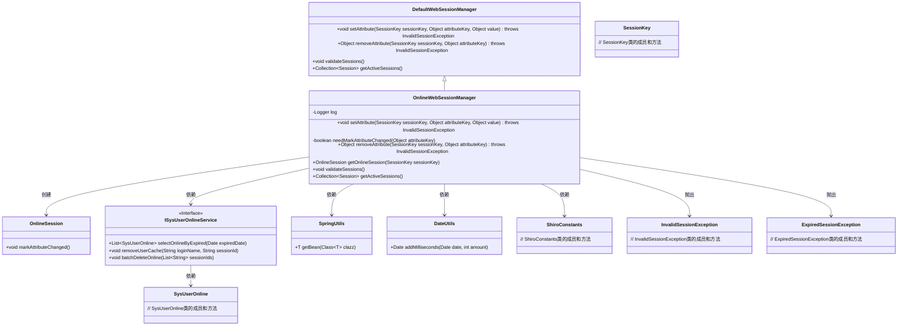
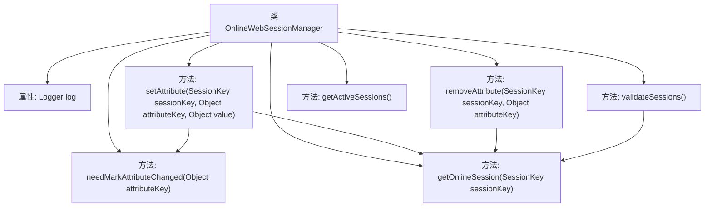
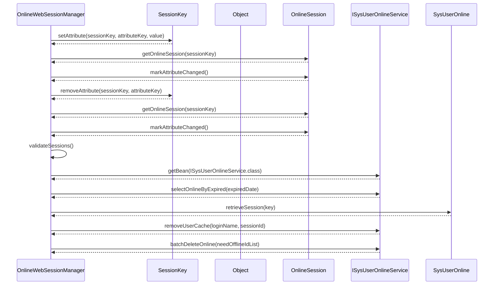

# 基础信息

|      |      |
|------|------|
| 名称 | OnlineWebSessionManager |
| 编码语言 | .java |
| 代码路径 | RuoYi-main/ruoyi-framework/src/main/java/com/ruoyi/framework/shiro/web/session/OnlineWebSessionManager.java |
| 包名 | com.ruoyi.framework.shiro.web.session |
| 依赖项 | ['java.util.ArrayList', 'java.util.Collection', 'java.util.Date', 'java.util.List', 'org.apache.commons.lang3.time.DateUtils', 'org.apache.shiro.session.ExpiredSessionException', 'org.apache.shiro.session.InvalidSessionException', 'org.apache.shiro.session.Session', 'org.apache.shiro.session.mgt.DefaultSessionKey', 'org.apache.shiro.session.mgt.SessionKey', 'org.apache.shiro.web.session.mgt.DefaultWebSessionManager', 'org.slf4j.Logger', 'org.slf4j.LoggerFactory', 'com.ruoyi.common.constant.ShiroConstants', 'com.ruoyi.common.utils.StringUtils', 'com.ruoyi.common.utils.bean.BeanUtils', 'com.ruoyi.common.utils.spring.SpringUtils', 'com.ruoyi.framework.shiro.session.OnlineSession', 'com.ruoyi.system.domain.SysUserOnline', 'com.ruoyi.system.service.ISysUserOnlineService'] |
| 概述说明 | OnlineWebSessionManager管理会话，标记属性，验证并删除过期会话。 |

# 说明

OnlineWebSessionManager负责管理在线会话，其主要功能包括监控会话状态，标记属性变化，进行会话验证，并自动删除已过期的会话，确保系统高效运行和安全性。

# 类列表 Class Summary

| 名称   | 类型  | 说明 |
|-------|------|-------------|
| OnlineWebSessionManager | class | OnlineWebSessionManager管理在线会话，标记属性变化，验证并删除过期会话。 |

## 类 OnlineWebSessionManager

|      |      |
|------|------|
| 访问范围 | public |
| 类型 | class |
| 名称 | OnlineWebSessionManager |
| 说明 | OnlineWebSessionManager管理在线会话，标记属性变化，验证并删除过期会话。 |

### UML类图

### 描述
`OnlineWebSessionManager` 类继承自 `DefaultWebSessionManager`，用于管理在线会话。它通过 `setAttribute` 和 `removeAttribute` 方法处理会话属性的设置和删除，并在必要时标记会话属性的更改。`validateSessions` 方法用于验证会话的有效性，并删除过期的会话。`getOnlineSession` 方法用于获取在线会话对象。该类依赖 `ISysUserOnlineService`、`SpringUtils`、`DateUtils` 等工具类和服务类来完成其功能，并可能抛出 `InvalidSessionException` 和 `ExpiredSessionException` 异常。

### 内部方法调用关系图

这段代码定义了一个名为`OnlineWebSessionManager`的类，继承自`DefaultWebSessionManager`，主要用于管理在线Web会话。它包含多个方法，如`setAttribute`、`removeAttribute`、`getOnlineSession`和`validateSessions`，用于处理会话属性的设置、删除、获取以及会话的有效性验证。`validateSessions`方法会检查并删除过期的会话，同时记录日志。代码通过调用`ISysUserOnlineService`服务来处理会话的批量删除和缓存清理。

### 字段列表 Field List

| 名称  | 类型  | 说明 |
|-------|-------|------|
| log = LoggerFactory.getLogger(OnlineWebSessionManager.class) | Logger | 在线Web会话管理器类中定义了一个静态日志实例。 |

### 方法列表 Method List

| 名称  | 类型  | 说明 |
|-------|-------|------|
| setAttribute | void | 重写setAttribute方法，设置属性并标记变更。 |
| getActiveSessions | Collection<Session> | 重写getActiveSessions方法，抛出不支持操作异常。 |
| validateSessions | void | 验证会话，处理过期会话，批量删除无效会话并记录日志。 |
| needMarkAttributeChanged | boolean | 该方法检查属性键是否需要标记更改，排除特定前缀和特定键。 |
| removeAttribute | Object | 重写方法移除会话属性，标记会话属性变更并返回移除值。 |
| getOnlineSession | OnlineSession | 获取在线会话：根据会话键查询并复制属性到新会话对象。 |

