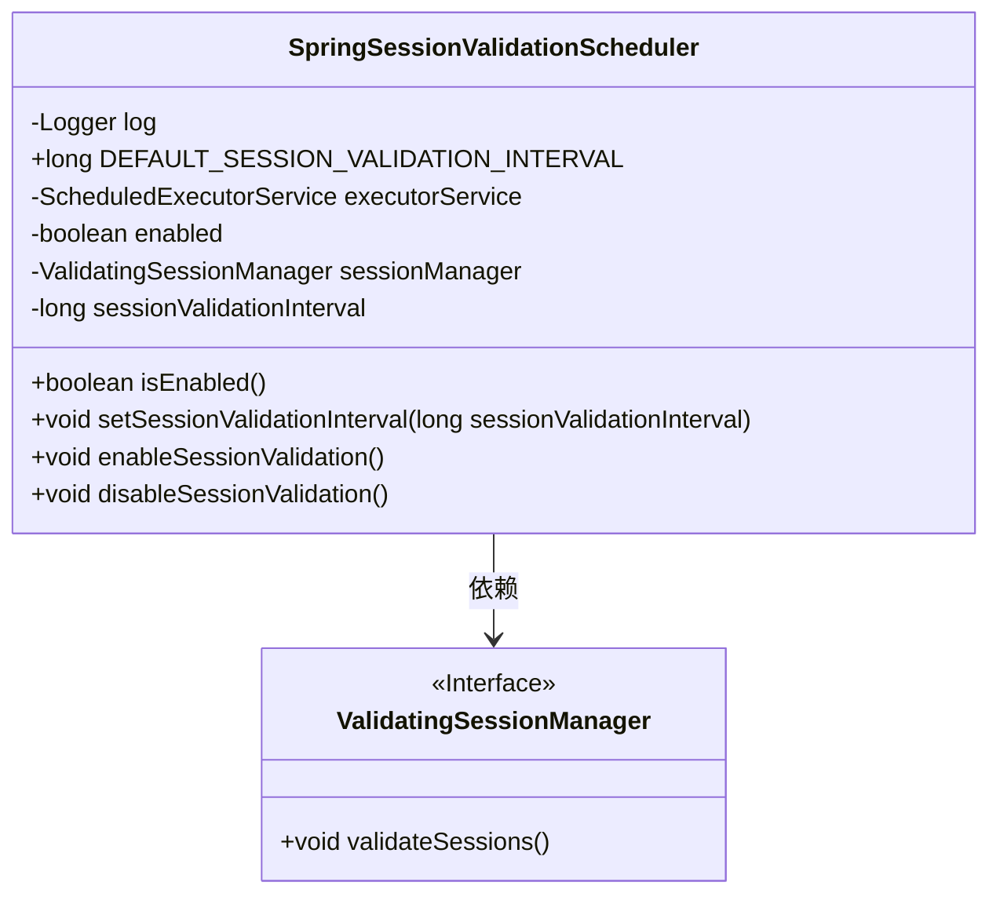
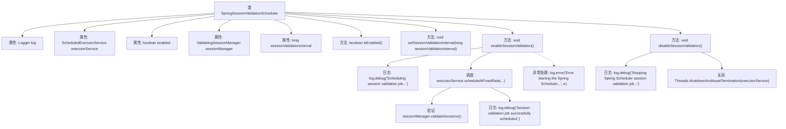

# 基础信息

|      |      |
|------|------|
| 名称 | SpringSessionValidationScheduler |
| 编码语言 | .java |
| 代码路径 | RuoYi-main/ruoyi-framework/src/main/java/com/ruoyi/framework/shiro/web/session/SpringSessionValidationScheduler.java |
| 包名 | com.ruoyi.framework.shiro.web.session |
| 依赖项 | ['java.util.concurrent.ScheduledExecutorService', 'java.util.concurrent.TimeUnit', 'org.apache.shiro.session.mgt.DefaultSessionManager', 'org.apache.shiro.session.mgt.SessionValidationScheduler', 'org.apache.shiro.session.mgt.ValidatingSessionManager', 'org.slf4j.Logger', 'org.slf4j.LoggerFactory', 'org.springframework.beans.factory.annotation.Autowired', 'org.springframework.beans.factory.annotation.Qualifier', 'org.springframework.beans.factory.annotation.Value', 'org.springframework.context.annotation.Lazy', 'org.springframework.stereotype.Component', 'com.ruoyi.common.utils.Threads'] |
| 概述说明 | SpringSessionValidationScheduler类定时验证会话有效性，支持启用和禁用功能。 |

# 说明

SpringSessionValidationScheduler类主要用于定时验证会话的有效性。该类的核心功能包括启用和禁用会话验证功能，确保会话在设定的时间间隔内进行有效性检查。通过这种方式，可以及时发现并处理无效或过期的会话，从而提高系统的安全性和稳定性。该类提供了灵活的配置选项，使开发者能够根据具体需求调整验证的频率和启用状态。

# 类列表 Class Summary

| 名称   | 类型  | 说明 |
|-------|------|-------------|
| SpringSessionValidationScheduler | class | SpringSessionValidationScheduler类用于定时验证会话有效性，支持启用和禁用验证功能。 |

## 类 SpringSessionValidationScheduler

|      |      |
|------|------|
| 访问范围 | @Component;public |
| 类型 | class |
| 名称 | SpringSessionValidationScheduler |
| 说明 | SpringSessionValidationScheduler类用于定时验证会话有效性，支持启用和禁用验证功能。 |

### UML类图

这段代码定义了一个 `SpringSessionValidationScheduler` 类，用于调度会话验证任务。该类依赖于 `ValidatingSessionManager` 接口来执行实际的会话验证操作。`SpringSessionValidationScheduler` 通过 `ScheduledExecutorService` 定期调用 `validateSessions` 方法，以确保会话的有效性。类中包含了启用和禁用会话验证的方法，并允许配置会话验证的时间间隔。

### 内部方法调用关系图

这段代码实现了一个Spring会话验证调度器，用于定期验证会话的有效性。代码通过`ScheduledExecutorService`调度任务，定期调用`sessionManager.validateSessions()`方法进行会话验证。`enableSessionValidation()`方法启动调度任务，`disableSessionValidation()`方法停止调度任务。代码中还包含详细的日志记录和异常处理机制，确保调度任务的稳定运行。

### 字段列表 Field List

| 名称  | 类型  | 说明 |
|-------|-------|------|
| log = LoggerFactory.getLogger(SpringSessionValidationScheduler.class) | Logger | SpringSessionValidationScheduler类中声明了静态日志对象。 |
| executorService | ScheduledExecutorService | 使用Autowired和Qualifier注入ScheduledExecutorService实例。 |
| enabled = false | boolean | 私有易变布尔变量enabled初始值为false。 |
| sessionManager | ValidatingSessionManager | 使用Autowired和Qualifier注入名为sessionManager的Lazy ValidatingSessionManager实例。 |
| DEFAULT_SESSION_VALIDATION_INTERVAL = DefaultSessionManager.DEFAULT_SESSION_VALIDATION_INTERVAL | long | 默认会话验证间隔等于DefaultSessionManager的默认值。 |
| sessionValidationInterval | long | Shiro会话验证间隔时间配置项。 |

### 方法列表 Method List

| 名称  | 类型  | 说明 |
|-------|-------|------|
| setSessionValidationInterval | void | 设置会话验证间隔时间的方法。 |
| disableSessionValidation | void | 停止Spring Scheduler会话验证任务并关闭执行服务。 |
| isEnabled | boolean | 该方法返回布尔值，表示当前对象是否启用。 |
| enableSessionValidation | void | 启用会话验证，使用Spring Scheduler定期执行，记录调试和错误信息。 |

