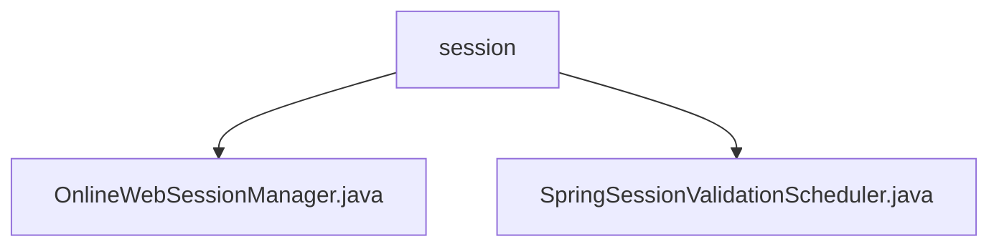

# 基础信息

|      |      |
|------|------|
| 名称 | session |
| 编码语言 | .java |
| 代码路径 | RuoYi-main/ruoyi-framework/src/main/java/com/ruoyi/framework/shiro/web/session |
| 包名 | RuoYi-main.ruoyi-framework.src.main.java.com.ruoyi.framework.shiro.web.session |
| 概述说明 | OnlineWebSessionManager管理会话状态与验证，SpringSessionValidationScheduler定时检查会话有效性。 |

# 说明

## 概述
该代码模块主要负责管理在线会话的监控、验证和清理，确保系统的高效运行和安全性。核心功能包括会话状态的监控、会话属性的变化标记、会话的有效性验证以及过期会话的自动删除。通过定时验证会话的有效性，模块能够及时发现并处理无效或过期的会话，从而提升系统的稳定性和安全性。

## 主要业务场景
1. **会话管理**：通过 `OnlineWebSessionManager` 类，系统能够实时监控会话状态，标记会话属性的变化，并自动清理过期会话，确保会话数据的及时更新和资源的有效释放。
2. **会话验证**：通过 `SpringSessionValidationScheduler` 类，系统定时验证会话的有效性，确保会话在设定的时间间隔内进行有效性检查，防止无效或过期的会话占用系统资源。
3. **安全性保障**：通过会话监控和验证机制，系统能够及时发现和处理潜在的安全威胁，例如会话劫持或会话过期问题，从而保障系统的安全性。
4. **灵活配置**：开发者可以根据具体需求，灵活配置会话验证的频率和启用状态，以满足不同业务场景下的性能和安全要求。

### 包内部结构视图

该流程图展示了路径中的层级关系，其中`session`文件夹包含两个文件：`OnlineWebSessionManager.java`和`SpringSessionValidationScheduler.java`。路径的层级关系清晰，仅使用最后一级元素作为节点名称，符合生成规则。

# 文件列表 File List

| 名称   | 类型  | 说明 |
|-------|------|-------------|
| [OnlineWebSessionManager.java](OnlineWebSessionManager.md) | file | OnlineWebSessionManager管理会话，标记属性，验证并删除过期会话。 |
| [SpringSessionValidationScheduler.java](SpringSessionValidationScheduler.md) | file | SpringSessionValidationScheduler类定时验证会话有效性，支持启用和禁用功能。 |

