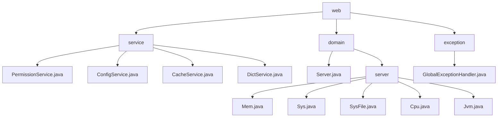

# 基础信息

|      |      |
|------|------|
| 名称 | web |
| 编码语言 | .java |
| 代码路径 | RuoYi-main/ruoyi-framework/src/main/java/com/ruoyi/framework/web |
| 包名 | RuoYi-main.ruoyi-framework.src.main.java.com.ruoyi.framework.web |
| 概述说明 | Java框架模块提供权限验证、配置管理、缓存操作、字典查询及资源监控功能，确保系统安全、高效运行。 |

# 说明

## 概述

该代码模块是一个基于Java的框架服务模块，主要由权限验证、配置管理、缓存操作、字典数据查询、服务器资源监控和全局异常处理等功能组成。模块中的各个服务类通过提供特定的功能接口，确保了系统的安全性、配置灵活性、缓存高效性、数据查询便捷性以及系统资源的全面监控和管理。这些服务类共同构成了系统的基础服务层，为上层业务逻辑提供了必要的支持。

## 主要业务场景

1. **权限验证**：`PermissionService`类负责验证用户的权限和角色，并根据验证结果返回相应的数据。这些数据被前端用于控制界面元素的显示与隐藏，确保用户只能访问和操作其权限范围内的功能，从而增强系统的安全性和用户体验。

2. **配置管理**：`ConfigService`类通过传入的`configKey`参数查询并获取相应的配置信息，返回与该键对应的值。该类专注于配置管理，确保系统能够高效地检索和使用参数配置，满足不同场景下的配置需求。

3. **缓存操作**：`CacheService`类提供了多种缓存操作功能，包括获取缓存的名称、键名、键值以及删除缓存。通过这些功能，`CacheService`类能够有效地管理和维护缓存数据，确保缓存系统的高效运行和数据一致性，提升系统的性能。

4. **字典数据查询**：`DictService`类是一个用于查询字典数据的工具，支持通过指定类型或键值来获取相关信息。该类提供了灵活的数据查询方式，用户可以根据具体需求选择按类型或键值进行信息检索，从而高效地获取所需数据，简化了数据查询的流程。

5. **服务器资源监控**：
   - **内存管理**：`Mem`类用于管理内存信息，包括内存总量、已用内存和剩余内存。通过该类，用户可以查询当前内存状态，并根据需要更新内存数据，从而有效监控和优化内存使用情况。
   - **服务器信息管理**：`Sys`类提供了对服务器名称、IP地址、项目路径、操作系统和系统架构等关键属性的管理功能。开发者可以通过该类轻松获取服务器的详细信息，确保系统配置和环境的一致性，提高开发效率和系统稳定性。
   - **文件系统管理**：`SysFile`类负责管理盘符路径、文件类型、文件大小以及资源使用率等信息。通过整合这些数据，用户可以全面监控和优化文件系统的资源使用情况。
   - **CPU 性能监控**：`CPU`类用于描述和监控 CPU 的状态和性能，包括核心数、总使用率、系统使用率、用户使用率、等待率和空闲率等。通过该类，用户可以全面了解 CPU 的性能表现，并进行相应的优化。
   - **JVM 状态监控**：`JVM`类提供了关于 Java 虚拟机的重要信息，如内存使用情况、JDK版本、文件路径、启动时间、运行时间以及运行时的参数配置。这些信息有助于开发者进行性能监控和问题排查，确保 JVM 的稳定运行。

6. **全局异常处理**：全局异常处理器负责捕获和处理各类异常，包括权限异常、请求方式异常、运行时异常、系统异常和业务异常等。当异常发生时，处理器会根据异常类型返回相应的错误信息或执行页面跳转，确保系统在遇到问题时能够提供清晰的反馈和适当的处理措施，从而提升用户体验和系统稳定性。

通过这些功能，该代码模块为系统提供了全面的基础服务支持，适用于需要安全性、配置管理、缓存优化、数据查询、资源监控和异常处理的各种业务场景。

### 包内部结构视图

该流程图展示了RuoYi框架中web模块的层级结构。web模块下包含service、domain和exception三个子模块。service模块下有四个服务类文件，domain模块下包含Server类和server子模块，server子模块下又包含五个与服务器相关的类文件。exception模块下包含一个全局异常处理类文件。

# 文件列表 File List

| 名称   | 类型  | 说明 |
|-------|------|-------------|
| [exception](exception/_module.md) | package | 全局异常处理器处理权限、请求、运行、系统及业务异常，返回错误信息或跳转页面。 |
| [domain](domain/_module.md) | package | Server类管理服务器核心资源，涵盖CPU、内存、JVM、磁盘等，提供监控与优化功能。 |
| [service](service/_module.md) | package | PermissionService验证权限，ConfigService获取配置，CacheService管理缓存，DictService查询字典数据。 |

