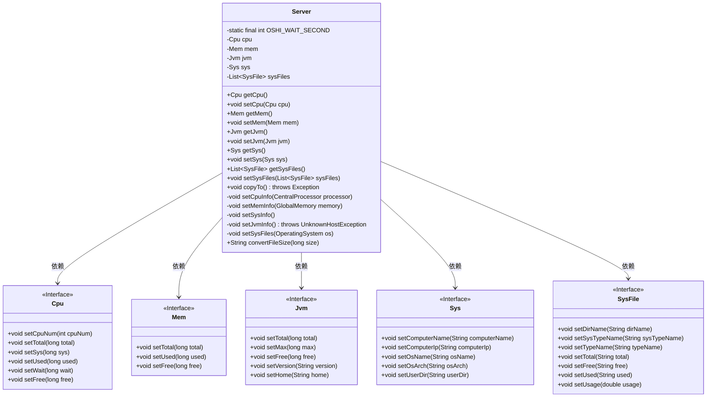

# 基础信息

|      |      |
|------|------|
| 名称 | Server |
| 编码语言 | .java |
| 代码路径 | RuoYi-main/ruoyi-framework/src/main/java/com/ruoyi/framework/web/domain/Server.java |
| 包名 | com.ruoyi.framework.web.domain |
| 依赖项 | ['java.net.UnknownHostException', 'java.util.LinkedList', 'java.util.List', 'java.util.Properties', 'com.ruoyi.common.utils.Arith', 'com.ruoyi.common.utils.IpUtils', 'com.ruoyi.framework.web.domain.server.Cpu', 'com.ruoyi.framework.web.domain.server.Jvm', 'com.ruoyi.framework.web.domain.server.Mem', 'com.ruoyi.framework.web.domain.server.Sys', 'com.ruoyi.framework.web.domain.server.SysFile', 'oshi.SystemInfo', 'oshi.hardware.CentralProcessor', 'oshi.hardware.CentralProcessor.TickType', 'oshi.hardware.GlobalMemory', 'oshi.hardware.HardwareAbstractionLayer', 'oshi.software.os.FileSystem', 'oshi.software.os.OSFileStore', 'oshi.software.os.OperatingSystem', 'oshi.util.Util'] |
| 概述说明 | Server类管理CPU、内存、JVM、服务器和磁盘信息，并提供获取和设置方法。 |

# 说明

Server类负责管理服务器的核心资源，包括CPU、内存、JVM、服务器本身以及磁盘信息。该类提供了一系列方法，用于获取和设置这些资源的相关数据和配置。通过Server类，用户可以监控和调整服务器的性能参数，确保系统运行在最佳状态。该类功能全面，涵盖了服务器资源管理的各个方面，是服务器管理的重要工具。

# 类列表 Class Summary

| 名称   | 类型  | 说明 |
|-------|------|-------------|
| Server | class | Server类管理CPU、内存、JVM、服务器和磁盘信息，提供相关获取和设置方法。 |

## 类 Server

|      |      |
|------|------|
| 访问范围 | public |
| 类型 | class |
| 名称 | Server |
| 说明 | Server类管理CPU、内存、JVM、服务器和磁盘信息，提供相关获取和设置方法。 |

### UML类图

这段代码定义了一个`Server`类，用于管理和获取服务器的各种信息，包括CPU、内存、JVM、系统和磁盘信息。`Server`类依赖于多个接口（`Cpu`、`Mem`、`Jvm`、`Sys`、`SysFile`），这些接口定义了设置和获取相关信息的抽象方法。`Server`类通过调用这些接口的实现类来获取和设置服务器的详细信息，并将这些信息存储在类的私有成员变量中。

### 内部方法调用关系图

```mermaid
graph TD
    A["类Server"]
    B["常量: int OSHI_WAIT_SECOND"]
    C["属性: Cpu cpu"]
    D["属性: Mem mem"]
    E["属性: Jvm jvm"]
    F["属性: Sys sys"]
    G["属性: List<SysFile> sysFiles"]
    H["方法: Cpu getCpu()"]
    I["方法: void setCpu(Cpu cpu)"]
    J["方法: Mem getMem()"]
    K["方法: void setMem(Mem mem)"]
    L["方法: Jvm getJvm()"]
    M["方法: void setJvm(Jvm jvm)"]
    N["方法: Sys getSys()"]
    O["方法: void setSys(Sys sys)"]
    P["方法: List<SysFile> getSysFiles()"]
    Q["方法: void setSysFiles(List<SysFile> sysFiles)"]
    R["方法: void copyTo()"]
    S["方法: void setCpuInfo(CentralProcessor processor)"]
    T["方法: void setMemInfo(GlobalMemory memory)"]
    U["方法: void setSysInfo()"]
    V["方法: void setJvmInfo()"]
    W["方法: void setSysFiles(OperatingSystem os)"]
    X["方法: String convertFileSize(long size)"]

    A --> B
    A --> C
    A --> D
    A --> E
    A --> F
    A --> G
    A --> H
    A --> I
    A --> J
    A --> K
    A --> L
    A --> M
    A --> N
    A --> O
    A --> P
    A --> Q
    A --> R
    R --> S
    R --> T
    R --> U
    R --> V
    R --> W
    A --> X
```

这段代码定义了一个`Server`类，用于管理服务器相关的信息，包括CPU、内存、JVM、系统信息和磁盘信息。类中包含了多个属性和方法，用于获取和设置这些信息。`copyTo`方法负责从系统硬件和操作系统中获取信息，并调用相应的私有方法设置到类的属性中。流程图展示了类中各个方法和属性之间的调用关系，帮助理解代码的执行流程。

### 字段列表 Field List

| 名称  | 类型  | 说明 |
|-------|-------|------|
| sys = new Sys() | Sys | 创建并初始化一个私有系统对象实例。 |
| jvm = new Jvm() | Jvm | 创建了一个名为jvm的Jvm类实例。 |
| OSHI_WAIT_SECOND = 1000 | int | 定义静态常量OSHI_WAIT_SECOND，值为1000。 |
| sysFiles = new LinkedList<SysFile>() | List<SysFile> | 创建一个私有链表`sysFiles`，用于存储`SysFile`对象。 |
| mem = new Mem() | Mem | 创建了一个名为mem的私有Mem类实例。 |
| cpu = new Cpu() | Cpu | 创建了一个私有的Cpu类实例。 |

### 方法列表 Method List

| 名称  | 类型  | 说明 |
|-------|-------|------|
| getCpu | Cpu | 获取CPU对象的方法。 |
| setJvm | void | 设置JVM实例。 |
| setSysFiles | void | 该方法用于设置系统文件列表。 |
| getSysFiles | List<SysFile> | 获取系统文件列表的方法。 |
| setCpu | void | 设置CPU对象为当前对象的CPU属性。 |
| setSysInfo | void | 方法获取系统信息并设置到sys对象中。 |
| getSys | Sys | 获取系统对象的公共方法。 |
| setJvmInfo | void | 获取并设置JVM内存信息和版本属性。 |
| getJvm | Jvm | 获取JVM实例的方法。 |
| getMem | Mem | 获取mem对象的公共方法。 |
| convertFileSize | String | 将文件大小转换为GB、MB、KB或B的字符串表示。 |
| setSys | void | 该方法用于设置系统对象。 |
| setCpuInfo | void | 获取CPU信息并计算各类时间差，设置CPU使用情况。 |
| setMemInfo | void | 设置内存信息，包括总量、已用和可用内存。 |
| copyTo | void | 该方法通过系统信息获取硬件数据，设置CPU、内存、系统、JVM及系统文件信息。 |
| setSysFiles | void | 该方法遍历操作系统文件系统，计算并存储每个文件存储的总空间、可用空间、已用空间及使用率。 |
| setMem | void | 该方法用于设置成员变量mem的值。 |

