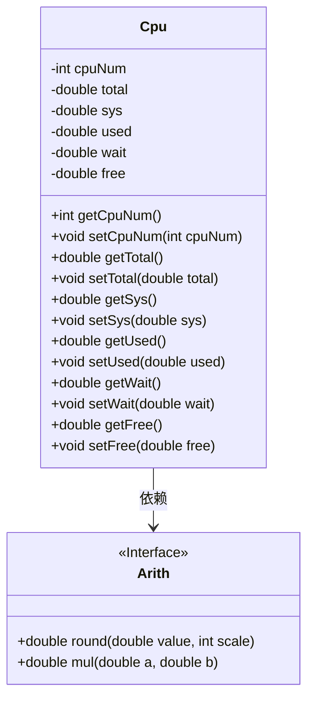

# 基础信息

|      |      |
|------|------|
| 名称 | Cpu |
| 编码语言 | .java |
| 代码路径 | RuoYi-main/ruoyi-framework/src/main/java/com/ruoyi/framework/web/domain/server/Cpu.java |
| 包名 | com.ruoyi.framework.web.domain.server |
| 依赖项 | ['com.ruoyi.common.utils.Arith'] |
| 概述说明 | CPU类包含核心数、使用率、系统使用率、用户使用率、等待率和空闲率等属性及方法。 |

# 说明

CPU类包含多个关键属性，用于描述CPU的状态和性能。这些属性包括核心数，表示CPU的核心数量；总使用率，反映CPU的整体使用情况；系统使用率，表示CPU用于系统操作的时间比例；用户使用率，表示CPU用于用户程序的时间比例；等待率，表示CPU等待I/O操作的时间比例；空闲率，表示CPU处于空闲状态的时间比例。此外，该类还提供了对应的方法，用于获取和操作这些属性，以便全面监控和管理CPU的性能。

# 类列表 Class Summary

| 名称   | 类型  | 说明 |
|-------|------|-------------|
| Cpu | class | CPU类包含核心数、总使用率、系统使用率、用户使用率、等待率和空闲率等属性及对应方法。 |

## 类 Cpu

|      |      |
|------|------|
| 访问范围 | public |
| 类型 | class |
| 名称 | Cpu |
| 说明 | CPU类包含核心数、总使用率、系统使用率、用户使用率、等待率和空闲率等属性及对应方法。 |

### UML类图

这段代码定义了一个 `Cpu` 类，用于表示 CPU 的核心数及其使用率信息。`Cpu` 类包含多个私有属性，如 `cpuNum`、`total`、`sys`、`used`、`wait` 和 `free`，分别表示 CPU 的核心数、总使用率、系统使用率、用户使用率、等待率和空闲率。类中还提供了这些属性的 getter 和 setter 方法，并在 getter 方法中调用了 `Arith` 类的 `round` 和 `mul` 方法来进行数值的舍入和乘法运算。`Arith` 类被标记为接口，提供了 `round` 和 `mul` 两个方法，`Cpu` 类依赖于 `Arith` 类来完成计算。

### 内部方法调用关系图

```mermaid
graph TD
    A["类Cpu"]
    B["属性: int cpuNum"]
    C["属性: double total"]
    D["属性: double sys"]
    E["属性: double used"]
    F["属性: double wait"]
    G["属性: double free"]
    H["方法: int getCpuNum()"]
    I["方法: void setCpuNum(int cpuNum)"]
    J["方法: double getTotal()"]
    K["方法: void setTotal(double total)"]
    L["方法: double getSys()"]
    M["方法: void setSys(double sys)"]
    N["方法: double getUsed()"]
    O["方法: void setUsed(double used)"]
    P["方法: double getWait()"]
    Q["方法: void setWait(double wait)"]
    R["方法: double getFree()"]
    S["方法: void setFree(double free)"]

    A --> B
    A --> C
    A --> D
    A --> E
    A --> F
    A --> G
    A --> H
    A --> I
    A --> J
    A --> K
    A --> L
    A --> M
    A --> N
    A --> O
    A --> P
    A --> Q
    A --> R
    A --> S
```

该流程图展示了`Cpu`类的结构及其属性和方法之间的关系。`Cpu`类包含多个属性，如`cpuNum`、`total`、`sys`、`used`、`wait`和`free`，分别表示CPU的核心数、总使用率、系统使用率、用户使用率、等待率和空闲率。类中还定义了相应的getter和setter方法，用于获取和设置这些属性的值。每个方法都与对应的属性相关联，确保数据的封装性和可访问性。

### 字段列表 Field List

| 名称  | 类型  | 说明 |
|-------|-------|------|
| cpuNum | int | 定义私有整型变量cpuNum。 |
| free | double | 定义了一个私有双精度浮点型变量free。 |
| used | double | 声明一个私有的双精度浮点数变量`used`。 |
| sys | double | 定义一个私有的双精度浮点型变量sys。 |
| wait | double | 声明了一个私有的双精度浮点型变量wait。 |
| total | double | 定义了一个私有的双精度浮点数变量total。 |

### 方法列表 Method List

| 名称  | 类型  | 说明 |
|-------|-------|------|
| getCpuNum | int | 该方法返回CPU数量。 |
| setSys | void | 设置系统变量sys的值。 |
| setWait | void | 设置等待时间的公共方法。 |
| setFree | void | 设置自由度的值为指定双精度浮点数。 |
| setTotal | void | 设置类中total属性的值。 |
| getSys | double | 该方法计算系统占用比例并四舍五入保留两位小数。 |
| getWait | double | 该方法计算并返回等待时间占总时间的百分比，结果保留两位小数。 |
| setCpuNum | void | 设置CPU数量的方法，参数为整数类型。 |
| setUsed | void | 定义方法setUsed，用于设置used属性的值。 |
| getUsed | double | 方法返回已使用资源占总资源的百分比，保留两位小数。 |
| getTotal | double | 该方法返回总金额乘以100后四舍五入保留两位小数的结果。 |
| getFree | double | 该方法计算并返回空闲资源占总资源的百分比，保留两位小数。 |

