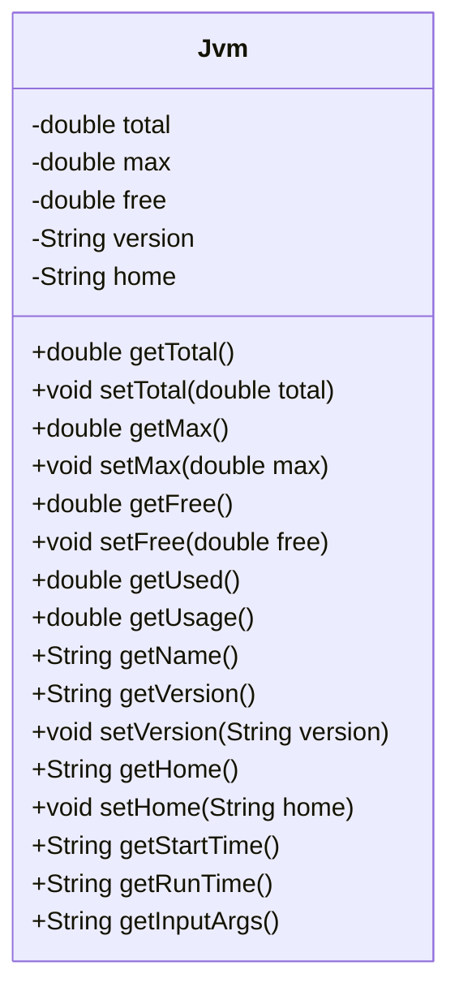

# 基础信息

|      |      |
|------|------|
| 名称 | Jvm |
| 编码语言 | .java |
| 代码路径 | RuoYi-main/ruoyi-framework/src/main/java/com/ruoyi/framework/web/domain/server/Jvm.java |
| 包名 | com.ruoyi.framework.web.domain.server |
| 依赖项 | ['java.lang.management.ManagementFactory', 'com.ruoyi.common.utils.Arith', 'com.ruoyi.common.utils.DateUtils'] |
| 概述说明 | JVM类涵盖内存、JDK版本、路径、启动时间、运行时间及参数等关键信息。 |

# 说明

JVM类包含了关于Java虚拟机的重要信息，涵盖了内存使用情况、JDK版本、文件路径、启动时间、运行时间以及运行时的参数配置。这些信息全面反映了JVM的运行状态和配置细节，有助于开发者进行性能监控和问题排查。

# 类列表 Class Summary

| 名称   | 类型  | 说明 |
|-------|------|-------------|
| Jvm | class | JVM类包含内存、JDK版本、路径、启动时间、运行时间及运行参数等信息。 |

## 类 Jvm

|      |      |
|------|------|
| 访问范围 | public |
| 类型 | class |
| 名称 | Jvm |
| 说明 | JVM类包含内存、JDK版本、路径、启动时间、运行时间及运行参数等信息。 |

### UML类图

这段代码定义了一个名为 `Jvm` 的类，用于管理和获取JVM（Java虚拟机）的相关信息。类中包含多个私有属性，如 `total`、`max`、`free`、`version` 和 `home`，分别表示JVM占用的内存总数、最大可用内存、空闲内存、JDK版本和JDK路径。类中提供了多个公有方法，用于获取和设置这些属性，并计算JVM的内存使用情况、运行时间、启动时间等信息。通过这些方法，可以方便地监控和管理JVM的运行状态。

### 内部方法调用关系图

```mermaid
graph TD
    A["类Jvm"]
    B["属性: double total"]
    C["属性: double max"]
    D["属性: double free"]
    E["属性: String version"]
    F["属性: String home"]
    G["方法: double getTotal()"]
    H["方法: void setTotal(double total)"]
    I["方法: double getMax()"]
    J["方法: void setMax(double max)"]
    K["方法: double getFree()"]
    L["方法: void setFree(double free)"]
    M["方法: double getUsed()"]
    N["方法: double getUsage()"]
    O["方法: String getName()"]
    P["方法: String getVersion()"]
    Q["方法: void setVersion(String version)"]
    R["方法: String getHome()"]
    S["方法: void setHome(String home)"]
    T["方法: String getStartTime()"]
    U["方法: String getRunTime()"]
    V["方法: String getInputArgs()"]

    A --> B
    A --> C
    A --> D
    A --> E
    A --> F
    A --> G
    A --> H
    A --> I
    A --> J
    A --> K
    A --> L
    A --> M
    A --> N
    A --> O
    A --> P
    A --> Q
    A --> R
    A --> S
    A --> T
    A --> U
    A --> V
```

这段代码定义了一个名为`Jvm`的类，用于管理和获取JVM（Java虚拟机）的相关信息，包括内存使用情况、JDK版本、路径、启动时间、运行时间以及运行参数等。类中包含了多个属性用于存储这些信息，并提供了相应的getter和setter方法来访问和修改这些属性。此外，还包含了一些计算方法，如`getUsed`和`getUsage`，用于计算已用内存和内存使用率。流程图展示了类`Jvm`的结构及其内部方法和属性之间的调用关系。

### 字段列表 Field List

| 名称  | 类型  | 说明 |
|-------|-------|------|
| total | double | 定义一个私有的双精度浮点数变量total。 |
| free | double | 定义了一个私有的双精度浮点数变量free。 |
| version | String | 定义了一个私有字符串变量version。 |
| home | String | 定义了一个私有字符串变量home。 |
| max | double | 定义了私有的双精度浮点数变量max。 |

### 方法列表 Method List

| 名称  | 类型  | 说明 |
|-------|-------|------|
| getVersion | String | 该方法返回版本字符串。 |
| setMax | void | 设置最大值为指定数值。 |
| getName | String | 获取Java虚拟机名称的方法。 |
| getStartTime | String | 获取服务器启动时间并格式化为字符串。 |
| setFree | void | 该方法用于设置变量free的值。 |
| getTotal | double | 该方法计算并返回总大小，单位转换为MB，保留两位小数。 |
| getInputArgs | String | 获取JVM启动参数并返回字符串形式。 |
| getMax | double | 该方法返回最大值的MB单位，保留两位小数。 |
| setVersion | void | 设置版本号的方法，将传入的版本字符串赋值给类成员变量。 |
| setHome | void | 设置对象的home属性为指定值。 |
| getFree | double | 该方法计算并返回以MB为单位的空闲内存大小，保留两位小数。 |
| getUsage | double | 该方法计算并返回资源使用率，公式为((总量-空闲量)/总量)*100，保留四位小数。 |
| setTotal | void | 设置总数值的方法，将传入的total赋值给类成员变量this.total。 |
| getRunTime | String | 获取当前时间与服务器启动时间的时间差。 |
| getUsed | double | 计算并返回已使用内存大小，保留两位小数。 |
| getHome | String | 该方法返回名为"home"的字符串变量值。 |

