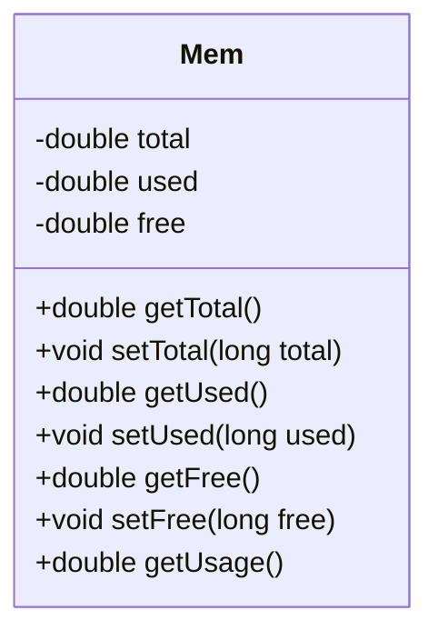
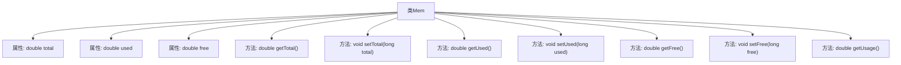

# 基础信息

|      |      |
|------|------|
| 名称 | Mem |
| 编码语言 | .java |
| 代码路径 | RuoYi-main/ruoyi-framework/src/main/java/com/ruoyi/framework/web/domain/server/Mem.java |
| 包名 | com.ruoyi.framework.web.domain.server |
| 依赖项 | ['com.ruoyi.common.utils.Arith'] |
| 概述说明 | Mem类管理内存总量、已用、剩余，提供获取和设置方法。 |

# 说明

Mem类用于管理内存信息，包含内存总量、已用内存和剩余内存的数据。该类提供了获取这些内存信息的方法，使用户能够查询当前内存状态。同时，Mem类还提供了设置内存信息的方法，允许用户根据需要更新内存数据。通过这些功能，Mem类能够有效地管理和监控内存使用情况，为系统或应用程序提供内存管理支持。

# 类列表 Class Summary

| 名称   | 类型  | 说明 |
|-------|------|-------------|
| Mem | class | Mem类管理内存信息，包含总量、已用和剩余内存，并提供获取和设置方法。 |

## 类 Mem

|      |      |
|------|------|
| 访问范围 | public |
| 类型 | class |
| 名称 | Mem |
| 说明 | Mem类管理内存信息，包含总量、已用和剩余内存，并提供获取和设置方法。 |

### UML类图

这段代码定义了一个 `Mem` 类，用于管理内存信息。类中包含三个私有属性：`total`（内存总量）、`used`（已用内存）和 `free`（剩余内存）。类提供了获取和设置这些属性的方法，并且通过 `Arith` 工具类对这些值进行转换和计算。`getUsage` 方法用于计算内存使用率。代码的主要功能是管理和计算内存的使用情况，并将结果以易于理解的格式返回。

### 内部方法调用关系图

这段代码定义了一个名为 `Mem` 的类，用于管理内存信息。类中包含三个私有属性：`total`（内存总量）、`used`（已用内存）和 `free`（剩余内存）。类提供了多个公有方法，包括获取和设置这些属性的方法，以及计算内存使用率的方法 `getUsage()`。所有获取方法都通过调用 `Arith` 类的 `div` 或 `mul` 方法对内存数据进行格式化处理，确保返回的值以 GB 为单位，并保留指定的小数位数。

### 字段列表 Field List

| 名称  | 类型  | 说明 |
|-------|-------|------|
| used | double | 声明了一个私有的双精度浮点型变量used。 |
| free | double | 定义一个私有的双精度浮点型变量free。 |
| total | double | 定义了一个私有双精度浮点型变量total。 |

### 方法列表 Method List

| 名称  | 类型  | 说明 |
|-------|-------|------|
| getFree | double | 该方法返回以GB为单位的空闲内存量，保留两位小数。 |
| setFree | void | 设置free属性的方法，接受长整型参数free。 |
| getTotal | double | 该方法返回总大小，单位为GB，保留两位小数。 |
| getUsed | double | 该方法计算并返回已用内存量，单位为GB，保留两位小数。 |
| setTotal | void | 设置总数值的方法，将传入的total赋值给类成员变量this.total。 |
| getUsage | double | 该方法计算资源使用率，返回使用量与总量的百分比。 |
| setUsed | void | 设置已使用量方法，将参数值赋给类变量。 |

