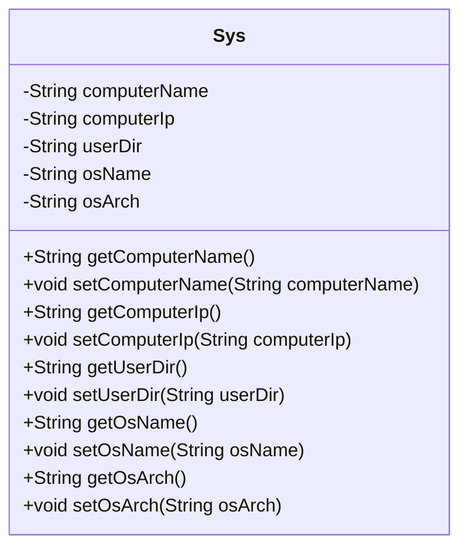

# 基础信息

|      |      |
|------|------|
| 名称 | Sys |
| 编码语言 | .java |
| 代码路径 | RuoYi-main/ruoyi-framework/src/main/java/com/ruoyi/framework/web/domain/server/Sys.java |
| 包名 | com.ruoyi.framework.web.domain.server |
| 依赖项 | [] |
| 概述说明 | Sys类包含服务器信息及系统架构的属性和方法。 |

# 说明

Sys类是一个用于管理服务器相关信息的类，包含了服务器名称、IP地址、项目路径、操作系统和系统架构等关键属性。该类还提供了相应的方法，用于获取和操作这些属性，以便在软件开发过程中方便地管理和访问服务器信息。通过Sys类，开发者可以轻松地获取服务器的详细信息，确保系统配置和环境的一致性，从而提高开发效率和系统稳定性。

# 类列表 Class Summary

| 名称   | 类型  | 说明 |
|-------|------|-------------|
| Sys | class | Sys类包含服务器名称、IP、项目路径、操作系统和系统架构的属性和方法。 |

## 类 Sys

|      |      |
|------|------|
| 访问范围 | public |
| 类型 | class |
| 名称 | Sys |
| 说明 | Sys类包含服务器名称、IP、项目路径、操作系统和系统架构的属性和方法。 |

### UML类图

**描述：**
`Sys` 类用于表示系统信息，包含服务器名称、服务器IP、项目路径、操作系统名称和系统架构等属性。类中提供了这些属性的获取和设置方法，通过这些方法可以访问和修改系统信息。该类主要用于封装和管理与系统相关的数据。

### 内部方法调用关系图

```mermaid
graph TD
    A["类Sys"]
    B["属性: String computerName"]
    C["属性: String computerIp"]
    D["属性: String userDir"]
    E["属性: String osName"]
    F["属性: String osArch"]
    G["方法: String getComputerName()"]
    H["方法: void setComputerName(String computerName)"]
    I["方法: String getComputerIp()"]
    J["方法: void setComputerIp(String computerIp)"]
    K["方法: String getUserDir()"]
    L["方法: void setUserDir(String userDir)"]
    M["方法: String getOsName()"]
    N["方法: void setOsName(String osName)"]
    O["方法: String getOsArch()"]
    P["方法: void setOsArch(String osArch)"]

    A --> B
    A --> C
    A --> D
    A --> E
    A --> F
    A --> G
    A --> H
    A --> I
    A --> J
    A --> K
    A --> L
    A --> M
    A --> N
    A --> O
    A --> P
```

这段代码定义了一个名为 `Sys` 的类，该类包含五个私有属性：`computerName`、`computerIp`、`userDir`、`osName` 和 `osArch`。每个属性都有对应的 `getter` 和 `setter` 方法，用于获取和设置这些属性的值。流程图展示了类 `Sys` 的结构及其属性和方法之间的关系，清晰地反映了类的设计。

### 字段列表 Field List

| 名称  | 类型  | 说明 |
|-------|-------|------|
| computerName | String | 声明了一个私有字符串变量computerName。 |
| osArch | String | 定义私有字符串变量`osArch`。 |
| computerIp | String | 定义私有字符串变量computerIp。 |
| osName | String | 声明了一个私有字符串变量osName。 |
| userDir | String | 私有字符串变量userDir定义。 |

### 方法列表 Method List

| 名称  | 类型  | 说明 |
|-------|-------|------|
| getUserDir | String | 获取用户目录路径的方法。 |
| getOsArch | String | 获取操作系统架构的字符串方法。 |
| getOsName | String | 获取操作系统名称的方法。 |
| getComputerIp | String | 获取计算机IP地址的方法。 |
| setOsName | void | 设置操作系统名称的方法。 |
| setComputerName | void | 设置计算机名称的方法。 |
| setOsArch | void | 该方法用于设置操作系统的架构属性。 |
| setComputerIp | void | 设置计算机IP地址的方法。 |
| setUserDir | void | 设置用户目录路径。 |
| getComputerName | String | 获取计算机名称的方法。 |

