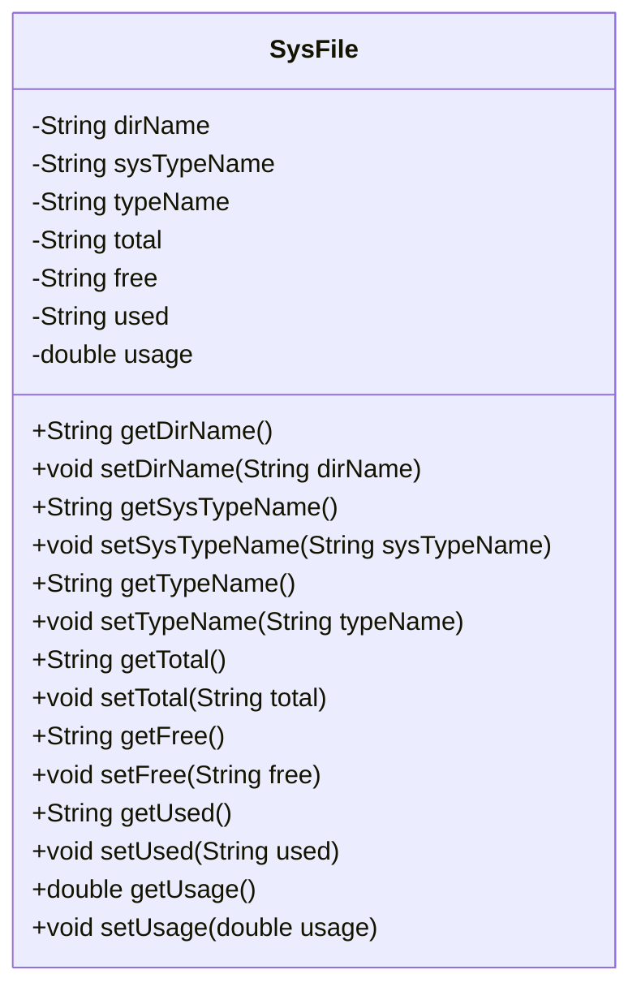

# 基础信息

|      |      |
|------|------|
| 名称 | SysFile |
| 编码语言 | .java |
| 代码路径 | RuoYi-main/ruoyi-framework/src/main/java/com/ruoyi/framework/web/domain/server/SysFile.java |
| 包名 | com.ruoyi.framework.web.domain.server |
| 依赖项 | [] |
| 概述说明 | SysFile类管理盘符路径、类型、文件类型、大小及资源使用率。 |

# 说明

SysFile类负责管理盘符路径、文件类型、文件大小以及资源使用率等相关信息。它通过整合这些关键数据，提供了对系统文件的全面管理功能，帮助用户有效监控和优化资源使用情况。

# 类列表 Class Summary

| 名称   | 类型  | 说明 |
|-------|------|-------------|
| SysFile | class | SysFile类管理盘符路径、类型、文件类型、大小及资源使用率等信息。 |

## 类 SysFile

|      |      |
|------|------|
| 访问范围 | public |
| 类型 | class |
| 名称 | SysFile |
| 说明 | SysFile类管理盘符路径、类型、文件类型、大小及资源使用率等信息。 |

### UML类图

**描述：**  
`SysFile` 类用于表示系统文件的相关信息，包含盘符路径、盘符类型、文件类型、总大小、剩余大小、已使用量以及资源使用率等属性。类中提供了每个属性的 `getter` 和 `setter` 方法，用于获取和设置这些属性的值。通过该类，可以方便地管理和操作与系统文件相关的数据。

### 内部方法调用关系图

```mermaid
graph TD
    A["类SysFile"]
    B["属性: String dirName"]
    C["属性: String sysTypeName"]
    D["属性: String typeName"]
    E["属性: String total"]
    F["属性: String free"]
    G["属性: String used"]
    H["属性: double usage"]
    I["方法: String getDirName()"]
    J["方法: void setDirName(String dirName)"]
    K["方法: String getSysTypeName()"]
    L["方法: void setSysTypeName(String sysTypeName)"]
    M["方法: String getTypeName()"]
    N["方法: void setTypeName(String typeName)"]
    O["方法: String getTotal()"]
    P["方法: void setTotal(String total)"]
    Q["方法: String getFree()"]
    R["方法: void setFree(String free)"]
    S["方法: String getUsed()"]
    T["方法: void setUsed(String used)"]
    U["方法: double getUsage()"]
    V["方法: void setUsage(double usage)"]

    A --> B
    A --> C
    A --> D
    A --> E
    A --> F
    A --> G
    A --> H
    A --> I
    A --> J
    A --> K
    A --> L
    A --> M
    A --> N
    A --> O
    A --> P
    A --> Q
    A --> R
    A --> S
    A --> T
    A --> U
    A --> V
```

该流程图展示了类 `SysFile` 的结构，包括其属性和方法。类 `SysFile` 包含多个属性，如 `dirName`、`sysTypeName`、`typeName` 等，以及相应的 `getter` 和 `setter` 方法。每个方法都与对应的属性相关联，用于获取或设置属性的值。这种结构使得类 `SysFile` 能够有效地管理和操作文件系统相关的数据。

### 字段列表 Field List

| 名称  | 类型  | 说明 |
|-------|-------|------|
| sysTypeName | String | 私有字符串变量sysTypeName。 |
| total | String | 定义一个私有的字符串变量total。 |
| dirName | String | 定义私有字符串变量dirName。 |
| usage | double | 私有双精度类型变量usage。 |
| used | String | 私有字符串变量声明。 |
| typeName | String | 定义私有字符串类型变量typeName。 |
| free | String | 私有字符串变量free声明。 |

### 方法列表 Method List

| 名称  | 类型  | 说明 |
|-------|-------|------|
| setSysTypeName | void | 设置系统类型名称的方法。 |
| setDirName | void | 设置目录名称的方法。 |
| setUsage | void | 设置usage值为传入参数。 |
| getSysTypeName | String | 获取系统类型名称的方法。 |
| getUsed | String | 该方法返回变量`used`的值。 |
| setTotal | void | 该方法用于设置总数值。 |
| getUsage | double | 获取使用率的方法，返回usage值。 |
| setFree | void | 该方法用于设置对象的free属性值。 |
| getFree | String | 该方法返回字符串类型的free变量值。 |
| getTypeName | String | 获取类型名称的方法，返回变量typeName。 |
| setUsed | void | 方法`setUsed`用于设置`used`变量的值。 |
| getDirName | String | 该方法返回dirName变量的值。 |
| setTypeName | void | 设置对象类型名称的方法。 |
| getTotal | String | 方法getTotal返回字符串类型的total变量。 |

