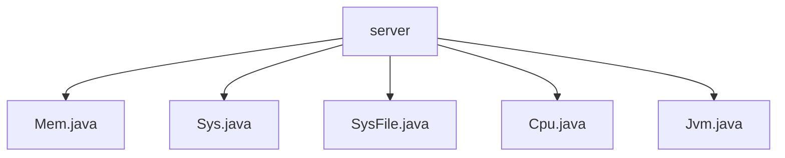

# 基础信息

|      |      |
|------|------|
| 名称 | server |
| 编码语言 | .java |
| 代码路径 | RuoYi-main/ruoyi-framework/src/main/java/com/ruoyi/framework/web/domain/server |
| 包名 | RuoYi-main.ruoyi-framework.src.main.java.com.ruoyi.framework.web.domain.server |
| 概述说明 | Mem类管理内存信息，Sys类管理服务器信息，SysFile类管理文件信息，CPU类监控CPU性能，JVM类监控JVM状态。 |

# 说明

## 概述

该代码模块主要用于管理和监控服务器及Java虚拟机的各项资源信息。通过多个类（如 `Mem`、`Sys`、`SysFile`、`CPU` 和 `JVM`），模块提供了对内存、服务器信息、文件系统、CPU 和 JVM 状态的全面管理功能。这些类分别负责收集、存储和操作相关数据，为系统或应用程序提供了详细的资源监控和管理支持。

## 主要业务场景

1. **内存管理**：`Mem` 类用于管理内存信息，包括内存总量、已用内存和剩余内存。通过该类，用户可以查询当前内存状态，并根据需要更新内存数据，从而有效监控和优化内存使用情况。

2. **服务器信息管理**：`Sys` 类提供了对服务器名称、IP地址、项目路径、操作系统和系统架构等关键属性的管理功能。开发者可以通过该类轻松获取服务器的详细信息，确保系统配置和环境的一致性，提高开发效率和系统稳定性。

3. **文件系统管理**：`SysFile` 类负责管理盘符路径、文件类型、文件大小以及资源使用率等信息。通过整合这些数据，用户可以全面监控和优化文件系统的资源使用情况。

4. **CPU 性能监控**：`CPU` 类用于描述和监控 CPU 的状态和性能，包括核心数、总使用率、系统使用率、用户使用率、等待率和空闲率等。通过该类，用户可以全面了解 CPU 的性能表现，并进行相应的优化。

5. **JVM 状态监控**：`JVM` 类提供了关于 Java 虚拟机的重要信息，如内存使用情况、JDK版本、文件路径、启动时间、运行时间以及运行时的参数配置。这些信息有助于开发者进行性能监控和问题排查，确保 JVM 的稳定运行。

通过这些功能，该代码模块为服务器和 Java 虚拟机的资源管理提供了全面的支持，适用于需要监控和优化系统资源的各种业务场景。

### 包内部结构视图

该流程图展示了在`server`目录下的五个Java文件：`Mem.java`、`Sys.java`、`SysFile.java`、`Cpu.java`和`Jvm.java`。这些文件均位于`server`目录下，且彼此之间没有进一步的层级关系，直接隶属于`server`目录。

# 文件列表 File List

| 名称   | 类型  | 说明 |
|-------|------|-------------|
| [Jvm.java](Jvm.md) | file | JVM类涵盖内存、JDK版本、路径、启动时间、运行时间及参数等关键信息。 |
| [Mem.java](Mem.md) | file | Mem类管理内存总量、已用、剩余，提供获取和设置方法。 |
| [Cpu.java](Cpu.md) | file | CPU类包含核心数、使用率、系统使用率、用户使用率、等待率和空闲率等属性及方法。 |
| [SysFile.java](SysFile.md) | file | SysFile类管理盘符路径、类型、文件类型、大小及资源使用率。 |
| [Sys.java](Sys.md) | file | Sys类包含服务器信息及系统架构的属性和方法。 |

