# 基础信息

|      |      |
|------|------|
| 名称 | GlobalExceptionHandler |
| 编码语言 | .java |
| 代码路径 | RuoYi-main/ruoyi-framework/src/main/java/com/ruoyi/framework/web/exception/GlobalExceptionHandler.java |
| 包名 | com.ruoyi.framework.web.exception |
| 依赖项 | ['javax.servlet.http.HttpServletRequest', 'org.apache.shiro.authz.AuthorizationException', 'org.slf4j.Logger', 'org.slf4j.LoggerFactory', 'org.springframework.validation.BindException', 'org.springframework.web.HttpRequestMethodNotSupportedException', 'org.springframework.web.bind.MissingPathVariableException', 'org.springframework.web.bind.annotation.ExceptionHandler', 'org.springframework.web.bind.annotation.RestControllerAdvice', 'org.springframework.web.method.annotation.MethodArgumentTypeMismatchException', 'org.springframework.web.servlet.ModelAndView', 'com.ruoyi.common.core.domain.AjaxResult', 'com.ruoyi.common.core.text.Convert', 'com.ruoyi.common.exception.DemoModeException', 'com.ruoyi.common.exception.ServiceException', 'com.ruoyi.common.utils.ServletUtils', 'com.ruoyi.common.utils.StringUtils', 'com.ruoyi.common.utils.html.EscapeUtil', 'com.ruoyi.common.utils.security.PermissionUtils'] |
| 概述说明 | 全局异常处理器处理权限、请求、运行、系统及业务异常，返回错误信息或跳转页面。 |

# 说明

全局异常处理器负责捕获和处理各类异常，包括权限异常、请求方式异常、运行时异常、系统异常和业务异常等。当异常发生时，处理器会根据异常类型返回相应的错误信息或执行页面跳转，确保系统在遇到问题时能够提供清晰的反馈和适当的处理措施，从而提升用户体验和系统稳定性。

# 类列表 Class Summary

| 名称   | 类型  | 说明 |
|-------|------|-------------|
| GlobalExceptionHandler | class | 全局异常处理器，处理权限、请求方式、运行时、系统、业务等异常，返回错误信息或跳转页面。 |

## 类 GlobalExceptionHandler

|      |      |
|------|------|
| 访问范围 | @RestControllerAdvice;public |
| 类型 | class |
| 名称 | GlobalExceptionHandler |
| 说明 | 全局异常处理器，处理权限、请求方式、运行时、系统、业务等异常，返回错误信息或跳转页面。 |

### UML类图

```mermaid
classDiagram
    class GlobalExceptionHandler {
        -Logger log
        +Object handleAuthorizationException(AuthorizationException e, HttpServletRequest request)
        +AjaxResult handleHttpRequestMethodNotSupported(HttpRequestMethodNotSupportedException e, HttpServletRequest request)
        +AjaxResult handleRuntimeException(RuntimeException e, HttpServletRequest request)
        +AjaxResult handleException(Exception e, HttpServletRequest request)
        +Object handleServiceException(ServiceException e, HttpServletRequest request)
        +AjaxResult handleMissingPathVariableException(MissingPathVariableException e, HttpServletRequest request)
        +AjaxResult handleMethodArgumentTypeMismatchException(MethodArgumentTypeMismatchException e, HttpServletRequest request)
        +AjaxResult handleBindException(BindException e)
        +AjaxResult handleDemoModeException(DemoModeException e)
    }
    class AuthorizationException {
        <<Exception>>
    }
    class HttpRequestMethodNotSupportedException {
        <<Exception>>
    }
    class RuntimeException {
        <<Exception>>
    }
    class Exception {
        <<Exception>>
    }
    class ServiceException {
        <<Exception>>
    }
    class MissingPathVariableException {
        <<Exception>>
    }
    class MethodArgumentTypeMismatchException {
        <<Exception>>
    }
    class BindException {
        <<Exception>>
    }
    class DemoModeException {
        <<Exception>>
    }
    class AjaxResult {
        <<Data Transfer Object>>
    }
    class ModelAndView {
        <<View>>
    }
    class ServletUtils {
        <<Utility>>
        +static boolean isAjaxRequest(HttpServletRequest request)
    }
    class PermissionUtils {
        <<Utility>>
        +static String getMsg(String message)
    }
    class Convert {
        <<Utility>>
        +static String toStr(Object value)
    }
    class EscapeUtil {
        <<Utility>>
        +static String clean(String value)
    }
    class StringUtils {
        <<Utility>>
        +static boolean isNotEmpty(String value)
    }
    GlobalExceptionHandler --> AuthorizationException : 处理
    GlobalExceptionHandler --> HttpRequestMethodNotSupportedException : 处理
    GlobalExceptionHandler --> RuntimeException : 处理
    GlobalExceptionHandler --> Exception : 处理
    GlobalExceptionHandler --> ServiceException : 处理
    GlobalExceptionHandler --> MissingPathVariableException : 处理
    GlobalExceptionHandler --> MethodArgumentTypeMismatchException : 处理
    GlobalExceptionHandler --> BindException : 处理
    GlobalExceptionHandler --> DemoModeException : 处理
    GlobalExceptionHandler --> AjaxResult : 返回
    GlobalExceptionHandler --> ModelAndView : 返回
    GlobalExceptionHandler --> ServletUtils : 依赖
    GlobalExceptionHandler --> PermissionUtils : 依赖
    GlobalExceptionHandler --> Convert : 依赖
    GlobalExceptionHandler --> EscapeUtil : 依赖
    GlobalExceptionHandler --> StringUtils : 依赖
```

### 描述
`GlobalExceptionHandler` 类是一个全局异常处理器，用于捕获和处理不同类型的异常。它通过 `@ExceptionHandler` 注解来定义对不同异常的处理逻辑，并根据请求类型（如 Ajax 请求）返回不同的响应结果（如 `AjaxResult` 或 `ModelAndView`）。该类依赖多个工具类（如 `ServletUtils`、`PermissionUtils` 等）来辅助处理异常和生成响应。

### 内部方法调用关系图

```mermaid
graph TD
    A["类GlobalExceptionHandler"]
    B["属性: Logger log"]
    C["方法: handleAuthorizationException(AuthorizationException e, HttpServletRequest request)"]
    D["方法: handleHttpRequestMethodNotSupported(HttpRequestMethodNotSupportedException e, HttpServletRequest request)"]
    E["方法: handleRuntimeException(RuntimeException e, HttpServletRequest request)"]
    F["方法: handleException(Exception e, HttpServletRequest request)"]
    G["方法: handleServiceException(ServiceException e, HttpServletRequest request)"]
    H["方法: handleMissingPathVariableException(MissingPathVariableException e, HttpServletRequest request)"]
    I["方法: handleMethodArgumentTypeMismatchException(MethodArgumentTypeMismatchException e, HttpServletRequest request)"]
    J["方法: handleBindException(BindException e)"]
    K["方法: handleDemoModeException(DemoModeException e)"]

    A --> B
    A --> C
    A --> D
    A --> E
    A --> F
    A --> G
    A --> H
    A --> I
    A --> J
    A --> K
```

该流程图展示了`GlobalExceptionHandler`类的结构及其内部方法的关系。`GlobalExceptionHandler`类用于全局异常处理，包含多个`@ExceptionHandler`注解的方法，分别处理不同类型的异常。每个方法根据异常类型和请求类型（如Ajax请求或页面请求）返回不同的响应结果。通过日志记录异常信息，并根据请求类型返回错误信息或跳转页面。

### 字段列表 Field List

| 名称  | 类型  | 说明 |
|-------|-------|------|
| log = LoggerFactory.getLogger(GlobalExceptionHandler.class) | Logger | 全局异常处理器中定义了一个静态日志记录器。 |

### 方法列表 Method List

| 名称  | 类型  | 说明 |
|-------|-------|------|
| handleRuntimeException | AjaxResult | 处理运行时异常，记录错误并返回错误信息。 |
| handleMethodArgumentTypeMismatchException | AjaxResult | 处理请求参数类型不匹配异常，记录日志并返回错误信息。 |
| handleMissingPathVariableException | AjaxResult | 处理缺失路径变量异常，记录错误并返回提示信息。 |
| handleException | AjaxResult | 异常处理方法，记录请求地址和异常信息，返回错误消息。 |
| handleDemoModeException | AjaxResult | 处理DemoModeException异常，返回演示模式错误信息。 |
| handleHttpRequestMethodNotSupported | AjaxResult | 处理HTTP请求方法不支持的异常，记录错误并返回错误信息。 |
| handleBindException | AjaxResult | 处理绑定异常，记录错误并返回第一条错误信息。 |
| handleServiceException | Object | 处理ServiceException，记录错误并根据请求类型返回Ajax结果或错误页面。 |
| handleAuthorizationException | Object | 处理权限异常，记录日志并返回错误信息或视图。 |

