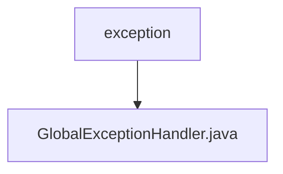

# 基础信息

|      |      |
|------|------|
| 名称 | exception |
| 编码语言 | .java |
| 代码路径 | RuoYi-main/ruoyi-framework/src/main/java/com/ruoyi/framework/web/exception |
| 包名 | RuoYi-main.ruoyi-framework.src.main.java.com.ruoyi.framework.web.exception |
| 概述说明 | 全局异常处理器处理权限、请求、运行、系统及业务异常，返回错误信息或跳转页面。 |

# 说明

全局异常处理器负责捕获和处理各类异常，包括权限异常、请求方式异常、运行时异常、系统异常和业务异常等。当异常发生时，处理器会根据异常类型返回相应的错误信息或执行页面跳转，确保系统在遇到问题时能够提供清晰的反馈和适当的处理措施，从而提升用户体验和系统稳定性。

### 包内部结构视图

该流程图展示了路径的层级关系，`exception` 是父节点，`GlobalExceptionHandler.java` 是其子节点。路径结构清晰，展示了从文件夹到文件的层级关系，符合给定的路径信息。

# 文件列表 File List

| 名称   | 类型  | 说明 |
|-------|------|-------------|
| [GlobalExceptionHandler.java](GlobalExceptionHandler.md) | file | 全局异常处理器处理权限、请求、运行、系统及业务异常，返回错误信息或跳转页面。 |

