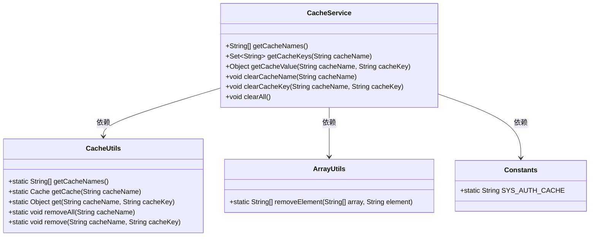
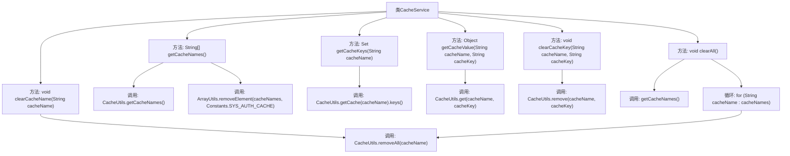

# 基础信息

|      |      |
|------|------|
| 名称 | CacheService |
| 编码语言 | .java |
| 代码路径 | RuoYi-main/ruoyi-framework/src/main/java/com/ruoyi/framework/web/service/CacheService.java |
| 包名 | com.ruoyi.framework.web.service |
| 依赖项 | ['java.util.Set', 'java.util.TreeSet', 'org.apache.commons.lang3.ArrayUtils', 'org.springframework.stereotype.Service', 'com.ruoyi.common.constant.Constants', 'com.ruoyi.common.utils.CacheUtils'] |
| 概述说明 | CacheService类管理缓存，支持获取名称、键名、键值及删除操作。 |

# 说明

CacheService类是一个用于管理缓存的功能模块，提供了多种缓存操作功能。该类允许用户获取缓存的名称、键名以及对应的键值，同时还支持删除缓存的操作。通过这些功能，CacheService类能够有效地管理和维护缓存数据，确保缓存系统的高效运行和数据一致性。

# 类列表 Class Summary

| 名称   | 类型  | 说明 |
|-------|------|-------------|
| CacheService | class | CacheService类提供缓存管理功能，包括获取缓存名称、键名、键值，以及删除缓存。 |

## 类 CacheService

|      |      |
|------|------|
| 访问范围 | @Service;public |
| 类型 | class |
| 名称 | CacheService |
| 说明 | CacheService类提供缓存管理功能，包括获取缓存名称、键名、键值，以及删除缓存。 |

### UML类图

类图描述：`CacheService` 类提供了对缓存的管理功能，包括获取缓存名称、缓存键、缓存值，以及清理缓存的操作。它依赖于 `CacheUtils` 类来执行具体的缓存操作，`ArrayUtils` 类用于数组操作，`Constants` 类提供了系统常量。通过这些依赖关系，`CacheService` 实现了对缓存的高效管理。

### 内部方法调用关系图

这段代码定义了一个名为 `CacheService` 的服务类，提供了多种方法来管理和操作缓存。主要功能包括获取缓存名称、根据缓存名称获取键名、根据缓存名称和键名获取值、根据名称删除缓存、根据名称和键名删除缓存以及清理所有缓存。代码通过调用 `CacheUtils` 和 `ArrayUtils` 类中的方法来实现这些功能，确保缓存操作的准确性和高效性。

### 字段列表 Field List

| 名称  | 类型  | 说明 |
|-------|-------|------|

### 方法列表 Method List

| 名称  | 类型  | 说明 |
|-------|-------|------|
| getCacheNames | String[] | 获取缓存名称数组并移除系统授权缓存。 |
| clearAll | void | 清除所有缓存内容。 |
| clearCacheName | void | 清除指定缓存名称的所有缓存数据。 |
| clearCacheKey | void | 清除指定缓存名称和键的缓存项。 |
| getCacheValue | Object | 获取指定缓存名称和键的值。 |
| getCacheKeys | Set<String> | 获取指定缓存名称的所有键，并返回有序集合。 |

