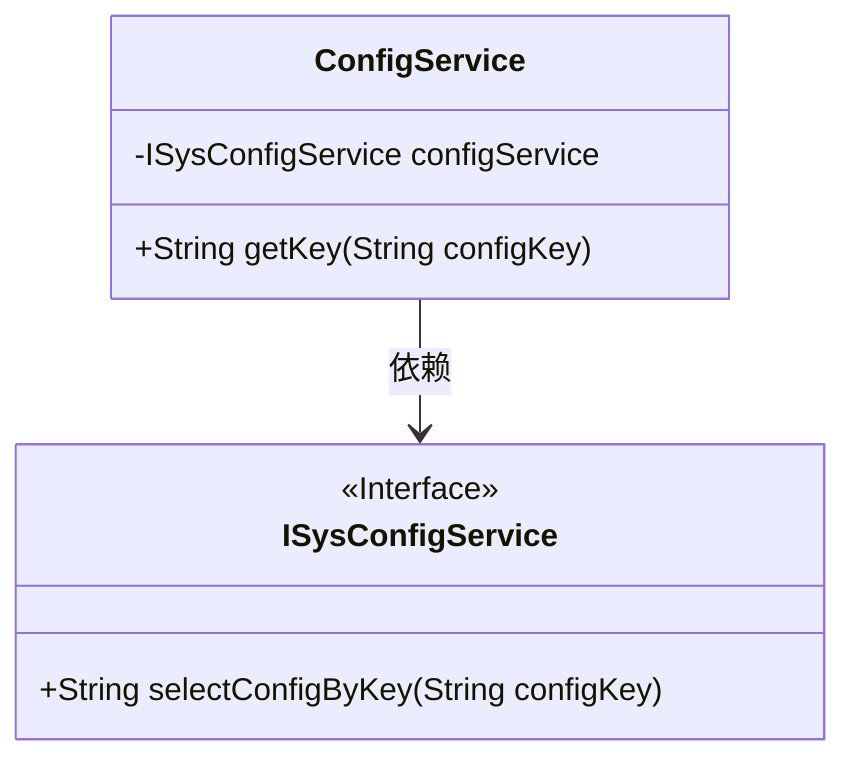
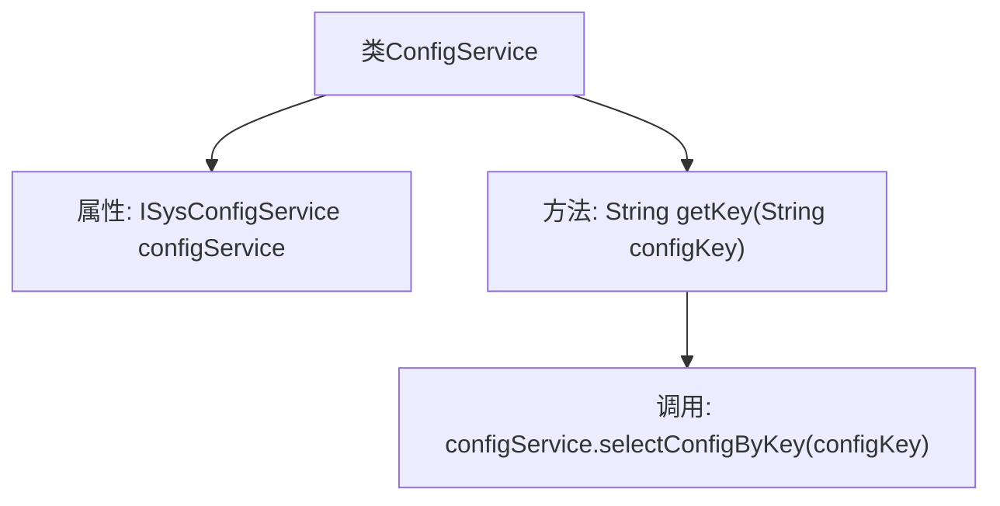

# 基础信息

|      |      |
|------|------|
| 名称 | ConfigService |
| 编码语言 | .java |
| 代码路径 | RuoYi-main/ruoyi-framework/src/main/java/com/ruoyi/framework/web/service/ConfigService.java |
| 包名 | com.ruoyi.framework.web.service |
| 依赖项 | ['org.springframework.beans.factory.annotation.Autowired', 'org.springframework.stereotype.Service', 'com.ruoyi.system.service.ISysConfigService'] |
| 概述说明 | ConfigService类通过configKey查询并返回配置键值。 |

# 说明

ConfigService类的主要功能是通过传入的configKey参数查询并获取相应的配置信息，最终返回与该键对应的值。该类专注于配置管理，确保能够高效地检索和使用系统中的参数配置。

# 类列表 Class Summary

| 名称   | 类型  | 说明 |
|-------|------|-------------|
| ConfigService | class | ConfigService类通过configKey查询参数配置信息并返回键值。 |

## 类 ConfigService

|      |      |
|------|------|
| 访问范围 | @Service("config");public |
| 类型 | class |
| 名称 | ConfigService |
| 说明 | ConfigService类通过configKey查询参数配置信息并返回键值。 |

### UML类图

**描述：**  
`ConfigService`类是一个服务类，依赖于`ISysConfigService`接口。`ConfigService`类中有一个私有成员`configService`，类型为`ISysConfigService`，并通过`@Autowired`注解进行依赖注入。`ConfigService`类提供了一个公有方法`getKey`，该方法接收一个`String`类型的参数`configKey`，并调用`configService`的`selectConfigByKey`方法来获取参数键值。`ISysConfigService`是一个接口，定义了一个方法`selectConfigByKey`，用于根据键名查询参数配置信息。

### 内部方法调用关系图

这段代码定义了一个名为`ConfigService`的服务类，其中包含一个自动注入的`ISysConfigService`实例。`getKey`方法通过调用`configService`的`selectConfigByKey`方法，根据传入的键名查询并返回相应的参数键值。流程图展示了类结构及其内部方法调用关系，清晰地反映了代码的执行流程。

### 字段列表 Field List

| 名称  | 类型  | 说明 |
|-------|-------|------|
| configService | ISysConfigService | 自动注入系统配置服务实例。 |

### 方法列表 Method List

| 名称  | 类型  | 说明 |
|-------|-------|------|
| getKey | String | 方法getKey通过configService获取指定配置键的值。 |

