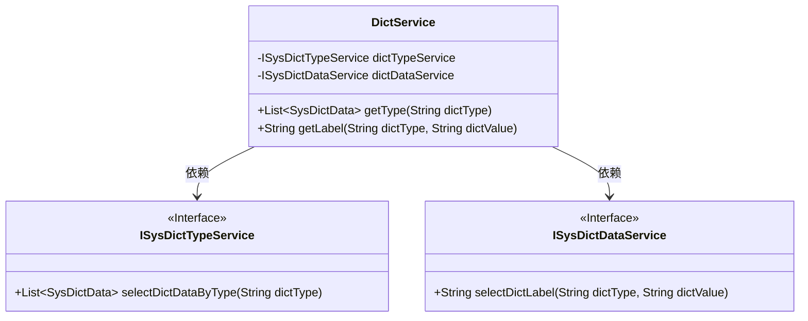
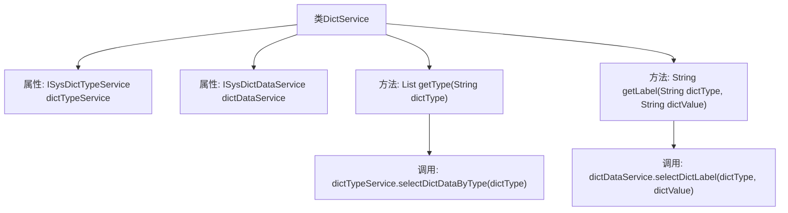

# 基础信息

|      |      |
|------|------|
| 名称 | DictService |
| 编码语言 | .java |
| 代码路径 | RuoYi-main/ruoyi-framework/src/main/java/com/ruoyi/framework/web/service/DictService.java |
| 包名 | com.ruoyi.framework.web.service |
| 依赖项 | ['java.util.List', 'org.springframework.beans.factory.annotation.Autowired', 'org.springframework.stereotype.Service', 'com.ruoyi.common.core.domain.entity.SysDictData', 'com.ruoyi.system.service.ISysDictDataService', 'com.ruoyi.system.service.ISysDictTypeService'] |
| 概述说明 | DictService类支持按类型或键值查询字典数据。 |

# 说明

DictService类是一个用于查询字典数据的工具，它支持通过指定类型或键值来获取相关信息。该类的主要功能是提供灵活的数据查询方式，用户可以根据具体需求选择按类型或键值进行信息检索，从而高效地获取所需数据。

# 类列表 Class Summary

| 名称   | 类型  | 说明 |
|-------|------|-------------|
| DictService | class | DictService类提供查询字典数据功能，支持按类型或键值获取信息。 |

## 类 DictService

|      |      |
|------|------|
| 访问范围 | @Service("dict");public |
| 类型 | class |
| 名称 | DictService |
| 说明 | DictService类提供查询字典数据功能，支持按类型或键值获取信息。 |

### UML类图

这段代码定义了一个名为 `DictService` 的服务类，它依赖于两个接口 `ISysDictTypeService` 和 `ISysDictDataService`。`DictService` 提供了两个公有方法：`getType` 用于根据字典类型查询字典数据信息，`getLabel` 用于根据字典类型和字典键值查询字典标签。这两个方法分别调用了 `ISysDictTypeService` 和 `ISysDictDataService` 接口中的方法来完成具体的业务逻辑。

### 内部方法调用关系图

这段代码定义了一个名为 `DictService` 的服务类，该类包含两个自动注入的属性 `dictTypeService` 和 `dictDataService`。`getType` 方法通过 `dictTypeService` 查询指定字典类型的字典数据信息，而 `getLabel` 方法则通过 `dictDataService` 查询指定字典类型和键值的字典标签。流程图展示了类的结构以及方法之间的调用关系。

### 字段列表 Field List

| 名称  | 类型  | 说明 |
|-------|-------|------|
| dictTypeService | ISysDictTypeService | 自动注入字典类型服务实例。 |
| dictDataService | ISysDictDataService | 自动注入系统字典数据服务实例。 |

### 方法列表 Method List

| 名称  | 类型  | 说明 |
|-------|-------|------|
| getType | List<SysDictData> | 获取指定字典类型的数据列表。 |
| getLabel | String | 该方法通过字典类型和值获取对应标签。 |

