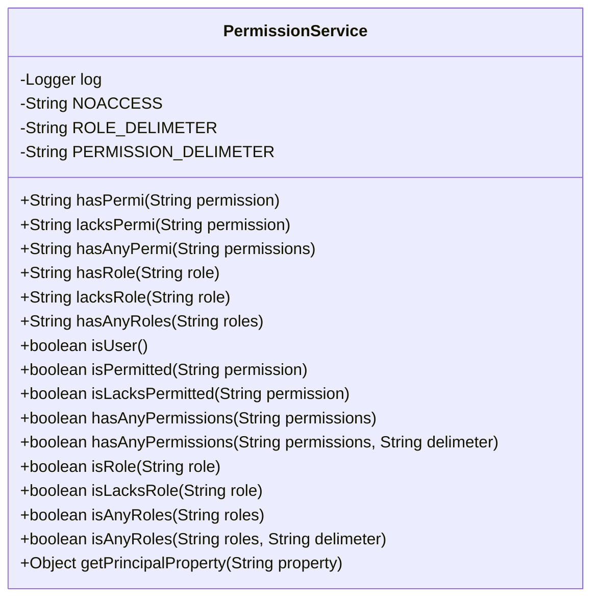

# 基础信息

|      |      |
|------|------|
| 名称 | PermissionService |
| 编码语言 | .java |
| 代码路径 | RuoYi-main/ruoyi-framework/src/main/java/com/ruoyi/framework/web/service/PermissionService.java |
| 包名 | com.ruoyi.framework.web.service |
| 依赖项 | ['java.beans.BeanInfo', 'java.beans.Introspector', 'java.beans.PropertyDescriptor', 'org.apache.shiro.SecurityUtils', 'org.apache.shiro.subject.Subject', 'org.slf4j.Logger', 'org.slf4j.LoggerFactory', 'org.springframework.stereotype.Service', 'com.ruoyi.common.utils.StringUtils'] |
| 概述说明 | PermissionService类验证用户权限和角色，控制前端按钮显示。 |

# 说明

PermissionService类的主要功能是验证用户的权限和角色，并根据验证结果返回相应的数据。这些返回的数据被前端用于决定是否隐藏特定按钮，从而实现基于用户权限的界面控制。该类通过权限和角色的验证，确保用户只能访问和操作其权限范围内的功能，增强了系统的安全性和用户体验。

# 类列表 Class Summary

| 名称   | 类型  | 说明 |
|-------|------|-------------|
| PermissionService | class | PermissionService类用于验证用户权限和角色，返回结果用于前端隐藏按钮。 |

## 类 PermissionService

|      |      |
|------|------|
| 访问范围 | @Service("permission");public |
| 类型 | class |
| 名称 | PermissionService |
| 说明 | PermissionService类用于验证用户权限和角色，返回结果用于前端隐藏按钮。 |

### UML类图

**描述：**  
`PermissionService` 类是一个服务类，主要用于权限验证和角色管理。它提供了多种方法来验证用户是否具备特定权限或角色，并根据验证结果返回相应的字符串或布尔值。类中包含了一些常量用于权限和角色的分隔符，以及用于标识无权限的字符串。此外，该类还提供了获取用户属性的方法，用于从用户主体中提取特定属性的值。

### 内部方法调用关系图

```mermaid
graph TD
    A["类PermissionService"]
    B["常量: NOACCESS = 'hidden'"]
    C["常量: ROLE_DELIMETER = ','"]
    D["常量: PERMISSION_DELIMETER = ','"]
    E["方法: hasPermi(String permission)"]
    F["方法: lacksPermi(String permission)"]
    G["方法: hasAnyPermi(String permissions)"]
    H["方法: hasRole(String role)"]
    I["方法: lacksRole(String role)"]
    J["方法: hasAnyRoles(String roles)"]
    K["方法: isUser()"]
    L["方法: isPermitted(String permission)"]
    M["方法: isLacksPermitted(String permission)"]
    N["方法: hasAnyPermissions(String permissions)"]
    O["方法: hasAnyPermissions(String permissions, String delimeter)"]
    P["方法: isRole(String role)"]
    Q["方法: isLacksRole(String role)"]
    R["方法: isAnyRoles(String roles)"]
    S["方法: isAnyRoles(String roles, String delimeter)"]
    T["方法: getPrincipalProperty(String property)"]

    A --> B
    A --> C
    A --> D
    A --> E
    A --> F
    A --> G
    A --> H
    A --> I
    A --> J
    A --> K
    A --> L
    A --> M
    A --> N
    A --> O
    A --> P
    A --> Q
    A --> R
    A --> S
    A --> T
```

这段代码定义了一个名为 `PermissionService` 的类，主要用于权限验证和角色管理。类中包含多个方法，用于判断用户是否具备特定权限或角色，并返回相应的结果。代码通过调用 `SecurityUtils.getSubject()` 获取当前用户的主体信息，并基于该信息进行权限和角色的验证。部分方法还支持通过分隔符处理多个权限或角色的字符串。整体结构清晰，功能明确，适用于需要精细权限控制的系统。

### 字段列表 Field List

| 名称  | 类型  | 说明 |
|-------|-------|------|
| log = LoggerFactory.getLogger(PermissionService.class) | Logger | PermissionService类中定义了一个私有的静态日志记录器。 |
| ROLE_DELIMETER = "," | String | 定义私有静态常量ROLE_DELIMETER，值为逗号。 |
| PERMISSION_DELIMETER = "," | String | 定义常量字符串PERMISSION_DELIMETER，值为逗号。 |
| NOACCESS = "hidden" | String | 定义了一个不可修改的字符串常量NOACCESS，其值为"hidden"。 |

### 方法列表 Method List

| 名称  | 类型  | 说明 |
|-------|-------|------|
| hasRole | String | 方法hasRole检查角色，若匹配返回空字符串，否则返回无权限标识。 |
| isLacksPermitted | boolean | 检查权限是否缺失。 |
| hasAnyPermissions | boolean | 检查指定权限是否存在。 |
| isPermitted | boolean | 该方法检查当前用户是否拥有指定权限。 |
| getPrincipalProperty | Object | 获取主体对象的指定属性值，若出错则记录日志并返回空。 |
| isAnyRoles | boolean | 检查角色是否包含指定分隔符的任何角色。 |
| lacksRole | String | 方法检查角色缺失，返回空字符串或无访问权限。 |
| isRole | boolean | 该方法检查当前用户是否具有指定角色。 |
| isLacksRole | boolean | 检查指定角色是否存在，若不存在则返回真。 |
| isUser | boolean | 检查用户是否已登录。 |
| lacksPermi | String | 方法检查权限，无权限返回空字符串，否则返回无访问标识。 |
| hasPermi | String | 方法hasPermi检查权限，返回空字符串或无访问权限。 |
| hasAnyPermi | String | 方法检查权限，无权限返回NOACCESS，否则返回空字符串。 |
| isAnyRoles | boolean | 检查用户是否具有指定角色列表中的任一角色。 |
| hasAnyPermissions | boolean | 检查用户是否拥有指定权限，若有则返回真。 |
| hasAnyRoles | String | 方法检查用户是否有指定角色，无角色返回NOACCESS，否则返回空字符串。 |

