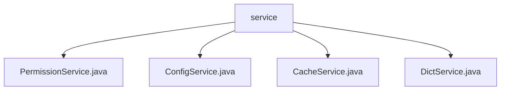

# 基础信息

|      |      |
|------|------|
| 名称 | service |
| 编码语言 | .java |
| 代码路径 | RuoYi-main/ruoyi-framework/src/main/java/com/ruoyi/framework/web/service |
| 包名 | RuoYi-main.ruoyi-framework.src.main.java.com.ruoyi.framework.web.service |
| 概述说明 | PermissionService验证权限，ConfigService获取配置，CacheService管理缓存，DictService查询字典数据。 |

# 说明

## 概述
该代码模块是一个基于Java的框架服务模块，主要用于权限验证、配置管理、缓存操作和字典数据查询。模块中的各个服务类通过提供特定的功能接口，确保了系统的安全性、配置灵活性、缓存高效性以及数据查询的便捷性。这些服务类共同构成了系统的基础服务层，为上层业务逻辑提供了必要的支持。

## 主要业务场景
1. **权限验证**：`PermissionService`类负责验证用户的权限和角色，并根据验证结果返回相应的数据。这些数据被前端用于控制界面元素的显示与隐藏，确保用户只能访问和操作其权限范围内的功能，从而增强系统的安全性和用户体验。
2. **配置管理**：`ConfigService`类通过传入的`configKey`参数查询并获取相应的配置信息，返回与该键对应的值。该类专注于配置管理，确保系统能够高效地检索和使用参数配置，满足不同场景下的配置需求。
3. **缓存操作**：`CacheService`类提供了多种缓存操作功能，包括获取缓存的名称、键名、键值以及删除缓存。通过这些功能，`CacheService`类能够有效地管理和维护缓存数据，确保缓存系统的高效运行和数据一致性，提升系统的性能。
4. **字典数据查询**：`DictService`类是一个用于查询字典数据的工具，支持通过指定类型或键值来获取相关信息。该类提供了灵活的数据查询方式，用户可以根据具体需求选择按类型或键值进行信息检索，从而高效地获取所需数据，简化了数据查询的流程。

### 包内部结构视图

该流程图展示了`service`文件夹下的四个Java文件：`PermissionService.java`、`ConfigService.java`、`CacheService.java`和`DictService.java`。这些文件均位于`service`目录下，表明它们是同一层级的相关服务类文件，用于处理不同的业务逻辑或功能模块。

# 文件列表 File List

| 名称   | 类型  | 说明 |
|-------|------|-------------|
| [DictService.java](DictService.md) | file | DictService类支持按类型或键值查询字典数据。 |
| [ConfigService.java](ConfigService.md) | file | ConfigService类通过configKey查询并返回配置键值。 |
| [CacheService.java](CacheService.md) | file | CacheService类管理缓存，支持获取名称、键名、键值及删除操作。 |
| [PermissionService.java](PermissionService.md) | file | PermissionService类验证用户权限和角色，控制前端按钮显示。 |

