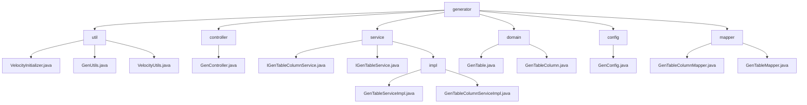

# 基础信息

|      |      |
|------|------|
| 名称 | ruoyi |
| 编码语言 | .java |
| 代码路径 | RuoYi-main/ruoyi-generator/src/main/java/com/ruoyi |
| 包名 | RuoYi-main.ruoyi-generator.src.main.java.com.ruoyi |
| 概述说明 | 基于Velocity的代码生成工具，管理表信息与列属性，简化开发流程，提升一致性。 |

# 说明

## 概述
该代码模块是一个基于Velocity模板引擎的代码生成工具，主要用于生成与数据库表相关的代码模板。模块通过初始化Velocity引擎、管理表信息和列属性、以及生成代码模板等功能，简化了开发流程，提升了代码的一致性和可维护性。模块涵盖了从表结构映射到代码生成的完整流程，支持对业务表和字段的全面管理，确保系统数据的准确性和时效性。

## 主要业务场景
1. **Velocity引擎初始化**：`VelocityInitializer`类负责初始化Velocity引擎，配置资源加载器和字符集，确保引擎能够正确加载资源并处理字符编码，为后续的模板渲染提供基础支持。
2. **表信息管理**：`GenUtils`类用于初始化表信息和列属性，包括表名转换、字段类型设置以及查询条件配置，确保数据库表的相关信息能够被准确管理和配置。
3. **代码模板生成**：`VelocityUtils`类提供了路径配置、模板变量设置、文件命名以及导入包管理等功能，帮助用户高效生成符合需求的代码模板，简化开发流程，提升代码的一致性和可维护性。
4. **业务表管理**：通过`GenTableServiceImpl`类，用户可以执行对业务表的查询、修改、删除、导入以及生成代码等操作。这些功能涵盖了业务表管理的主要需求，帮助用户高效地管理和操作业务表数据。
5. **业务字段管理**：通过`GenTableColumnServiceImpl`类，用户可以执行对业务字段的查询、新增、修改和删除操作。这些操作确保了业务字段数据的准确性和时效性，提升了系统的灵活性和可维护性。
6. **表结构映射**：通过 `GenTableColumn` 类，开发者可以定义数据库表列的属性，并将其映射到Java对象中，便于后续操作。
7. **代码生成配置**：使用 `GenTable` 类，开发者可以配置生成代码所需的关键参数，如表结构、字段属性、代码输出路径以及使用的模板类型。
8. **自动化代码生成**：结合 `GenTable` 和 `GenTableColumn` 类的功能，开发者可以快速生成符合表结构的代码，减少手动编写代码的工作量，提高开发效率。
9. **代码生成器的数据管理**：该模块主要用于代码生成器中的表和字段信息的管理。通过`GenTableMapper`和`GenTableColumnMapper`，开发者可以方便地获取数据库表和字段的详细信息，这些信息将被用于生成相应的代码模板。
10. **数据库表与字段的CRUD操作**：该模块提供了对数据库表和字段的基本操作，包括查询表信息、查询字段信息、插入新表或字段、更新表或字段信息以及删除表或字段等。这些操作是代码生成器核心功能的基础。
11. **动态生成代码**：通过获取数据库表和字段的元数据信息，代码生成器可以根据这些信息动态生成对应的实体类、Mapper接口、Service层代码以及Controller层代码，从而减少开发者的重复劳动，提高开发效率。
12. **数据库元数据的管理与维护**：该模块还负责维护数据库表和字段的元数据信息，确保代码生成器能够准确反映数据库结构的变化，并生成与数据库结构一致的代码。

### 包内部结构视图

该流程图展示了RuoYi项目中`ruoyi-generator`模块的目录结构。`generator`作为根节点，包含`util`、`controller`、`service`、`domain`、`config`和`mapper`等子目录。每个子目录下又包含具体的Java文件，如`util`目录下的`VelocityInitializer.java`、`GenUtils.java`和`VelocityUtils.java`，`controller`目录下的`GenController.java`，以及`service`目录下的`IGenTableColumnService.java`和`IGenTableService.java`等。

# 文件列表 File List

| 名称   | 类型  | 说明 |
|-------|------|-------------|
| [generator](generator/_module.md) | package | 基于Velocity的代码生成工具，管理表信息与列属性，简化开发流程，提升一致性。 |

