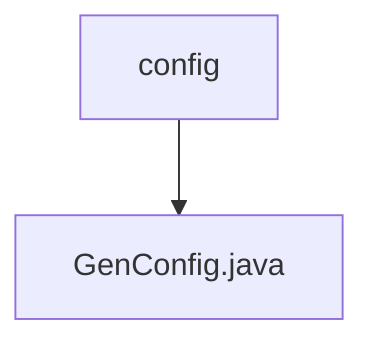

# 基础信息

|      |      |
|------|------|
| 名称 | config |
| 编码语言 | .java |
| 代码路径 | RuoYi-main/ruoyi-generator/src/main/java/com/ruoyi/generator/config |
| 包名 | RuoYi-main.ruoyi-generator.src.main.java.com.ruoyi.generator.config |
| 概述说明 | GenConfig类配置生成器属性，含作者、包路径、表前缀、去前缀及文件覆盖权限。 |

# 说明

GenConfig类用于配置生成器的各项属性，主要包括作者信息、包路径、表前缀、自动去除前缀的功能以及文件覆盖的权限设置。通过这些配置，用户可以定制生成器的行为，确保生成的代码符合项目需求。

### 包内部结构视图

该流程图展示了路径 `RuoYi-main/ruoyi-generator/src/main/java/com/ruoyi/generator/config` 及其子文件 `GenConfig.java` 的层级关系。`config` 是父节点，`GenConfig.java` 是其子节点，表示配置文件与其具体实现类的关系。

# 文件列表 File List

| 名称   | 类型  | 说明 |
|-------|------|-------------|
| [GenConfig.java](GenConfig.md) | file | GenConfig类配置生成器属性，含作者、包路径、表前缀、去前缀及文件覆盖权限。 |

