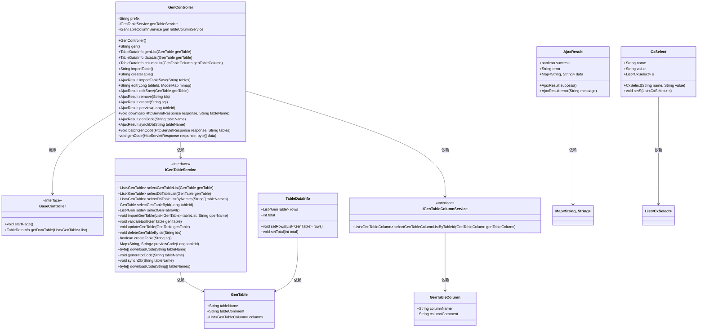

# 基础信息

|      |      |
|------|------|
| 名称 | GenController |
| 编码语言 | .java |
| 代码路径 | RuoYi-main/ruoyi-generator/src/main/java/com/ruoyi/generator/controller/GenController.java |
| 包名 | com.ruoyi.generator.controller |
| 依赖项 | ['java.io.IOException', 'java.util.ArrayList', 'java.util.List', 'java.util.Map', 'javax.servlet.http.HttpServletResponse', 'org.apache.commons.io.IOUtils', 'org.apache.shiro.authz.annotation.RequiresPermissions', 'org.apache.shiro.authz.annotation.RequiresRoles', 'org.springframework.beans.factory.annotation.Autowired', 'org.springframework.stereotype.Controller', 'org.springframework.ui.ModelMap', 'org.springframework.validation.annotation.Validated', 'org.springframework.web.bind.annotation.GetMapping', 'org.springframework.web.bind.annotation.PathVariable', 'org.springframework.web.bind.annotation.PostMapping', 'org.springframework.web.bind.annotation.RequestMapping', 'org.springframework.web.bind.annotation.ResponseBody', 'com.alibaba.druid.DbType', 'com.alibaba.druid.sql.SQLUtils', 'com.alibaba.druid.sql.ast.SQLStatement', 'com.alibaba.druid.sql.dialect.mysql.ast.statement.MySqlCreateTableStatement', 'com.alibaba.fastjson.JSON', 'com.ruoyi.common.annotation.Log', 'com.ruoyi.common.core.controller.BaseController', 'com.ruoyi.common.core.domain.AjaxResult', 'com.ruoyi.common.core.domain.CxSelect', 'com.ruoyi.common.core.page.TableDataInfo', 'com.ruoyi.common.core.text.Convert', 'com.ruoyi.common.enums.BusinessType', 'com.ruoyi.common.utils.StringUtils', 'com.ruoyi.common.utils.security.PermissionUtils', 'com.ruoyi.common.utils.sql.SqlUtil', 'com.ruoyi.generator.config.GenConfig', 'com.ruoyi.generator.domain.GenTable', 'com.ruoyi.generator.domain.GenTableColumn', 'com.ruoyi.generator.service.IGenTableColumnService', 'com.ruoyi.generator.service.IGenTableService'] |
| 概述说明 | GenController支持代码生成、表结构管理及数据表操作，涵盖查询、导入、修改、删除、预览和下载功能。 |

# 说明

GenController是一个功能强大的代码生成和管理工具，专注于处理代码生成、表结构管理以及数据表操作。它支持多种操作，包括查询、导入、修改、删除、预览和下载代码。通过这些功能，用户可以高效地管理和操作数据表，同时生成所需的代码，提升开发效率。

# 类列表 Class Summary

| 名称   | 类型  | 说明 |
|-------|------|-------------|
| GenController | class | GenController处理代码生成、表结构管理及数据表操作，支持查询、导入、修改、删除、预览和下载代码。 |

## 类 GenController

|      |      |
|------|------|
| 访问范围 | @Controller;@RequestMapping("/tool/gen");public |
| 类型 | class |
| 名称 | GenController |
| 说明 | GenController处理代码生成、表结构管理及数据表操作，支持查询、导入、修改、删除、预览和下载代码。 |

### UML类图

这段代码是一个基于Spring MVC的控制器类 `GenController`，主要用于代码生成的相关操作。它继承了 `BaseController`，并通过 `IGenTableService` 和 `IGenTableColumnService` 接口与数据库进行交互。类图中展示了 `GenController` 与各个相关类之间的关系，包括数据表、表字段、查询结果等。`GenController` 提供了多种方法，如查询表结构、生成代码、同步数据库等，这些方法通过调用服务接口来实现具体功能。

### 内部方法调用关系图

```mermaid
graph TD
    A["类GenController"]
    B["属性: String prefix"]
    C["属性: IGenTableService genTableService"]
    D["属性: IGenTableColumnService genTableColumnService"]
    E["方法: String gen()"]
    F["方法: TableDataInfo genList(GenTable genTable)"]
    G["方法: TableDataInfo dataList(GenTable genTable)"]
    H["方法: TableDataInfo columnList(GenTableColumn genTableColumn)"]
    I["方法: String importTable()"]
    J["方法: String createTable()"]
    K["方法: AjaxResult importTableSave(String tables)"]
    L["方法: String edit(Long tableId, ModelMap mmap)"]
    M["方法: AjaxResult editSave(GenTable genTable)"]
    N["方法: AjaxResult remove(String ids)"]
    O["方法: AjaxResult create(String sql)"]
    P["方法: AjaxResult preview(Long tableId)"]
    Q["方法: void download(HttpServletResponse response, String tableName)"]
    R["方法: AjaxResult genCode(String tableName)"]
    S["方法: AjaxResult synchDb(String tableName)"]
    T["方法: void batchGenCode(HttpServletResponse response, String tables)"]
    U["方法: void genCode(HttpServletResponse response, byte[] data)"]

    A --> B
    A --> C
    A --> D
    A --> E
    A --> F
    A --> G
    A --> H
    A --> I
    A --> J
    A --> K
    A --> L
    A --> M
    A --> N
    A --> O
    A --> P
    A --> Q
    A --> R
    A --> S
    A --> T
    A --> U
```

这段代码是一个Spring MVC控制器类`GenController`，用于处理与代码生成相关的请求。它继承自`BaseController`，并包含多个方法，分别用于处理不同的HTTP请求，如查询代码生成列表、查询数据库列表、导入表结构、修改代码生成业务等。每个方法都通过注解与特定的URL路径和HTTP方法绑定，并且部分方法需要特定的权限才能访问。控制器类还依赖于`IGenTableService`和`IGenTableColumnService`服务类来处理业务逻辑。

### 字段列表 Field List

| 名称  | 类型  | 说明 |
|-------|-------|------|
| genTableColumnService | IGenTableColumnService | 自动注入GenTableColumnService实例。 |
| prefix = "tool/gen" | String | 代码定义字符串变量prefix，值为"tool/gen"。 |
| genTableService | IGenTableService | 使用Autowired注解自动注入IGenTableService实例。 |

### 方法列表 Method List

| 名称  | 类型  | 说明 |
|-------|-------|------|
| gen | String | 代码通过权限检查后，返回指定路径。 |
| synchDb | AjaxResult | 代码生成同步数据库表，需权限并记录日志。 |
| genList | TableDataInfo | 权限验证后，分页查询并返回生成表数据列表。 |
| edit | String | 获取表信息并生成编辑页面数据。 |
| batchGenCode | void | 代码生成接口，需权限，批量生成并下载代码。 |
| importTableSave | AjaxResult | 代码生成工具中，通过POST请求导入指定表信息并保存。 |
| remove | AjaxResult | 删除代码生成表，需权限，返回成功结果。 |
| download | void | 权限校验生成代码，日志记录下载操作。 |
| createTable | String | Get请求映射到/createTable，返回前缀加/createTable。 |
| preview | AjaxResult | 该代码为预览接口，需权限，返回指定表格ID的代码预览结果。 |
| create | AjaxResult | 管理员通过SQL语句创建表，处理异常并记录日志。 |
| importTable | String | 需要权限"tool:gen:list"，获取"/importTable"路径返回导入表页面。 |
| dataList | TableDataInfo | 权限要求为"tool:gen:list"，POST请求路径"/db/list"，返回数据库表数据列表。 |
| genCode | AjaxResult | 代码生成接口，检查配置后生成代码并返回结果。 |
| genCode | void | 生成代码设置响应头并写入数据流。 |
| editSave | AjaxResult | 权限控制下，代码生成编辑功能通过验证后更新数据。 |
| columnList | TableDataInfo | 需要权限"tool:gen:list"，POST请求"/column/list"，返回表格数据信息。 |

