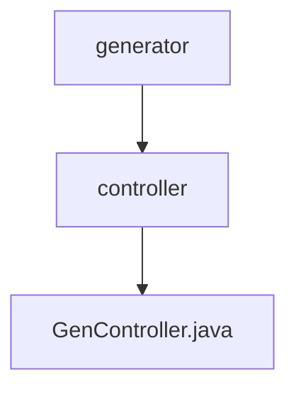

# 基础信息

|      |      |
|------|------|
| 名称 | controller |
| 编码语言 | .java |
| 代码路径 | RuoYi-main/ruoyi-generator/src/main/java/com/ruoyi/generator/controller |
| 包名 | RuoYi-main.ruoyi-generator.src.main.java.com.ruoyi.generator.controller |
| 概述说明 | GenController支持代码生成、表结构管理及数据表操作，涵盖查询、导入、修改、删除、预览和下载功能。 |

# 说明

GenController是一个功能强大的代码生成和管理工具，专注于处理代码生成、表结构管理以及数据表操作。它支持多种操作，包括查询、导入、修改、删除、预览和下载代码。通过这些功能，用户可以高效地管理和操作数据表，同时生成所需的代码，提升开发效率。

### 包内部结构视图

该流程图展示了`RuoYi-main/ruoyi-generator`项目中的路径层级关系。`generator`作为根节点，包含`controller`子节点，而`controller`节点下又包含`GenController.java`文件。整个结构简洁明了，清晰地反映了文件与文件夹之间的从属关系。

# 文件列表 File List

| 名称   | 类型  | 说明 |
|-------|------|-------------|
| [GenController.java](GenController.md) | file | GenController支持代码生成、表结构管理及数据表操作，涵盖查询、导入、修改、删除、预览和下载功能。 |

