# 基础信息

|      |      |
|------|------|
| 名称 | GenTableColumn |
| 编码语言 | .java |
| 代码路径 | RuoYi-main/ruoyi-generator/src/main/java/com/ruoyi/generator/domain/GenTableColumn.java |
| 包名 | com.ruoyi.generator.domain |
| 依赖项 | ['javax.validation.constraints.NotBlank', 'com.ruoyi.common.core.domain.BaseEntity', 'com.ruoyi.common.utils.StringUtils'] |
| 概述说明 | GenTableColumn类定义数据库表列属性，包括ID、名称、类型、Java字段、主键、自增等。 |

# 说明

GenTableColumn类用于定义数据库表列的属性，包含列ID、名称、类型、Java字段、主键、自增等关键属性，并提供相应的操作方法。该类旨在全面描述数据库表列的结构和行为，便于在开发中进行数据库操作和映射。

# 类列表 Class Summary

| 名称   | 类型  | 说明 |
|-------|------|-------------|
| GenTableColumn | class | GenTableColumn类用于定义数据库表列属性，包含列ID、名称、类型、Java字段、主键、自增等属性及相应操作方法。 |

## 类 GenTableColumn

|      |      |
|------|------|
| 访问范围 | public |
| 类型 | class |
| 名称 | GenTableColumn |
| 说明 | GenTableColumn类用于定义数据库表列属性，包含列ID、名称、类型、Java字段、主键、自增等属性及相应操作方法。 |

### UML类图

```mermaid
classDiagram
    class GenTableColumn {
        -Long serialVersionUID
        -Long columnId
        -Long tableId
        -String columnName
        -String columnComment
        -String columnType
        -String javaType
        -String javaField
        -String isPk
        -String isIncrement
        -String isRequired
        -String isInsert
        -String isEdit
        -String isList
        -String isQuery
        -String queryType
        -String htmlType
        -String dictType
        -Integer sort
        +void setColumnId(Long columnId)
        +Long getColumnId()
        +void setTableId(Long tableId)
        +Long getTableId()
        +void setColumnName(String columnName)
        +String getColumnName()
        +void setColumnComment(String columnComment)
        +String getColumnComment()
        +void setColumnType(String columnType)
        +String getColumnType()
        +void setJavaType(String javaType)
        +String getJavaType()
        +void setJavaField(String javaField)
        +String getJavaField()
        +String getCapJavaField()
        +void setIsPk(String isPk)
        +String getIsPk()
        +boolean isPk()
        +boolean isPk(String isPk)
        +String getIsIncrement()
        +void setIsIncrement(String isIncrement)
        +boolean isIncrement()
        +boolean isIncrement(String isIncrement)
        +void setIsRequired(String isRequired)
        +String getIsRequired()
        +boolean isRequired()
        +boolean isRequired(String isRequired)
        +void setIsInsert(String isInsert)
        +String getIsInsert()
        +boolean isInsert()
        +boolean isInsert(String isInsert)
        +void setIsEdit(String isEdit)
        +String getIsEdit()
        +boolean isEdit()
        +boolean isEdit(String isEdit)
        +void setIsList(String isList)
        +String getIsList()
        +boolean isList()
        +boolean isList(String isList)
        +void setIsQuery(String isQuery)
        +String getIsQuery()
        +boolean isQuery()
        +boolean isQuery(String isQuery)
        +void setQueryType(String queryType)
        +String getQueryType()
        +String getHtmlType()
        +void setHtmlType(String htmlType)
        +void setDictType(String dictType)
        +String getDictType()
        +void setSort(Integer sort)
        +Integer getSort()
        +boolean isSuperColumn()
        +static boolean isSuperColumn(String javaField)
        +boolean isUsableColumn()
        +static boolean isUsableColumn(String javaField)
        +String readConverterExp()
    }

    GenTableColumn --> BaseEntity : 继承
```

这段代码定义了一个名为 `GenTableColumn` 的类，它继承自 `BaseEntity` 类。`GenTableColumn` 类包含多个私有属性，用于描述数据库表的列信息，如列ID、表ID、列名、列类型、Java类型等。类中还定义了大量的getter和setter方法，用于访问和修改这些属性。此外，类中还有一些方法用于判断列是否为主键、是否自增、是否必填等。`GenTableColumn` 类通过继承 `BaseEntity` 类，获得了 `BaseEntity` 的所有属性和方法。

### 内部方法调用关系图

这段代码定义了一个名为`GenTableColumn`的类，该类继承自`BaseEntity`。该类包含了多个属性，如`columnId`、`tableId`、`columnName`等，以及相应的getter和setter方法。此外，该类还包含了一些逻辑方法，如`isPk()`、`isIncrement()`等，用于判断某些属性的状态。`readConverterExp()`方法用于从`columnComment`中提取特定格式的字符串并转换为另一种格式。整体上，该类用于管理和操作数据库表的列信息。

### 字段列表 Field List

| 名称  | 类型  | 说明 |
|-------|-------|------|
| columnId | Long | 定义长整型变量columnId。 |
| columnComment | String | 私有字符串变量存储列注释。 |
| isEdit | String | 定义私有字符串变量isEdit。 |
| sort | Integer | 定义私有整型变量sort。 |
| columnName | String | 私有字符串类型变量columnName。 |
| tableId | Long | 定义长整型变量tableId。 |
| isRequired | String | 私有字符串变量isRequired。 |
| isIncrement | String | 私有字符串变量isIncrement声明。 |
| isQuery | String | 定义了一个私有的字符串变量isQuery。 |
| javaType | String | Java类中定义了一个私有字符串类型变量。 |
| isPk | String | 定义私有字符串变量isPk。 |
| htmlType | String | 定义了一个私有字符串变量htmlType。 |
| serialVersionUID = 1L | long | 定义静态长整型常量serialVersionUID，值为1L。 |
| isList | String | 定义一个私有字符串变量isList。 |
| queryType | String | 定义私有字符串变量queryType。 |
| javaField | String | Java字段验证：确保字段不为空。 |
| isInsert | String | 声明一个私有字符串变量isInsert。 |
| columnType | String | 定义私有字符串变量columnType。 |
| dictType = "" | String | 定义了一个私有字符串变量dictType，初始值为空。 |

### 方法列表 Method List

| 名称  | 类型  | 说明 |
|-------|-------|------|
| getSort | Integer | 获取排序值的整数方法。 |
| setColumnId | void | 设置列ID的方法。 |
| getJavaType | String | 该方法返回Java类型。 |
| setIsInsert | void | 设置插入状态的方法。 |
| setIsList | void | 设置isList属性的方法。 |
| setJavaField | void | 定义方法设置Java字段值。 |
| setTableId | void | 设置表格ID的方法。 |
| setIsPk | void | 设置主键状态的方法。 |
| getIsPk | String | 获取主键状态的方法。 |
| setIsQuery | void | 设置isQuery属性的方法。 |
| setColumnComment | void | 设置列注释的方法。 |
| getIsEdit | String | 获取isEdit属性的方法。 |
| getDictType | String | 该方法返回字典类型字符串。 |
| getColumnType | String | 该方法返回列类型字符串。 |
| getIsInsert | String | 获取插入状态的方法。 |
| getIsQuery | String | 获取isQuery字符串值的方法。 |
| getIsRequired | String | 该方法返回isRequired变量的值。 |
| setDictType | void | 设置字典类型的方法。 |
| getTableId | Long | 该方法返回一个长整型的表ID。 |
| setJavaType | void | 设置Java类型的公共方法。 |
| setIsEdit | void | 设置isEdit属性的方法。 |
| getQueryType | String | 该方法返回查询类型字符串。 |
| getColumnName | String | 获取列名的方法，返回columnName变量。 |
| getCapJavaField | String | 该方法将javaField首字母大写后返回。 |
| isList | boolean | 该方法检查字符串是否为"1"，且不为空。 |
| isInsert | boolean | 判断输入字符串是否为插入操作。 |
| isList | boolean | 该方法检查对象是否为列表并返回布尔值。 |
| getColumnComment | String | 获取列注释的方法，返回列注释字符串。 |
| getColumnId | Long | 获取columnId的方法，返回类型为Long。 |
| isInsert | boolean | 方法isInsert返回布尔值，调用内部isInsert函数。 |
| isQuery | boolean | 该方法返回当前对象是否为查询状态。 |
| setQueryType | void | 设置查询类型的方法，接受字符串参数。 |
| setSort | void | 设置排序数值的方法。 |
| isUsableColumn | boolean | 检查Java字段是否为可用列。 |
| isIncrement | boolean | 该方法返回布尔值，判断是否为增量操作。 |
| setColumnName | void | 设置列名的方法，将参数columnName赋值给当前对象的columnName属性。 |
| isEdit | boolean | 该方法检查当前操作是否为编辑，并返回布尔值。 |
| getJavaField | String | Java方法返回字段javaField的值。 |
| isQuery | boolean | 检查isQuery是否为"1"的布尔方法。 |
| isEdit | boolean | 方法判断字符串isEdit是否为"1"，返回布尔值。 |
| isSuperColumn | boolean | 判断字段是否为超级列，匹配特定字段名。 |
| isRequired | boolean | 该方法检查字符串是否为"1"，是则返回true，否则返回false。 |
| setHtmlType | void | 该方法用于设置htmlType属性的值。 |
| isUsableColumn | boolean | 检查字段是否在白名单内，包含parentId、orderNum、remark。 |
| getHtmlType | String | 该方法返回htmlType属性的字符串值。 |
| setIsRequired | void | 设置必填项的方法，将输入值赋给类变量。 |
| isSuperColumn | boolean | 检查当前字段是否为超级列。 |
| getIsIncrement | String | 该方法返回变量isIncrement的值。 |
| isPk | boolean | 方法判断字符串isPk是否为"1"，返回布尔值。 |
| isRequired | boolean | 检查对象是否为必需项。 |
| setColumnType | void | 设置列类型的方法，将传入的columnType赋值给当前对象的columnType属性。 |
| isIncrement | boolean | 该方法判断字符串是否为"1"，非空且相等返回true。 |
| setIsIncrement | void | 设置增量标识的Java方法。 |
| readConverterExp | String | 方法提取列注释中的备注，格式化后返回；若无备注，返回原注释。 |
| getIsList | String | 获取isList属性的字符串值。 |
| isPk | boolean | 方法isPk返回当前对象的主键状态。 |

